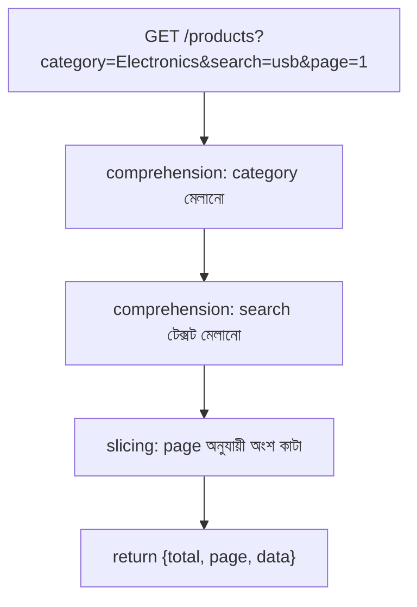

# ০৯. Common Backend Pattern with List Comprehensions and JSON

এই মডিউলের শেষ লেসনে চলো সব কিছুকে একসাথে জড়ো করে সত্যিকারের ব্যাকএন্ড প্যাটার্নে রূপ দিই। Module 6-এ আমরা GET endpoint বানিয়েছিলাম, Module 4 লেসন ৬-এ query parameter শিখেছিলাম। এখন আমরা list comprehension দিয়ে সেই query parameter-গুলোকে সত্যিকারের ফিল্টারিং, সার্চিং আর হালকা পেজিনেশনে রূপান্তর করবো।

ধরো আমাদের কাছে একটা প্রোডাক্ট তালিকা আছে:

```python
products = [
    {"id": 1, "name": "Wireless Mouse", "price": 950, "category": "Electronics"},
    {"id": 2, "name": "Office Chair", "price": 5200, "category": "Furniture"},
    {"id": 3, "name": "Bluetooth Speaker", "price": 1800, "category": "Electronics"},
    {"id": 4, "name": "Study Table", "price": 4300, "category": "Furniture"},
    {"id": 5, "name": "USB Cable", "price": 150, "category": "Electronics"},
]
```

প্রথম প্যাটার্ন — **ক্যাটাগরি অনুযায়ী ফিল্টার করা**। ক্লায়েন্ট যদি `/products?category=Electronics` কল করে, তাহলে শুধু Electronics ক্যাটাগরির প্রোডাক্ট ফেরত পাঠাতে হবে।

```python
from fastapi import FastAPI
from typing import Optional

app = FastAPI()

@app.get("/products")
def get_products(category: Optional[str] = None, search: Optional[str] = None, page: int = 1, limit: int = 2):
    result = products

    if category:
        result = [p for p in result if p["category"] == category]

    # পরের ধাপ এখানে যোগ হবে...
    return result
```

দ্বিতীয় প্যাটার্ন — **নাম দিয়ে সার্চ করা**। ধরো ক্লায়েন্ট `/products?search=speaker` পাঠালো — তখন প্রোডাক্টের নামের মধ্যে সেই টেক্সট আছে কিনা যাচাই করতে হবে, ছোট-বড় হাতের অক্ষর উপেক্ষা করে।

```python
    if search:
        result = [p for p in result if search.lower() in p["name"].lower()]
```

তৃতীয় প্যাটার্ন — **হালকা পেজিনেশন**। সব ফলাফল একসাথে না পাঠিয়ে, ছোট ছোট পাতায় ভাগ করে পাঠানো — অনেকটা একটা বইয়ের সবগুলো পাতা একসাথে না দিয়ে, একটা একটা পাতা উল্টে দেখানোর মতো। এখানে **slicing** কাজে লাগে, যেটা list-এর একটা নির্দিষ্ট অংশ কেটে বের করে আনে।

```python
    start_index = (page - 1) * limit
    end_index = start_index + limit
    paginated = result[start_index:end_index]

    return {
        "total": len(result),
        "page": page,
        "data": paginated,
    }
```

পুরো ফ্লো-টা একসাথে দেখলে বোঝা যায়, একটা রিকোয়েস্ট কীভাবে ধাপে ধাপে filter, search, আর pagination পেরিয়ে চূড়ান্ত রেসপন্সে পৌঁছায়।



এই প্যাটার্নটা এত কমন যে প্রায় প্রতিটা রিয়েল-ওয়ার্ল্ড API-তে এর কোনো না কোনো রূপ দেখা যায় — প্রোডাক্ট লিস্টিং, ইউজার সার্চ, অর্ডার হিস্টোরি, সবখানেই। আর লক্ষ্য করো, এখানে যা কিছু ব্যবহার করা হয়েছে — dict, list, unpacking-এর মতো ধারণা, comprehension, slicing — এই পুরো মডিউলে যা যা শিখেছি তার প্রায় সবকিছুই একসাথে কাজে লেগেছে।

## প্রোডাকশন নুয়ান্স — list comprehension কখন পড়তে কঠিন হয়ে যায়, আর কখন generator/loop-এ ফেরা উচিত

List comprehension অত্যন্ত সংক্ষিপ্ত আর elegant, কিন্তু এই সংক্ষিপ্ততাই একটা ফাঁদ হয়ে দাঁড়াতে পারে যদি এর ভেতরে অতিরিক্ত লজিক ঠেসে দেওয়া হয়। উপরের উদাহরণে আমরা দুটো আলাদা `if` ধাপে category আর search ফিল্টার করেছি — এটা ইচ্ছাকৃত সিদ্ধান্ত, একটাই জটিল comprehension-এর ভেতরে সবকিছু ঠেসে দেওয়ার বদলে। কেউ যদি লিখতো:

```python
result = [
    p for p in products
    if (not category or p["category"] == category)
    and (not search or search.lower() in p["name"].lower())
    and p["price"] < 10000
    and p["stock"] > 0
]
```

এটা কাজ করবে, কিন্তু এক লাইনে (বা এক comprehension-এ) এত বেশি শর্ত, এত বেশি নেগেশন লজিক (`not category or ...`) ঠেসে দেওয়ায় ছয় মাস পর যখন কেউ (এমনকি তুমি নিজেও) এই কোডে ফিরে আসবে, বুঝতে অনেক সময় লাগবে ঠিক কোন শর্তটা কী করছে। এটাই **readability limit** — যখন একটা comprehension একনজরে বোঝা যাচ্ছে না, তখন সেটা আর "সংক্ষিপ্ত" নয়, বরং "গোপন জটিলতা" হয়ে দাঁড়িয়েছে।

এর সমাধান হলো ধাপে ধাপে আলাদা variable-এ ভাগ করা (যেমন আমরা উপরে করেছি), বা একটা সাধারণ `for` লুপে ফিরে যাওয়া, যেখানে প্রতিটা শর্ত নিজের একটা লাইন পায়:

```python
result = []
for p in products:
    if category and p["category"] != category:
        continue
    if search and search.lower() not in p["name"].lower():
        continue
    if p["price"] >= 10000 or p["stock"] <= 0:
        continue
    result.append(p)
```

এটা বেশি লাইনের কোড, কিন্তু প্রতিটা শর্ত আলাদা করে পড়া যায়, ডিবাগ করা যায়, আর প্রতিটা শর্তের উপর ব্রেকপয়েন্ট বসানো যায় — যেটা এক-লাইন comprehension-এ করা কঠিন। বাস্তব প্রোডাকশন টিমে সাধারণ নিয়ম হলো — যদি একটা comprehension এক লাইনে আরামে পড়া যায় (একটা map বা একটা সাধারণ filter), সেটা রাখো; যদি একাধিক শর্ত, nested logic, বা side-effect ঢুকে পড়ে, `for` লুপে ফিরে যাও।

আরেকটা নুয়ান্স — **মেমরি ব্যবহার**। যদি তোমার ডেটাসেট বড় হয় (ধরো ডেটাবেজ থেকে লাখ লাখ রেকর্ড এসেছে, আর তুমি শুধু একটা করে প্রসেস করে ক্লায়েন্টে স্ট্রিম করতে চাও), তাহলে `[... for ... in ...]` (list comprehension) পুরো ফলাফল একসাথে মেমরিতে রাখে, যা RAM-এর উপর বড় চাপ তৈরি করতে পারে। সেই ক্ষেত্রে `(... for ... in ...)` (generator expression) ব্যবহার করা উচিত, যেটা একটা একটা আইটেম "প্রয়োজন হলেই" তৈরি করে, পুরো তালিকা একসাথে মেমরিতে রাখে না। FastAPI-তে বড় ডেটাসেট রেসপন্সের ক্ষেত্রে `StreamingResponse`-এর সাথে generator মিলিয়ে ব্যবহার করা একটা সাধারণ প্রোডাকশন প্যাটার্ন, যা আমরা ভবিষ্যতের মডিউলে বিস্তারিত দেখবো।

এতদিন আমরা কোডের ভেতরের লজিক নিয়ে কথা বলেছি — কীভাবে ডেটা প্রসেস হয়, কীভাবে রিকোয়েস্ট হ্যান্ডেল হয়। কিন্তু একটা `uvicorn main:app` কমান্ড চালানোর পর কম্পিউটারের ভেতরে আসলে কী ঘটে, সেটা এখনো আমরা খতিয়ে দেখিনি। পরের মডিউলে আমরা ঠিক সেই প্রশ্নের উত্তর খুঁজবো — Process আর Thread নিয়ে।
