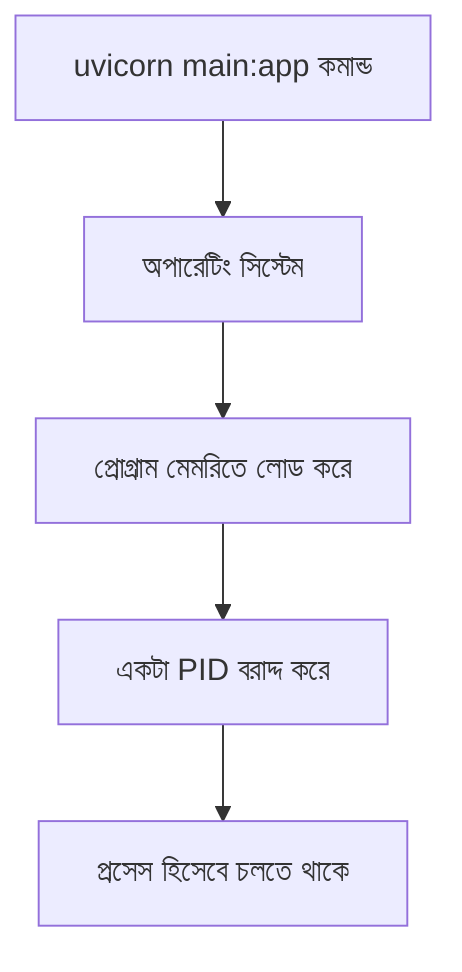

# ০১. What is Process? How do find a Python Process in windows PC?

Module 4-এ আমরা প্রথম যখন `uvicorn main:app` কমান্ড চালিয়ে একটা FastAPI সার্ভার তুলেছিলাম, তখন আমরা মূলত এর "ফলাফল" দেখেছি — ব্রাউজারে গিয়ে `localhost:৮০০০`-এ কিছু একটা দেখা যাচ্ছে। কিন্তু কমান্ডটা চালানোর সাথে সাথেই অপারেটিং সিস্টেমের ভেতরে আসলে কী ঘটে, সেটা আমরা এখনো খতিয়ে দেখিনি। এই মডিউলে আমরা ঠিক সেই পর্দার আড়ালের গল্পটা জানবো।

একটা রেস্টুরেন্ট চেইনের কথা কল্পনা করো, যার অনেকগুলো শাখা (branch) আছে — একটা ধানমন্ডিতে, একটা গুলশানে। প্রতিটা শাখা আলাদাভাবে চলে, তাদের নিজস্ব কর্মী আছে, নিজস্ব রান্নাঘর আছে, একটার সমস্যা আরেকটাকে সরাসরি প্রভাবিত করে না। অপারেটিং সিস্টেমে একটা **process** ঠিক এরকম — একটা প্রোগ্রামের চলমান একটা "শাখা" বা instance, যার নিজস্ব মেমরি, নিজস্ব রিসোর্স, আর একটা নিজস্ব পরিচয় নম্বর থাকে, যাকে বলে **PID (Process ID)**।

তুমি যখন টার্মিনালে `uvicorn main:app --port 8000` লেখো, তখন অপারেটিং সিস্টেম Python ইন্টারপ্রেটারটাকে মেমরিতে লোড করে, তাকে একটা PID দেয়, আর সেটাকে চালাতে শুরু করে। এই মুহূর্ত থেকে সেটা একটা independent প্রসেস — তুমি চাইলে একই সার্ভার কোড দুইবার চালিয়ে দুইটা আলাদা প্রসেস তৈরি করতে পারো (যদিও দুটো একসাথে একই পোর্টে চলতে পারবে না, Module 2-তে যেটা আমরা শিখেছিলাম পোর্ট সংঘর্ষের প্রসঙ্গে)।

```python
# main.py
import os
from fastapi import FastAPI

app = FastAPI()
print("এই প্রসেসের PID হলো:", os.getpid())

@app.get("/")
def read_root():
    return {"message": "Hello from a running process!"}
```

এখানে Python-এর বিল্ট-ইন `os` মডিউলের `os.getpid()` ফাংশন দিয়ে চলমান প্রসেসের PID পাওয়া যায় — Module 3-এ আমরা যখন Node.js-এর built-in `process` অবজেক্ট নিয়ে কথা বলেছিলাম, `os` মডিউলটা অনেকটা সেরকমই কাজ করে, শুধু এটা `import os` লিখে আনতে হয়, Node.js-এর `process`-এর মতো সবসময় গ্লোবালি হাজির থাকে না।

Windows-এ চলমান কোনো Python প্রসেস খুঁজে বের করতে দুইভাবে করা যায়। প্রথমত, **Task Manager** খুলে (Ctrl+Shift+Esc চাপলেই আসে) "Details" ট্যাবে গিয়ে `python.exe` নামের এন্ট্রি খুঁজলে সেখানে PID কলামেও দেখা যাবে।

দ্বিতীয়ত, কমান্ড লাইন থেকে:

```bash
tasklist | findstr python
```

এই কমান্ডটা চলমান সব প্রসেসের লিস্ট থেকে শুধু "python" শব্দটা যেখানে আছে সেগুলো ফিল্টার করে দেখাবে — অনেকটা আমরা Module 9-এ যেভাবে list comprehension বা `filter()` দিয়ে ডেটা বাছাই করেছিলাম, ঠিক সেই একই ধারণা, শুধু এবার অপারেটিং সিস্টেমের লেভেলে।

macOS বা Linux-এ একই তথ্য টার্মিনাল থেকে দেখা যায় এভাবে:

```bash
ps aux | grep python
```

অথবা আরও ইন্টারেক্টিভভাবে দেখতে চাইলে:

```bash
htop
```

`htop` একটা রিয়েল-টাইম, রঙিন প্রসেস মনিটর, যেখানে CPU আর মেমরি ব্যবহারের হিসাব সহ সব চলমান প্রসেস তালিকাভুক্ত থাকে — এখানে `python` বা `uvicorn` নামের এন্ট্রি খুঁজলেই PID চোখে পড়বে। **প্রোডাকশন নুয়ান্স:** সার্ভারে যখন একসাথে অনেকগুলো `python` প্রসেস চলে (যেমন Gunicorn worker গুলো), তখন শুধু "python" লিখে খোঁজা বিভ্রান্তিকর হতে পারে — সেখানে `ps aux | grep uvicorn` বা `ps aux | grep gunicorn` এর মতো আরও নির্দিষ্ট নাম দিয়ে খোঁজা ভালো, কারণ সিস্টেমে অন্য কোনো অপ্রাসঙ্গিক Python স্ক্রিপ্টও চলতে পারে যেটা তোমার সার্ভার না।



এখন প্রশ্ন আসতে পারে — একটা প্রসেস চলছে জানলাম, কিন্তু সেটাকে বন্ধ করতে হলে কী করবো? বিশেষ করে যখন "port already in use" এর মতো এরর আসে? সেই উত্তর খুঁজবো পরের লেসনে।
