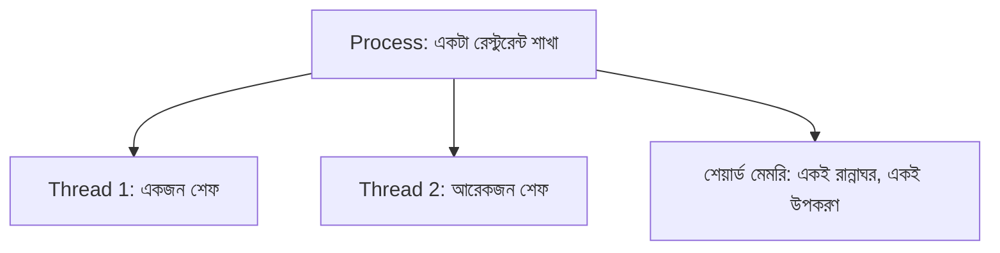
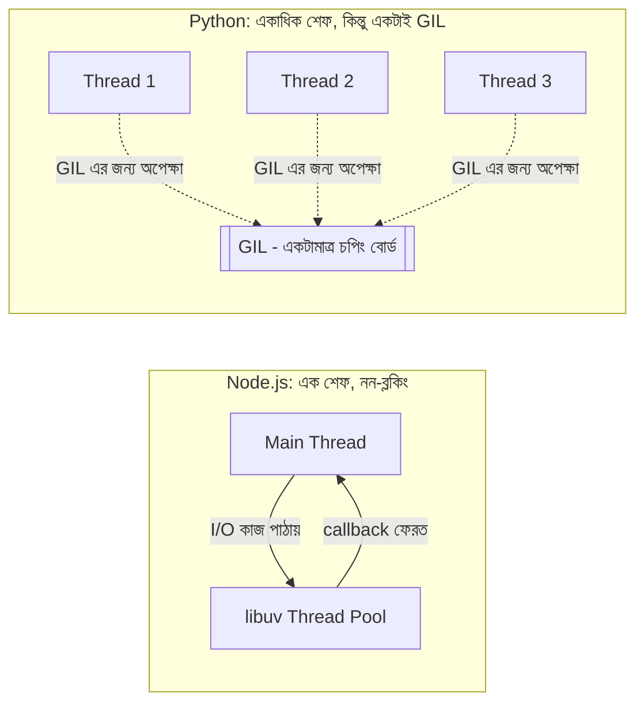
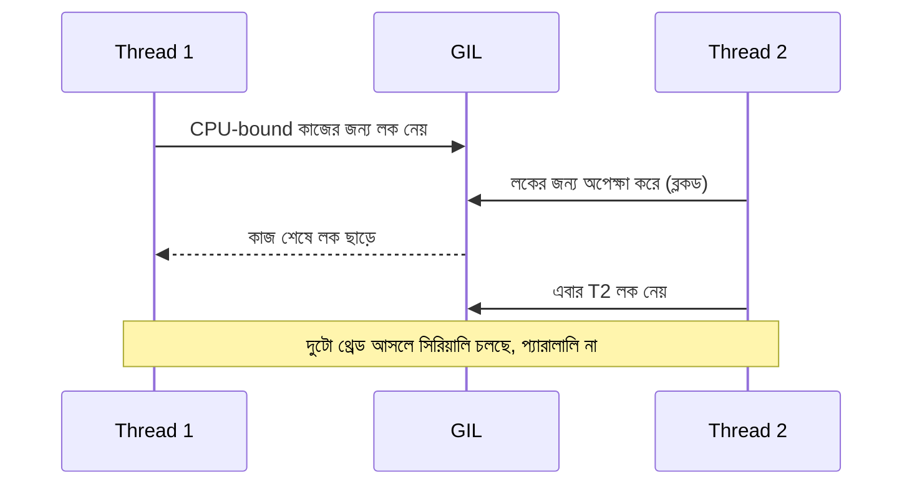

# ০৩. what is a thread?

রেস্টুরেন্ট শাখার (process) উদাহরণটা আরেকটু এগিয়ে নিই। একটা শাখার ভেতরে একজন বা একাধিক শেফ কাজ করতে পারে, তাই না? একজন শেফ একসাথে একটা কাজই করতে পারে — একটা তরকারি রান্না করা শেষ না করে সে আরেকটা শুরু করতে পারবে না, যদি না তার সহকারী থাকে। অপারেটিং সিস্টেমের ভাষায় এই একেকজন শেফকে বলা যায় একেকটা **thread** — একটা প্রসেসের ভেতরে কাজ সম্পাদনের সবচেয়ে ছোট একক।

তাহলে process আর thread-এর সম্পর্কটা কী? একটা প্রসেস হলো পুরো রেস্টুরেন্ট শাখা — তার নিজস্ব রান্নাঘর (মেমরি), নিজস্ব ঠিকানা (PID)। আর thread হলো সেই শাখার ভেতরে কাজ করা কর্মী। একটা প্রসেসে একটা থ্রেড থাকতে পারে (একজন শেফ), আবার অনেকগুলো থ্রেডও থাকতে পারে (অনেকজন শেফ, একই রান্নাঘর শেয়ার করে)।



এখন পর্যন্ত গল্পটা Node.js আর Python দুটো ভাষাতেই সমান সত্যি। কিন্তু এখানেই একটা মৌলিক মোড় আসে, যেটা না বুঝলে Python-এ পরে খুব বাস্তব একটা বাগে পড়তে হবে। Module 5-এ আমরা event loop নিয়ে বিস্তারিত কথা বলেছিলাম, আর সেখানে বলেছিলাম, Node.js-এর মূল ডিজাইন-দর্শনটাই হলো — একজন মাত্র শেফ (single main thread) দিয়ে, কিন্তু অপেক্ষার সময়টুকু নষ্ট না করে (non-blocking I/O দিয়ে), অনেকগুলো কাজ সামলানো। Node.js ইচ্ছাকৃতভাবেই একটা মাত্র থ্রেডে কোড চালায়, আর ভারী I/O কাজ পর্দার আড়ালে libuv thread pool-এ পাঠিয়ে দেয়।

Python-এর গল্পটা পুরোপুরি ভিন্ন জায়গা থেকে শুরু হয়। Python-এর `threading` মডিউল দিয়ে তুমি চাইলে সত্যিকারের একাধিক OS-level থ্রেড তৈরি করতে পারো — কোনো লুকানো thread pool এর দরকার নেই, তুমি নিজেই সরাসরি একাধিক থ্রেড চালাতে পারো:

```python
import threading

def worker(n):
    print(f"থ্রেড {n} কাজ করছে")

threads = [threading.Thread(target=worker, args=(i,)) for i in range(3)]
for t in threads:
    t.start()
for t in threads:
    t.join()
```

এটা দেখে মনে হতে পারে, "বাহ, Python-এ তো Node.js-এর চেয়েও বেশি সুবিধা — এখানে তো সত্যিকারের multi-threading আছে!" কিন্তু এখানেই লুকিয়ে আছে Python-এর সবচেয়ে গুরুত্বপূর্ণ এবং প্রায়ই ভুল বোঝা একটা ধারণা — **GIL (Global Interpreter Lock)**।

## GIL: একই সময়ে একজনই রান্নাঘরে ঢুকতে পারবে

কল্পনা করো, রেস্টুরেন্ট শাখাটায় তিনজন শেফ আছে, কিন্তু রান্নাঘরে একটামাত্র চপিং বোর্ড আছে, আর নিয়ম হলো — একই সময়ে একজনের বেশি শেফ সেই বোর্ড ছুঁতে পারবে না। তিনজন শেফ থাকলেও, তারা পালা করে করে বোর্ড ব্যবহার করবে, একসাথে না। CPython (Python-এর সবচেয়ে বহুল ব্যবহৃত ইমপ্লিমেন্টেশন)-এ ঠিক এই নিয়মটাই আছে, যাকে বলে GIL — একটা লক যা নিশ্চিত করে, একই সময়ে একটা মাত্র থ্রেড Python bytecode এক্সিকিউট করতে পারবে, প্রসেসের ভেতরে যত থ্রেডই থাকুক না কেন।

কেন এই লক আছে? Python-এর মেমরি ম্যানেজমেন্ট (reference counting দিয়ে গার্বেজ কালেকশন) থ্রেড-সেফ না, আর GIL সেই জটিলতা সরল রাখার জন্য একটা ঐতিহাসিক ডিজাইন সিদ্ধান্ত — একাধিক থ্রেড একসাথে মেমরি নিয়ে সংঘর্ষে জড়িয়ে ডেটা করাপ্ট করে ফেলবে না, তার নিশ্চয়তা এভাবেই দেওয়া হয়েছে।

এর ফলাফলটা হলো — Node.js যেখানে ইচ্ছাকৃতভাবে single-threaded (এক শেফ, কিন্তু I/O-তে অপেক্ষা করতে হয় না), Python-এর থ্রেডিং তার বিপরীত সমস্যায় পড়ে: একাধিক শেফ (থ্রেড) থাকলেও, CPU-bound (মানে ভারী গণনা, লুপ চালানো, হিসাব করার মতো) কাজে তারা সত্যিকারের প্যারালালিজম পায় না, কারণ GIL তাদের একজন একজন করে সিরিয়ালি কাজ করতে বাধ্য করে।



## কী ভেঙে যায়, যদি তুমি ধরে নেও Python থ্রেড মানেই সত্যিকারের প্যারালাল CPU কাজ

ধরো, তুমি একটা ভারী গণনার কাজ (যেমন বড় একটা লিস্টের প্রতিটা সংখ্যার বর্গ যোগ করা) চারটা থ্রেডে ভাগ করে দ্রুত করতে চাইছো, ঠিক যেমনটা তুমি ভাবতে পারো Node.js-এর worker threads বা অন্য কোনো ভাষায় করতে:

```python
import threading
import time

def cpu_heavy_task(n):
    total = 0
    for i in range(n):
        total += i * i
    return total

start = time.time()

# ভুল প্রত্যাশা: "চারটা থ্রেড চালালে চারগুণ দ্রুত হবে"
threads = [threading.Thread(target=cpu_heavy_task, args=(50_000_000,)) for _ in range(4)]
for t in threads:
    t.start()
for t in threads:
    t.join()

print("সময় লাগলো:", time.time() - start)
```

এই কোডটা চালালে দেখা যাবে, চারটা থ্রেড ব্যবহার করেও সময় প্রায় একই থাকছে, বরং কিছু কিছু ক্ষেত্রে GIL-এর কন্টেক্স্ট-সুইচিং ওভারহেডের কারণে সামান্য ধীরও হতে পারে — যেন চারজন শেফ থাকা সত্ত্বেও, তারা একে একে সেই একটামাত্র চপিং বোর্ডের জন্য লাইনে দাঁড়িয়ে সময় নষ্ট করছে। যে ডেভেলপার Node.js বা Java-র মতো ভাষা থেকে এসেছে, সে স্বাভাবিকভাবেই আশা করবে থ্রেড বাড়ালে CPU-bound কাজ দ্রুত হবে — কিন্তু Python-এ এই ধারণাটা ভুল, আর এই ভুল প্রত্যাশার উপর ভর করে প্রোডাকশন কোড লিখলে পারফরম্যান্স সমস্যায় পড়তে হয়।

তবে খেয়াল রাখা দরকার — এই সীমাবদ্ধতা কেবল CPU-bound কাজের জন্য। I/O-bound কাজে (যেমন একই সময়ে একাধিক নেটওয়ার্ক রিকোয়েস্ট পাঠানো, বা ফাইল পড়া) Python-এর থ্রেড এখনও কাজে লাগে, কারণ যখন একটা থ্রেড I/O-এর জন্য অপেক্ষা করে (যেমন নেটওয়ার্ক থেকে ডেটা আসার অপেক্ষা), তখন সে GIL ছেড়ে দেয়, আর অন্য থ্রেড সেই সুযোগে কাজ করতে পারে। এই দিক থেকে Python threading আর Node.js-এর non-blocking I/O ধারণাগতভাবে একই লক্ষ্যে পৌঁছায়, যদিও পদ্ধতি ভিন্ন।

## Python-এর সত্যিকারের উত্তর: multiprocessing

তাহলে CPU-bound কাজে সত্যিকারের প্যারালালিজম কীভাবে পাওয়া যায়? উত্তর হলো — থ্রেড না, বরং **প্রসেস**। Python-এর `multiprocessing` মডিউল দিয়ে একাধিক সম্পূর্ণ আলাদা প্রসেস তৈরি করা যায়, আর প্রতিটা প্রসেসের নিজস্ব Python ইন্টারপ্রেটার আর নিজস্ব GIL থাকে — তাই তারা সত্যিকারের একসাথে, আলাদা আলাদা CPU কোরে চলতে পারে।

```python
from multiprocessing import Pool

def cpu_heavy_task(n):
    total = 0
    for i in range(n):
        total += i * i
    return total

if __name__ == "__main__":
    with Pool(4) as pool:
        results = pool.map(cpu_heavy_task, [50_000_000] * 4)
    print(results)
```

এখানে প্রতিটা `Pool` worker একটা আলাদা প্রসেস, আর যেহেতু প্রতিটার নিজস্ব GIL আছে, তারা একে অপরকে ব্লক করে না — এই মডিউলের একদম শুরুতে যে "রেস্টুরেন্ট শাখা" উপমা দিয়েছিলাম, সেটাই এখানে প্রকৃত অর্থে কাজে আসে: চারটা আলাদা শাখা, প্রতিটার নিজস্ব রান্নাঘর, তাই তারা সত্যিই একসাথে, স্বাধীনভাবে রান্না করতে পারে। এই কারণেই বাস্তব প্রোডাকশন Python কোডে, ভারী গণনার কাজে `threading` না বেছে `multiprocessing` (বা FastAPI/Celery-এর মতো ফ্রেমওয়ার্কে ওয়ার্কার প্রসেস) বেছে নেওয়া হয়।

**সংক্ষেপে মূল পার্থক্যটা:**
- Node.js: এক থ্রেড, কিন্তু non-blocking I/O দিয়ে ডিজাইন করা — I/O-bound কাজে দুর্দান্ত।
- Python threading: একাধিক থ্রেড তৈরি করা যায়, কিন্তু GIL-এর কারণে CPU-bound কাজে সত্যিকারের প্যারালালিজম নেই; I/O-bound কাজে ঠিক কাজ করে।
- Python multiprocessing: একাধিক প্রসেস, প্রতিটার নিজস্ব GIL — CPU-bound কাজে সত্যিকারের প্যারালালিজম দেয়, কিন্তু মেমরি শেয়ার হয় না এত সহজে, আর প্রসেস তৈরির খরচও থ্রেডের চেয়ে বেশি।



Process আর thread-এর ধারণা, আর GIL-এর কারণে Python-এর থ্রেডিং কীভাবে Node.js-এর থ্রেডিং থেকে ভিন্ন আচরণ করে, সেটা এখন পরিষ্কার। এখন প্রশ্ন হলো — একটা চলমান প্রসেসের ভেতরে ঠিক কয়টা থ্রেড কাজ করছে, সেটা বাস্তবে অপারেটিং সিস্টেম থেকে কীভাবে দেখা যায়? পরের লেসনে আমরা সেই প্রশ্নের উত্তর খুঁজবো।
