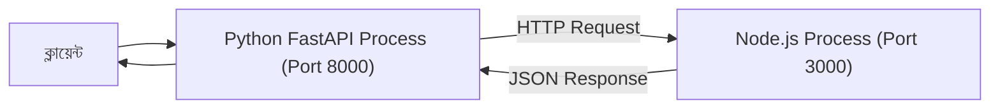

# ০৫. How to run multiple language software at the same time?

কোর্সের একদম শুরুর দিকে, Module 4 লেসন ৮-এ আমরা FastAPI আর Express.js-এর তুলনা করেছিলাম, আর লেসন ৭-এ দেখেছিলাম কীভাবে একটা ব্যাকএন্ড আরেকটা ব্যাকএন্ডকে ক্লায়েন্ট হিসেবে কল করতে পারে। তখন হয়তো প্রশ্ন জেগেছিল — যদি আমাদের সিস্টেমে একটা Python (FastAPI) সার্ভিস আর একটা Node.js বা Go সার্ভিস দুটোই দরকার হয়, তাহলে সেগুলো কি একসাথে চলতে পারে? এই মডিউলের শেষ লেসনে, process আর thread নিয়ে যা শিখেছি তার আলোকে, এই প্রশ্নের উত্তর এখন আমাদের কাছে অনেক সহজ।

উত্তরটা হলো — হ্যাঁ, সম্পূর্ণভাবে সম্ভব, কারণ প্রতিটা ভাষায় লেখা প্রোগ্রামই যখন চালানো হয়, তখন সেটা অপারেটিং সিস্টেমের চোখে শুধুই একটা **প্রসেস**। অপারেটিং সিস্টেম কোনো পক্ষপাত করে না — সে জানেই না প্রসেসটা পাইথন দিয়ে লেখা নাকি জাভাস্ক্রিপ্ট দিয়ে, C++ দিয়ে নাকি Go দিয়ে। তার কাছে প্রতিটা প্রসেসই একটা স্বাধীন, নিজস্ব মেমরিওয়ালা একক — ঠিক যেমন এই মডিউলের শুরুতে আমরা রেস্টুরেন্ট শাখার উদাহরণে বলেছিলাম, একই শহরে থাই খাবারের একটা শাখা আর বাঙালি খাবারের একটা শাখা পাশাপাশি চলতে কোনো বাধা নেই। এই কোর্সে আমরা একাধিক স্ট্যাক (Python/FastAPI, আর প্রয়োজনে Node.js বা Go) নিয়ে কাজ করছি, তাই এই ধারণাটা নিছক তাত্ত্বিক নয় — বাস্তবেই তোমার মেশিনে এই প্রসেসগুলো পাশাপাশি চলবে।

```bash
# টার্মিনাল ১ - Python FastAPI সার্ভিস চালু
uvicorn main:app --port 8000
# আউটপুট: Uvicorn running on port 8000

# টার্মিনাল ২ - Node.js ব্যাকএন্ড চালু
node server.js
# আউটপুট: Server running on port 3000
```

এখানে দুটো সম্পূর্ণ আলাদা প্রসেস, দুটো আলাদা প্রোগ্রামিং ভাষার রানটাইম দিয়ে চলছে, দুটো আলাদা পোর্টে (Module 2-তে শেখা পোর্টের ধারণা) কান পেতে বসে আছে। তারা একে অপরের অস্তিত্ব সম্পর্কে কিছুই জানে না, যতক্ষণ না কেউ তাদের একে অপরের সাথে যোগাযোগ করানোর ব্যবস্থা করে। `ps aux`-এ দেখলে দুটোই আলাদা PID নিয়ে, নিজের নিজের মেমরিতে, নিজের নিজের ভাষার রানটাইমে (একটা CPython ইন্টারপ্রেটার, একটা V8/Node রানটাইম) স্বাধীনভাবে বসে থাকবে।

আর সেই যোগাযোগটাই হলো আসল কৌশল — Module 4 লেসন ৭-এ আমরা যেমন শিখেছিলাম, একটা ব্যাকএন্ড আরেকটা ব্যাকএন্ডকে সাধারণ HTTP রিকোয়েস্টের মাধ্যমে কল করতে পারে, ঠিক ক্লায়েন্ট যেভাবে সার্ভারকে কল করে।

```python
# Python FastAPI সার্ভিস থেকে অন্য একটা ভাষার সার্ভিসকে কল করা
import httpx

async def call_node_service():
    async with httpx.AsyncClient() as client:
        response = await client.post(
            "http://localhost:3000/analyze",
            json={"text": "এই ডেটা প্রসেস করো"}
        )
        return response.json()
```

এই প্যাটার্নটা বাস্তব জগতে খুবই সাধারণ। মনে করো একটা কোম্পানির মূল ব্যাকএন্ড Python (FastAPI)-এ লেখা কারণ তাদের একটা মেশিন লার্নিং মডেল আছে যেটা পাইথনে সবচেয়ে ভালোভাবে চলে, কিন্তু রিয়েল-টাইম নোটিফিকেশনের জন্য একটা Node.js সার্ভিস আলাদাভাবে চলছে, বা পারফরম্যান্স-ক্রিটিক্যাল কোনো অংশ Go দিয়ে লেখা। তখন এই আলাদা আলাদা প্রসেস আলাদা ভাষায় চালিয়ে, তাদের মাঝে HTTP দিয়ে সেতু বানিয়ে দেওয়া হয় — প্রতিটা ভাষা তার সবচেয়ে শক্তিশালী জায়গায় কাজ করে, আর অপারেটিং সিস্টেমের কাছে তারা নিরীহভাবে পাশাপাশি চলা কয়েকটা স্বাধীন প্রসেস মাত্র।



এই ছোট মডিউলে আমরা কোডের গণ্ডি পেরিয়ে অপারেটিং সিস্টেমের স্তরে গিয়েছিলাম — process কী, কীভাবে খুঁজে বের করতে হয়, কীভাবে বন্ধ করতে হয়, thread কী, GIL কেন Python-এর থ্রেডিংকে Node.js থেকে ভিন্ন করে তোলে, আর কীভাবে ভিন্ন ভিন্ন ভাষার সার্ভিস একসাথে সহাবস্থান করে। এই ধারণাগুলো এখন থেকে যতবার তুমি কোনো সার্ভার চালু বা বন্ধ করবে, প্রতিবারই কাজে লাগবে।

কোর্স এখান থেকে এগিয়ে যাবে Module 11 — Cookies And Sessions-এর দিকে, যেখানে আমরা দেখবো, HTTP নিজে থেকে কোনো কিছু "মনে রাখে না" হওয়া সত্ত্বেও, কীভাবে একটা ওয়েবসাইট একজন ইউজারকে লগইন অবস্থায় "মনে রাখতে" পারে।
