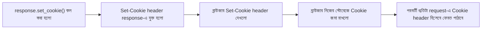

# ০২. Cookie বোঝা: কীভাবে বানাতে ও সেভ করতে হয়

আগের লেসনে আমরা বুঝেছি Cookie কেন দরকার। এবার হাতে-কলমে দেখি — FastAPI দিয়ে কীভাবে একটা Cookie বানানো যায়, ব্রাউজারে সেটা কীভাবে জমা হয়, আর কীভাবে সেটা পড়া যায়।

FastAPI-এ Cookie বসানোর জন্য `Response` অবজেক্টের একটা মেথড আছে — `response.set_cookie(key, value, max_age, ...)`। Node.js/Express-এর `res.cookie(name, value, options)`-এর সাথে ধারণাটা প্রায় একই, শুধু নাম আর argument সাজানোর ধরনটা একটু আলাদা।

```python
from fastapi import FastAPI, Response

app = FastAPI()


@app.get("/set-cookie")
def set_cookie(response: Response):
    response.set_cookie(key="username", value="arman", max_age=60)  # ৬০ সেকেন্ড পর্যন্ত বৈধ
    return {"message": "Cookie সেট করা হয়েছে!"}
```

```bash
uvicorn main:app --reload
```

লক্ষ্য করো, route function-এর parameter-এ আমরা `response: Response` লিখে দিয়েছি — FastAPI নিজে থেকেই বুঝে নেয় এটা একটা special object, এবং route চলা শেষে এই `response`-এর ওপর যা যা করা হয়েছে (যেমন cookie সেট করা), সেগুলো আসল HTTP response-এর সাথে জুড়ে দেয়। এই route-এ হিট করলে, response-এর সাথে একটা `Set-Cookie: username=arman; Max-Age=60; Path=/` header যাবে। ব্রাউজার (বা Postman) এটা দেখে নিজের স্টোরেজে জমা রাখবে। Chrome-এ DevTools খুলে Application ট্যাবে গেলে তুমি নিজের চোখেই দেখতে পাবে এই Cookie জমা আছে।

| | Node.js/Express | Python/FastAPI |
|---|---|---|
| Cookie সেট করা | `res.cookie(name, value, options)` | `response.set_cookie(key, value, max_age=...)` |
| Cookie পড়া | `req.cookies.name` (cookie-parser লাগে) | `request.cookies.get("name")` (বিল্ট-ইন, আলাদা প্যাকেজ লাগে না) |
| Cookie মোছা | `res.clearCookie(name)` | `response.delete_cookie(key)` |

এখন প্রশ্ন হলো — Cookie পড়বো কীভাবে? এখানে FastAPI-এর একটা বড় সুবিধা আছে — Express-এ যেমন `req.cookies` পেতে আলাদা `cookie-parser` middleware লাগে, FastAPI-এ এটা বিল্ট-ইন। শুধু route function-এ `request: Request` parameter নিলেই `request.cookies` একটা dict হিসেবে পাওয়া যায়:

```python
from fastapi import Request

@app.get("/read-cookie")
def read_cookie(request: Request):
    username = request.cookies.get("username")  # "arman"
    return {"message": f"তোমার cookie-তে username: {username}"}
```

Cookie বানানোর সময় কিছু গুরুত্বপূর্ণ parameter থাকে, যেগুলো Cookie-র আচরণ নিয়ন্ত্রণ করে:

| Parameter | কাজ |
|---|---|
| `max_age` | কত সেকেন্ড পর্যন্ত Cookie বৈধ থাকবে (Express-এ এটা মিলিসেকেন্ডে, FastAPI-এ সেকেন্ডে — এই পার্থক্যটা মনে না রাখলে bug হতে পারে) |
| `expires` | কোন নির্দিষ্ট তারিখ-সময়ে Cookie মেয়াদ শেষ হবে |
| `httponly` | `True` হলে JavaScript দিয়ে (`document.cookie`) Cookie পড়া যাবে না — শুধু HTTP request-এ যাবে |
| `secure` | `True` হলে শুধু HTTPS কানেকশনে Cookie পাঠানো হবে |
| `path` | কোন route/path-এ Cookie প্রযোজ্য হবে |
| `samesite` | `"lax"`, `"strict"`, বা `"none"` — cross-site request-এ Cookie যাবে কিনা নিয়ন্ত্রণ করে |

`httponly` আর `secure` — এই দুইটা parameter বিশেষভাবে মনে রাখা দরকার, কারণ Module 11-এর শেষের দিকে আমরা যখন Cookie-ভিত্তিক Auth-এর নিরাপত্তা সমস্যা নিয়ে কথা বলবো, তখন এই দুইটাই বারবার ফিরে আসবে। আপাতত এইটুকু মনে রাখো — `httponly=True` মানে হ্যাকার যদি তোমার সাইটে কোনোভাবে ক্ষতিকর JavaScript ঢুকিয়েও দেয়, সে তোমার Cookie চুরি করতে পারবে না, কারণ সেই স্ক্রিপ্ট Cookie-টা দেখতেই পাবে না।

Cookie মুছে ফেলতে চাইলে `response.delete_cookie("username")` ব্যবহার করা হয় — এটা মূলত ব্রাউজারকে বলে "এই Cookie-র মেয়াদ এক্ষুনি শেষ করে দাও।"

একটা প্রোডাকশন-লেভেল ভুল যা প্রায় সবাই একবার করে ফেলে — `set_cookie` আর `delete_cookie`-এর `path` আর `domain` parameter অবশ্যই একই হতে হবে, নাহলে delete কাজ করবে না। ধরো তুমি `path="/api"` দিয়ে Cookie সেট করেছো, কিন্তু delete করার সময় `path` উল্লেখ করোনি (default `/`) — ব্রাউজার এটাকে সম্পূর্ণ ভিন্ন একটা Cookie ধরে নেবে, আর পুরনো Cookie-টা রয়েই যাবে ব্রাউজারে।



এখন আমরা জানি কীভাবে Cookie বানাতে ও পড়তে হয়। পরের লেসনে আমরা এটা ব্যবহার করে সত্যিকারের একটা কাজের জিনিস বানাবো — Cookie দিয়ে লগইন সিস্টেম আর একটা প্রোটেক্টেড রুট।
