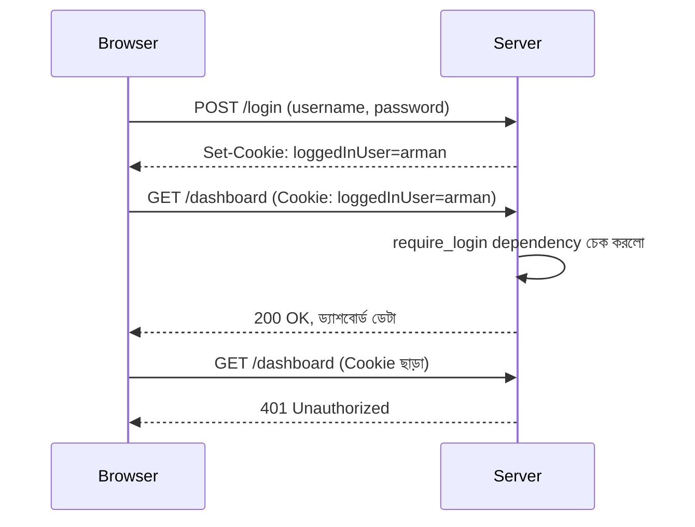

# ০৩. Cookie দিয়ে সিম্পল লগইন ও Protected Route

এখন পর্যন্ত আমরা Cookie বানাতে আর পড়তে শিখেছি। কিন্তু বাস্তব দুনিয়ায় Cookie-র সবচেয়ে পরিচিত ব্যবহার হলো — একজন ব্যবহারকারী লগইন করার পর তাকে "মনে রাখা", আর কিছু নির্দিষ্ট পাতা শুধু লগইন করা মানুষদেরই দেখানো। একে বলে **protected route**। এই লেসনে আমরা এটাই বানাবো, যদিও এখনো খুব সাধারণ (naive) পদ্ধতিতে — আসল, নিরাপদ পদ্ধতি আমরা ধাপে ধাপে শিখবো।

Express-এ এই কাজের জন্য `cookie-parser` নামের একটা আলাদা middleware লাগতো। FastAPI-এ Cookie পড়ার সুবিধা বিল্ট-ইন, তাই আলাদা কিছু ইনস্টল করার দরকার নেই — শুধু `fastapi` আর `uvicorn` থাকলেই চলবে।

```python
from fastapi import FastAPI, Request, Response, HTTPException, Depends

app = FastAPI()

# ভুয়া ইউজার ডেটাবেস, শুধু শেখার জন্য
users = [{"username": "arman", "password": "1234"}]


@app.post("/login")
def login(username: str, password: str, response: Response):
    user = next(
        (u for u in users if u["username"] == username and u["password"] == password),
        None,
    )

    if not user:
        raise HTTPException(status_code=401, detail="ভুল username অথবা password")

    # লগইন সফল হলে একটা Cookie সেট করে দিচ্ছি
    response.set_cookie(key="loggedInUser", value=username, httponly=True, max_age=3600)
    return {"message": "লগইন সফল!"}
```

লক্ষ্য করো, লগইন সফল হলেই আমরা `loggedInUser` নামে একটা Cookie সেট করে দিচ্ছি, যার মধ্যে username জমা আছে। এখন এই তথ্য ব্যবহার করে আমরা একটা **dependency** বানাবো, যেটা যাচাই করবে অনুরোধকারীর কাছে বৈধ Cookie আছে কিনা — Module 8-এ শেখা middleware চেইনের ধারণাটাই এখানে কাজে লাগছে, তবে FastAPI-এ এই কাজটা করার নিজস্ব ও বেশি প্রচলিত পদ্ধতি হলো **Dependency Injection (`Depends`)**।

```python
def require_login(request: Request) -> str:
    user = request.cookies.get("loggedInUser")

    if not user:
        raise HTTPException(status_code=401, detail="আগে লগইন করুন")

    return user  # পরের handler-এর জন্য রিটার্ন করে দিলাম


@app.get("/dashboard")
def dashboard(user: str = Depends(require_login)):
    return {"message": f"স্বাগতম, {user}! এটা তোমার ড্যাশবোর্ড।"}
```

এই `require_login` dependency-টাই আসল "গেটকিপার" — কেউ `/dashboard`-এ ঢুকতে চাইলে, FastAPI প্রথমে এই function-টা চালায়, Cookie চেক করে, তারপর এর return value-টা `user` parameter-এ বসিয়ে route function-টা চালায়। Cookie না থাকলে সে `HTTPException` তুলে ৪০১ Status Code (Module 6-এ শেখা Unauthorized) ফেরত দিয়ে দেয়, আর route function-টা আর চলেই না।

| | Node.js/Express | Python/FastAPI |
|---|---|---|
| Cookie যাচাইয়ের প্যাটার্ন | `requireLogin` middleware, `next()` কল করে | `require_login` dependency function, return value দিয়ে |
| ব্যর্থ হলে | `res.status(401).json(...)`, `next()` কল করা হয় না | `HTTPException(status_code=401, ...)` raise করা হয় |
| Route-এ যুক্ত করা | route-এর argument-এ middleware বসানো | `Depends(require_login)` দিয়ে |



FastAPI-এর dependency-র একটা বাড়তি সুবিধা এখানে খেয়াল করার মতো — একই `require_login` dependency তুমি চাইলে আরও দশটা route-এ পাঠিয়ে দিতে পারো, কোনো কোড আবার না লিখেই, আর `/docs`-এ গিয়ে দেখলে FastAPI নিজে থেকেই বুঝিয়ে দেবে কোন route-এর জন্য এই dependency লাগছে।

এই সিস্টেমটা কাজ করছে, কিন্তু এখানে একটা বড় দুর্বলতা লুকিয়ে আছে যেটা আমরা এখনই চিহ্নিত করে রাখি — আমরা সরাসরি Cookie-তে username রেখে দিচ্ছি, কোনো এনক্রিপশন বা যাচাই ছাড়া। কেউ যদি বুঝে ফেলে Cookie-র নাম আর ফরম্যাট, সে নিজে থেকে Cookie বানিয়ে যেকোনো username বসিয়ে দিতে পারবে, আর সার্ভার বিশ্বাস করে নেবে! এই সমস্যাটা সমাধানের জন্যই দরকার হয় **Session** — যেখানে Cookie-তে শুধু একটা এলোমেলো ID থাকে, আসল তথ্য থাকে সার্ভারের নিজের কাছে।

পরের লেসনে আমরা ঠিক এই সমস্যা সমাধান করতে নিজের হাতে (custom) একটা Session সিস্টেম বানাবো।
