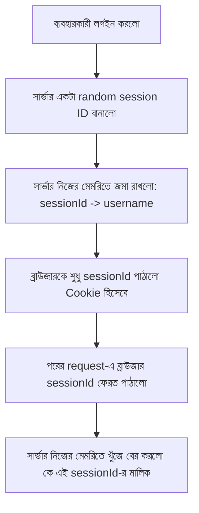

# ০৪. Cookie দিয়ে Session বানানো: Custom Session Storage

আগের লেসনের শেষে আমরা একটা ফাঁকফোকর খুঁজে পেয়েছিলাম — Cookie-তে সরাসরি username রেখে দিলে যে কেউ সেটা নকল করে জালিয়াতি করতে পারে। এই সমস্যার সমাধান হলো একটা সহজ কিন্তু শক্তিশালী ধারণা: Cookie-তে আসল তথ্য না রেখে, শুধু একটা এলোমেলো, অনুমান-অযোগ্য ID রাখো, আর আসল তথ্য জমা রাখো সার্ভারের নিজের মেমরিতে। একেই বলে **Session**।

চিন্তা করো এটা অনেকটা ক্লোকরুম টিকিটের মতো — তুমি কনসার্টে ঢোকার সময় ব্যাগ জমা দিলে, বদলে পেলে একটা টিকিট নম্বর, যেমন "৪৭"। তোমার ব্যাগে কী আছে সেটা টিকিটে লেখা নেই, শুধু নম্বরটা আছে। ফেরত নেয়ার সময় টিকিট দেখালেই কর্মচারী তার নিজের রেকর্ড বই থেকে দেখে বলে দেয় তোমার ব্যাগ কোনটা। Cookie হলো সেই টিকিট, আর সার্ভারের মেমরি হলো রেকর্ড বই।



চলো নিজের হাতে এটা বানাই। এলোমেলো ID বানানোর জন্য Python-এর built-in `secrets` মডিউল ব্যবহার করবো — Node.js-এর `crypto.randomBytes`-এর সমতুল্য, তবে `secrets` মডিউলটা বিশেষভাবেই security-sensitive random value বানানোর জন্য ডিজাইন করা (সাধারণ `random` মডিউল ভুলেও এই কাজে ব্যবহার করা উচিত না, কারণ সেটা predictable, cryptographically secure নয়)।

```python
import secrets
from datetime import datetime
from fastapi import FastAPI, Request, Response, HTTPException, Depends

app = FastAPI()

users = [{"username": "arman", "password": "1234"}]

# এটাই আমাদের "রেকর্ড বই" — আসল Session Storage, সার্ভারের মেমরিতে
session_store: dict[str, dict] = {}


@app.post("/login")
def login(username: str, password: str, response: Response):
    user = next(
        (u for u in users if u["username"] == username and u["password"] == password),
        None,
    )

    if not user:
        raise HTTPException(status_code=401, detail="ভুল username অথবা password")

    session_id = secrets.token_hex(16)  # এলোমেলো ID
    session_store[session_id] = {"username": username, "logged_in_at": datetime.now()}

    response.set_cookie(key="sessionId", value=session_id, httponly=True, max_age=3600)
    return {"message": "লগইন সফল!"}


def require_login(request: Request) -> str:
    session_id = request.cookies.get("sessionId")
    session = session_store.get(session_id)

    if not session:
        raise HTTPException(status_code=401, detail="আগে লগইন করুন")

    return session["username"]


@app.get("/dashboard")
def dashboard(user: str = Depends(require_login)):
    return {"message": f"স্বাগতম, {user}!"}


@app.post("/logout")
def logout(request: Request, response: Response):
    session_store.pop(request.cookies.get("sessionId"), None)  # রেকর্ড বই থেকে মুছে ফেললাম
    response.delete_cookie("sessionId")
    return {"message": "লগআউট সফল"}
```

এখন লক্ষ্য করো, Cookie-তে থাকা `sessionId` দেখে কেউ বুঝতেই পারবে না এটা কার — এটা শুধু একটা অর্থহীন এলোমেলো স্ট্রিং। আসল তথ্য (কে লগইন করেছে, কখন করেছে) সব সার্ভারের `session_store` ডিকশনারিতে, যেটা বাইরের কেউ কখনো সরাসরি দেখতে পায় না। এটাই Session-ভিত্তিক পদ্ধতির মূল শক্তি — ব্রাউজারের হাতে শুধু একটা "চাবি" থাকে, "তালা" আর "ঘর" দুটোই থাকে সার্ভারের কাছে।

| | Node.js/Express | Python/FastAPI |
|---|---|---|
| এলোমেলো ID | `crypto.randomBytes(16).toString("hex")` | `secrets.token_hex(16)` |
| Session storage | সাধারণ JS object (`{}`) | সাধারণ dict (`{}`) |
| Session storage-এর টাইপ safety | নেই | চাইলে Pydantic model দিয়ে টাইপ-সেফ করা যায় |

তবে এই `session_store` ডিকশনারির নিজেরও একটা সীমাবদ্ধতা আছে, আর এটা প্রায় নতুন ডেভেলপারদের সবচেয়ে বড় production mistake-এর একটা — এটা শুধু একটা সাধারণ Python dict, যেটা প্রসেসের RAM-এ থাকে। এর মানে দুটো বড় সমস্যা:

১. **সার্ভার রিস্টার্ট হলে সব Session হারিয়ে যাবে।** `uvicorn --reload` চালু থাকলে কোড বদলানোর সাথে সাথে প্রসেস রিস্টার্ট হয়, আর সাথে সাথে `session_store` খালি হয়ে যায় — সব ইউজার লগআউট হয়ে যায় কোনো নোটিশ ছাড়াই।

২. **একাধিক worker process চললে প্রতিটার আলাদা মেমরি থাকবে।** প্রোডাকশনে সাধারণত `uvicorn` বা `gunicorn` দিয়ে একাধিক worker process চালানো হয় (CPU-র সব কোর ব্যবহার করার জন্য)। প্রতিটা worker-এর নিজের আলাদা Python প্রসেস, তার মানে আলাদা মেমরি, তার মানে আলাদা `session_store`! Load balancer যদি লগইন request-টা worker-1-এ পাঠায় আর পরের request worker-2-এ পাঠায়, worker-2 এই session-এর কোনো হদিসই পাবে না। এই একই সমস্যা Node.js/Express-এও হয় — এটা framework-নির্দিষ্ট কোনো বাগ নয়, বরং in-memory storage-এর একটা মৌলিক সীমাবদ্ধতা।

বাস্তব প্রজেক্টে তাই মানুষ নিজে হাতে এই Storage না বানিয়ে, পরীক্ষিত একটা লাইব্রেরি বা কেন্দ্রীয় storage (যেমন Redis) ব্যবহার করে।

পরের লেসনে আমরা দেখবো কীভাবে third-party session middleware এই একই কাজ আরও পরিণত, নিরাপদ, আর কনফিগারযোগ্য উপায়ে করে দেয়।
