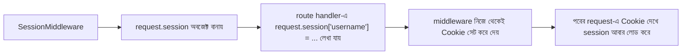

# ০৫. Third Party Library দিয়ে Session ও Cookie (SessionMiddleware, Redis-backed session)

আগের লেসনে আমরা নিজের হাতে একটা `session_store` ডিকশনারি বানিয়ে Session ম্যানেজ করেছিলাম। এটা কাজ করে, কিন্তু বাস্তব প্রজেক্টে এই চাকা আবার নতুন করে বানানোর দরকার নেই — কারণ session ID বানানো, মেয়াদ নিয়ন্ত্রণ করা, নিরাপদভাবে Cookie সাইন করা, এইসব খুঁটিনাটি ইতিমধ্যে হাজারো ডেভেলপার মিলে টেস্ট করে, ভুল ঠিক করে পরিণত লাইব্রেরিতে রূপ দিয়েছে।

FastAPI যেহেতু নিজেই Starlette-এর ওপর তৈরি (Module 4-এ আমরা এটা জেনেছিলাম), তাই Starlette-এর নিজস্ব `SessionMiddleware`-টাই এখানে Express-এর `express-session`-এর সমতুল্য কাজ করে। এটা পুরো Session ব্যবস্থাটাই সামলায়: session data সাইন করা, Cookie সেট করা, request-এ ফিরে এলে সেটা যাচাই করে ফিরিয়ে দেয়া — সব একসাথে।

```bash
pip install itsdangerous  # SessionMiddleware-এর নিচে এটা লাগে cookie সাইন করার জন্য
```

```python
from fastapi import FastAPI, Request, HTTPException, Depends
from starlette.middleware.sessions import SessionMiddleware

app = FastAPI()
app.add_middleware(SessionMiddleware, secret_key="amar-goopon-chabi")  # Cookie সাইন করার জন্য গোপন চাবি

users = [{"username": "arman", "password": "1234"}]


@app.post("/login")
def login(username: str, password: str, request: Request):
    user = next(
        (u for u in users if u["username"] == username and u["password"] == password),
        None,
    )

    if not user:
        raise HTTPException(status_code=401, detail="ভুল username অথবা password")

    request.session["username"] = username  # ব্যস, এতটুকুই!
    return {"message": "লগইন সফল!"}


def require_login(request: Request) -> str:
    username = request.session.get("username")
    if not username:
        raise HTTPException(status_code=401, detail="আগে লগইন করুন")
    return username


@app.get("/dashboard")
def dashboard(user: str = Depends(require_login)):
    return {"message": f"স্বাগতম, {user}!"}


@app.post("/logout")
def logout(request: Request):
    request.session.clear()
    return {"message": "লগআউট সফল"}
```

লক্ষ্য করো, আমরা `session_store`, `secrets.token_hex`, ম্যানুয়াল Cookie সেট করা — এসব কিছুই আর নিজে লিখিনি। `SessionMiddleware` ভেতরে ভেতরে ঠিক আগের লেসনের মতোই কাজ করে — একটা Cookie বানায় (ডিফল্ট নাম `session`), আর `request.session` নামের একটা dict-এর মতো অবজেক্টে তথ্য জমা রাখে যেটা আমরা যেকোনো route-এ সরাসরি ব্যবহার করতে পারি।



| | Node.js/Express (`express-session`) | Python/FastAPI (`SessionMiddleware`) |
|---|---|---|
| সেটআপ | `app.use(session({secret, ...}))` | `app.add_middleware(SessionMiddleware, secret_key=...)` |
| ডেটা লেখা | `req.session.username = ...` | `request.session["username"] = ...` |
| ডিফল্ট storage | `MemoryStore` (সার্ভারের RAM) | Cookie-র ভেতরেই সাইন করা ডেটা (client-side!) |
| Destroy | `req.session.destroy()` | `request.session.clear()` |

এখানে একটা গুরুত্বপূর্ণ, আর প্রায়ই ভুল বোঝা পার্থক্য মনে রাখা দরকার — `express-session` ডিফল্টভাবে সার্ভারের মেমরিতে (`MemoryStore`) session data রাখে, Cookie-তে থাকে শুধু একটা ID। কিন্তু Starlette-এর `SessionMiddleware` ডিফল্টভাবে **পুরো session data-টাই** cryptographically-signed অবস্থায় Cookie-র ভেতরে রেখে দেয় — সার্ভারের কোনো storage লাগে না। এটা সুবিধার (কোনো storage সেটআপ না করেই কাজ চলে), কিন্তু এর মানে ব্রাউজারের ৪KB Cookie সীমার মধ্যেই থাকতে হবে, আর signed হলেও ব্যবহারকারী চাইলে decode করে ডেটা *পড়তে* পারবে (যদিও বদলাতে পারবে না, কারণ সাইনেচার ভেঙে যাবে) — তাই কখনো password বা sensitive তথ্য সরাসরি `request.session`-এ রাখা ঠিক না।

সত্যিকারের সার্ভার-সাইড session storage পেতে চাইলে (যেমন আগের লেসনের `session_store`-এর মতো, কিন্তু প্রোডাকশন-রেডি), সবচেয়ে প্রচলিত পথ হলো Redis ব্যবহার করা — `redis` প্যাকেজ দিয়ে সরাসরি, বা `fastapi-sessions`-এর মতো লাইব্রেরি দিয়ে যেখানে Cookie-তে শুধু একটা session ID যায়, আর আসল ডেটা Redis-এ জমা থাকে:

```python
import redis
import secrets
import json

r = redis.Redis(host="localhost", port=6379, decode_responses=True)


@app.post("/login")
def login(username: str, password: str, response: Response):
    # ... যাচাই করার পর ...
    session_id = secrets.token_hex(16)
    r.setex(session_id, 3600, json.dumps({"username": username}))  # ৩৬০০ সেকেন্ড পর expire
    response.set_cookie("sessionId", session_id, httponly=True, max_age=3600)
    return {"message": "লগইন সফল!"}
```

Redis ব্যবহার করলে আগের লেসনের `session_store`-এর সেই দুটো সমস্যাই একসাথে সমাধান হয়ে যায় — Redis একটা আলাদা প্রসেস হিসেবে চলে, তাই FastAPI সার্ভার রিস্টার্ট হলেও Redis-এর ডেটা থেকে যায়, আর একাধিক worker/সার্ভার সবাই একই Redis instance-এর সাথে কথা বলতে পারে, ফলে load balancing-এও session হারিয়ে যায় না। এখন আমরা শুধু ধারণাটা ঠিকভাবে বুঝে রাখছি; স্টোরেজ পরিবর্তন করা মূলত একটা কনফিগারেশনের বিষয়, মূল লজিক একই থাকে।

এখন পর্যন্ত আমরা Cookie আর Session দুটোই হাতে-কলমে বানিয়ে দেখেছি, নিজে হাতে আর লাইব্রেরি দিয়ে। পরের লেসনে আমরা একটু থেমে পুরো যাত্রাটা মাথায় গুছিয়ে নেবো।
