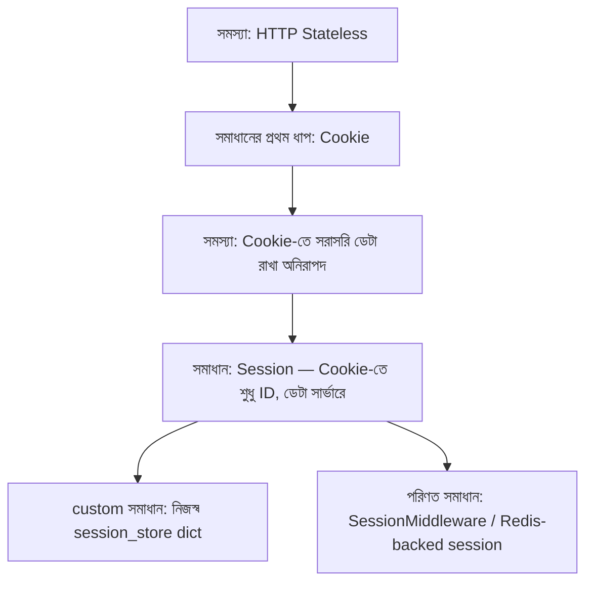

# ০৬. Session ও Cookie রিক্যাপ

এতগুলো লেসনে অনেক কিছু দেখেছি — চলো একটু থেমে, শ্বাস নিয়ে, পুরো যাত্রাটা একবার মাথার মধ্যে সাজিয়ে নেই। এটা নতুন কিছু শেখার লেসন না, বরং যা শিখেছি তা একটা পরিষ্কার ছবিতে জোড়া দেয়ার লেসন।

সবকিছুর শুরু হয়েছিলো একটা সমস্যা দিয়ে — HTTP স্বভাবগতভাবে **stateless**, মানে প্রতিটা request সার্ভারের কাছে সম্পূর্ণ নতুন, বিচ্ছিন্ন একটা ঘটনা। কিন্তু আমরা চাই সার্ভার মনে রাখুক কে লগইন করেছে, কার শপিং কার্টে কী আছে। এই ফাঁকটা পূরণ করতেই এসেছে **Cookie** — ব্রাউজারের কাছে জমা থাকা একটা ছোট তথ্যের টুকরো, যেটা প্রতিটা request-এর সাথে স্বয়ংক্রিয়ভাবে সার্ভারে ফেরত যায়।

আমরা প্রথমে Cookie-তে সরাসরি ব্যবহারকারীর তথ্য (যেমন username) রেখে একটা লগইন সিস্টেম বানিয়েছিলাম। এটা কাজ করলেও এখানে একটা বিপজ্জনক দুর্বলতা ছিলো — Cookie-র বিষয়বস্তু ব্রাউজার-সাইডে থাকে বলে জাল করা সহজ, যদি এনক্রিপশন বা যাচাই না থাকে।

এই সমস্যা সমাধান করতেই এসেছে **Session** ধারণা — Cookie-তে শুধু একটা অর্থহীন, এলোমেলো ID রাখা হয়, আসল তথ্য জমা থাকে সার্ভারের নিজের মেমরিতে (বা ডেটাবেসে)। আমরা এটা প্রথমে নিজের হাতে (একটা সাধারণ Python dict-এ) বানিয়েছি, তারপর দেখেছি কীভাবে Starlette-এর `SessionMiddleware` আর Redis-ভিত্তিক storage এই একই কাজ আরও নিরাপদ ও পরিণতভাবে করে।

পুরো ব্যবস্থাটার একটা সহজ সারসংক্ষেপ টেবিলে দেখা যাক:

| ধাপ | কী ঘটে |
|---|---|
| ১. লগইন | ব্যবহারকারী username/password পাঠায়, সার্ভার যাচাই করে |
| ২. Session তৈরি | সার্ভার একটা এলোমেলো ID বানায়, নিজের মেমরিতে ইউজার তথ্যের সাথে যুক্ত করে |
| ৩. Cookie পাঠানো | সেই ID-টাই `Set-Cookie` header দিয়ে ব্রাউজারে পাঠানো হয় |
| ৪. পরের request | ব্রাউজার স্বয়ংক্রিয়ভাবে Cookie header-এ ID ফেরত পাঠায় |
| ৫. যাচাই | middleware সেই ID দিয়ে সার্ভারের স্টোরেজে খুঁজে দেখে ব্যবহারকারী লগইন করা কিনা |
| ৬. লগআউট | Session মুছে ফেলা হয়, Cookie clear করা হয় |

এই ছয়টা ধাপ মুখস্থ করার দরকার নেই — বরং বুঝে নাও কেন প্রতিটা ধাপ দরকার, তাহলে যেকোনো ভাষা বা ফ্রেমওয়ার্কে (Django, Laravel, Spring — যেখানেই যাও) এই একই প্যাটার্ন চিনতে পারবে, কারণ ধারণাটা ভাষা-নিরপেক্ষ।

একটা জিনিস প্রায়ই মানুষ গুলিয়ে ফেলে — "Cookie" আর "Session" কি একই জিনিস? উত্তর হলো না, এরা একে অপরের পরিপূরক কিন্তু আলাদা ধারণা। Cookie হলো পরিবহনের মাধ্যম (ব্রাউজারে জমা তথ্য), আর Session হলো একটা প্যাটার্ন/কৌশল যেখানে সেই Cookie-কে ব্যবহার করা হয় শুধু একটা রেফারেন্স হিসেবে। পরের লেসনে আমরা এই পার্থক্যটা আরও স্পষ্টভাবে পাশাপাশি রেখে দেখবো।

একটা বাস্তব-জগতের common mistake এখানে উল্লেখ করার মতো — লেসন ৫-এ আমরা দেখেছি Starlette-এর `SessionMiddleware` ডিফল্টভাবে পুরো session data-টাই signed Cookie-তে রেখে দেয়, সার্ভারে কিছু জমা রাখে না। অনেক নতুন ডেভেলপার এটাকে "custom session_store"-এর মতোই ধরে নিয়ে password বা অন্য sensitive তথ্য সরাসরি `request.session`-এ বসিয়ে দেয় — যা ভুল, কারণ signed মানেই encrypted না, ব্যবহারকারী ইচ্ছা করলে সেই ডেটা decode করে পড়ে ফেলতে পারে। কোন ধরনের session backend ব্যবহার করছো সেটা বোঝা, শুধু "session লাগবে" জানাটাই যথেষ্ট না।
