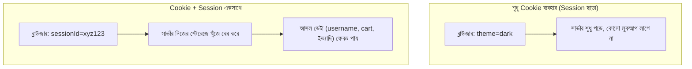

# ০৭. Session বনাম Cookie

আগের লেসনের শেষে আমরা একটা প্রশ্ন তুলে রেখেছিলাম — Cookie আর Session কি একই জিনিস? এই লেসনে আমরা দুটোকে পাশাপাশি রেখে পার্থক্যটা একদম স্পষ্ট করে ফেলবো, কারণ এই বিভ্রান্তি নতুন ডেভেলপারদের মধ্যে খুবই সাধারণ।

সবচেয়ে সহজ করে বললে — **Cookie হলো একটা জায়গা (storage mechanism), আর Session হলো একটা কৌশল (pattern)** যেটা সেই জায়গাকে ব্যবহার করে। এটা অনেকটা এরকম — "খাম" হলো একটা জিনিস বহন করার মাধ্যম, আর "চিঠি পাঠানোর নিয়ম" হলো একটা প্যাটার্ন যা ব্যবহার করে খামকে অর্থপূর্ণ কাজে লাগানো হয়। খাম দিয়ে তুমি টাকাও পাঠাতে পারো, চিঠিও পাঠাতে পারো — তেমনই Cookie দিয়ে তুমি সরাসরি ডেটাও রাখতে পারো (যেমন লেসন ৩-এ করেছিলাম), অথবা Session-এর জন্য শুধু একটা ID রাখতে পারো (লেসন ৪ ও ৫-এ করেছিলাম)।

| দিক | Cookie | Session |
|---|---|---|
| ডেটা কোথায় থাকে | ব্রাউজারে (client-side) | সার্ভারে (server-side), শুধু ID ব্রাউজারে |
| আকারের সীমা | সাধারণত ৪KB পর্যন্ত | সার্ভারের মেমরি/ডেটাবেসের সীমা অনুযায়ী, তুলনামূলক অনেক বড় ডেটা রাখা যায় |
| নিরাপত্তা | ব্যবহারকারী নিজে দেখতে/বদলাতে পারে (httpOnly না থাকলে) | ব্যবহারকারী শুধু ID দেখে, আসল ডেটা তার নাগালের বাইরে |
| সার্ভার রিসোর্স | সার্ভারে কোনো জায়গা লাগে না | প্রতিটা লগইন ইউজারের জন্য সার্ভারে মেমরি/স্টোরেজ লাগে |
| মেয়াদ নিয়ন্ত্রণ | ব্রাউজার নিয়ন্ত্রণ করে (`maxAge`/`expires`) | সার্ভার নিয়ন্ত্রণ করে, চাইলে যেকোনো সময় জোর করে মুছে ফেলতে পারে |
| উদাহরণ | ভাষা পছন্দ (`lang=bn`), থিম (`theme=dark`) | লগইন অবস্থা, শপিং কার্টের বিস্তারিত তথ্য |

এখান থেকে একটা গুরুত্বপূর্ণ সিদ্ধান্ত নেয়ার নিয়ম বের করা যায় — যদি তথ্যটা এমন হয় যা ব্যবহারকারী নিজে দেখলে বা বদলে ফেললে কোনো সমস্যা নেই (যেমন ভাষা পছন্দ, ডার্ক মোড অন/অফ), সরাসরি Cookie ব্যবহার করাই যথেষ্ট। কিন্তু যদি তথ্যটা সংবেদনশীল হয়, বা ব্যবহারকারীর হাতে বদলে ফেলার সুযোগ থাকলে ক্ষতি হতে পারে (যেমন লগইন অবস্থা, ব্যালেন্স, পারমিশন), তাহলে অবশ্যই Session প্যাটার্ন ব্যবহার করতে হবে — Cookie-তে শুধু ID, ডেটা সার্ভারে।

তবে Session-ভিত্তিক পদ্ধতিরও নিজস্ব কিছু সীমাবদ্ধতা আছে, বিশেষ করে যখন তোমার অ্যাপ্লিকেশন বড় হতে শুরু করে, একাধিক সার্ভারে ছড়িয়ে যায়, বা মোবাইল অ্যাপের সাথে কাজ করতে হয়। পরের লেসনে আমরা ঠিক এই সমস্যাগুলো নিয়ে বিস্তারিত কথা বলবো — কারণ এগুলো বোঝাই আমাদের Module 12-এ JWT শেখার আসল কারণ হয়ে দাঁড়াবে।
