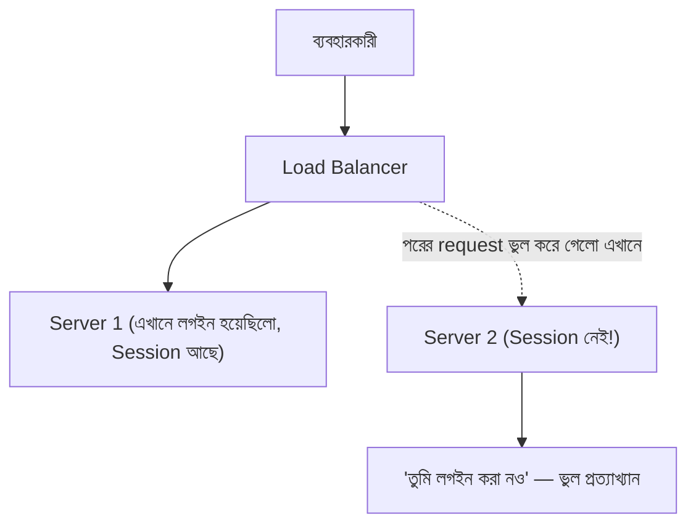
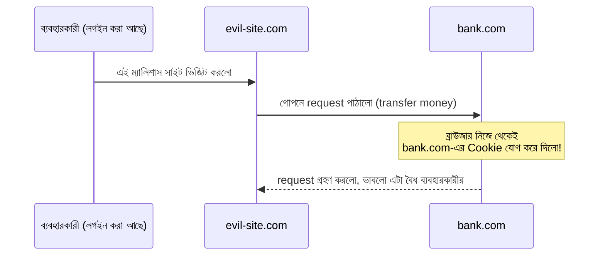

# ০৮. Cookie-ভিত্তিক Auth সিস্টেমের সমস্যা

Cookie আর Session মিলে যে Authentication পদ্ধতি আমরা এতক্ষণ বানিয়েছি, সেটা ছোট প্রজেক্টে চমৎকার কাজ করে। কিন্তু বাস্তব দুনিয়ায় যখন অ্যাপ্লিকেশন বড় হয়, ইউজার বাড়ে, আর সিস্টেম জটিল হয়, তখন এই পদ্ধতির কিছু গভীর সীমাবদ্ধতা প্রকাশ পেতে শুরু করে। এই সমস্যাগুলো বোঝা খুব জরুরি, কারণ এগুলোই ব্যাখ্যা করবে কেন আধুনিক অনেক সিস্টেম JWT-র মতো ভিন্ন একটা পদ্ধতির দিকে ঝুঁকেছে — যা আমরা পরের মডিউলে শিখবো।

প্রথম সমস্যাটা হলো **স্কেলেবিলিটি**। মনে করো তোমার অ্যাপ্লিকেশন এত জনপ্রিয় হয়ে গেছে যে একটা সার্ভার আর সামলাতে পারছে না, তাই তুমি একাধিক সার্ভার চালু করলে (লোড ব্যালান্সিং)। এখন সমস্যা হলো — ব্যবহারকারী যখন লগইন করে, তার Session তথ্য জমা হয় যে সার্ভারটা তখন রিকোয়েস্ট হ্যান্ডেল করেছিলো তার মেমরিতে। পরের request যদি লোড ব্যালান্সার অন্য একটা সার্ভারে পাঠায়, সেই সার্ভারের মেমরিতে তো এই Session-এর কোনো হদিস নেই!

এই সমস্যা সমাধানের কিছু উপায় আছে বটে (যেমন Redis-এ কেন্দ্রীয়ভাবে Session রাখা, বা "sticky session" ব্যবহার করা), কিন্তু এগুলো অতিরিক্ত জটিলতা আর অবকাঠামোগত খরচ যোগ করে।

দ্বিতীয় সমস্যা হলো **Cross-Domain সীমাবদ্ধতা**। Cookie মূলত একটা নির্দিষ্ট ডোমেইনের সাথে বাঁধা থাকে। ধরো তোমার ফ্রন্টএন্ড চলছে `app.example.com`-এ, আর API সার্ভার আলাদা ডোমেইন `api.example.com` বা সম্পূর্ণ ভিন্ন কোম্পানির ডোমেইনে। এরকম পরিস্থিতিতে Cookie ঠিকমতো পাঠানো, ব্রাউজারের নিরাপত্তা নীতি (CORS, SameSite) মেনে কাজ করানো অনেক বেশি ঝামেলার হয়ে যায়।

তৃতীয় সমস্যা — **মোবাইল অ্যাপ ও অন্যান্য ক্লায়েন্ট**। Cookie মূলত ব্রাউজারের একটা ফিচার। কিন্তু আজকাল একই ব্যাকএন্ড API-কে সার্ভ করতে হয় ওয়েব অ্যাপ, মোবাইল অ্যাপ (Android/iOS), এমনকি IoT ডিভাইসকেও। মোবাইল অ্যাপে Cookie জমা রাখা আর পাঠানো ব্রাউজারের মতো স্বয়ংক্রিয়ভাবে হয় না — প্রতিটা প্ল্যাটফর্মে আলাদা করে হ্যান্ডেল করতে হয়, যা অতিরিক্ত জটিলতা তৈরি করে।

চতুর্থ সমস্যা — **CSRF (Cross-Site Request Forgery)**-এর ঝুঁকি। যেহেতু ব্রাউজার প্রতিটা request-এ Cookie স্বয়ংক্রিয়ভাবে জুড়ে দেয় (এমনকি অন্য কোনো ম্যালিশাস ওয়েবসাইট থেকে পাঠানো request-এও), তাই একজন আক্রমণকারী একটা ভুয়া পাতা বানিয়ে ব্যবহারকারীকে দিয়ে না জেনে অনুরোধ পাঠিয়ে দিতে পারে, আর ব্রাউজার নিজের Cookie যোগ করে সেটাকে বৈধ বানিয়ে দেয়। এটা ঠেকাতে অতিরিক্ত সুরক্ষা ব্যবস্থা (CSRF token) দরকার হয়।

এই চারটা সমস্যা — স্কেলেবিলিটি, ক্রস-ডোমেইন, মাল্টি-প্ল্যাটফর্ম সমর্থন, আর CSRF ঝুঁকি — মিলিয়েই বোঝা যায় Cookie/Session পদ্ধতি সব পরিস্থিতির জন্য আদর্শ নয়। এগুলো একেবারে অকেজো নয় — অনেক প্রজেক্টে আজও ভালোভাবে ব্যবহৃত হয় — কিন্তু আধুনিক, ছড়িয়ে থাকা (distributed), মাল্টি-প্ল্যাটফর্ম সিস্টেমের জন্য একটা ভিন্ন সমাধান দরকার হয়ে পড়ে, যেটাকে বলে **token-based authentication** — যার সবচেয়ে জনপ্রিয় রূপ হলো JWT। এই ভিত্তির ওপর দাঁড়িয়েই আমরা Module 12-এ প্রবেশ করবো।

তার আগে, শেষ দুইটা লেসনে আমরা দেখবো Cookie বাস্তবে কোথায় কোথায় ব্যবহৃত হয়, আর একটা রিক্যাপ কুইজ দিয়ে নিজেদের যাচাই করে নেবো।
