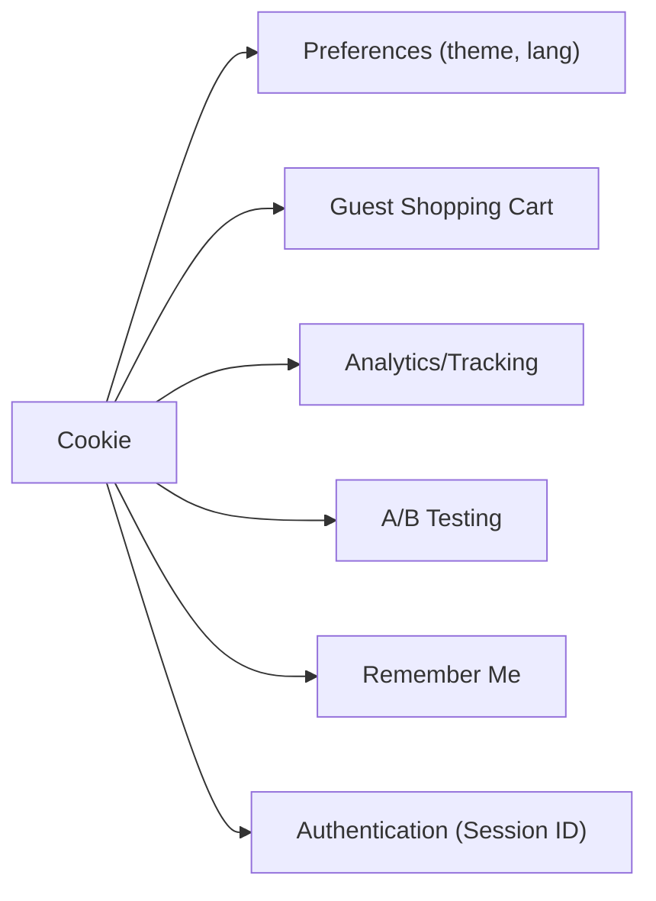

# ০৯. Cookie-র বাস্তব ব্যবহার

আগের লেসনে আমরা Cookie-ভিত্তিক Authentication-এর সমস্যাগুলো দেখলাম, আর মনে হতে পারে Cookie বুঝি একটা পুরনো, দুর্বল প্রযুক্তি। কিন্তু বাস্তবতা হলো — Cookie আজও ইন্টারনেটের সবচেয়ে বহুল ব্যবহৃত প্রযুক্তিগুলোর একটা, শুধু Authentication-এর বাইরে অনেক জায়গায় এটা দারুণভাবে কাজ করে। এই লেসনে আমরা দেখবো ঠিক কোথায় কোথায়।

**ব্যবহারকারীর পছন্দ মনে রাখা (Preferences)।** তুমি একটা ওয়েবসাইটে ডার্ক মোড অন করলে, বা ভাষা বাংলায় পরিবর্তন করলে — এই পছন্দটা প্রায়ই একটা সাধারণ Cookie-তে জমা থাকে (`theme=dark`, `lang=bn`)। এখানে নিরাপত্তার কোনো ঝুঁকি নেই, কারণ কেউ যদি এই Cookie বদলেও ফেলে, সবচেয়ে বেশি যা হবে তা হলো সে ভুল থিম দেখবে — কোনো ক্ষতি নেই।

```python
@app.get("/set-theme/{mode}")
def set_theme(mode: str, response: Response):
    response.set_cookie(key="theme", value=mode, max_age=30 * 24 * 60 * 60)  # ৩০ দিন
    return {"message": "থিম সেভ হলো"}
```

**শপিং কার্ট (গেস্ট ইউজারের জন্য)।** অনেক ই-কমার্স সাইটে তুমি লগইন না করেই কার্টে জিনিস যোগ করতে পারো। এই ক্ষেত্রে সাধারণত একটা অস্থায়ী Cookie-ভিত্তিক ID ব্যবহার করা হয়, যাতে তুমি পাতা পাল্টালেও কার্টের জিনিস মনে থাকে, যতক্ষণ না তুমি ব্রাউজার বন্ধ করো বা Cookie মুছে ফেলো।

**অ্যানালিটিক্স ও ট্র্যাকিং।** Google Analytics-এর মতো টুল Cookie ব্যবহার করে বোঝে তুমি নতুন ভিজিটর নাকি ফিরে আসা ভিজিটর, কোন পাতাগুলো তুমি আগে দেখেছো। এই কারণেই ওয়েবসাইটগুলোতে "Accept Cookies" ব্যানার দেখানো বাধ্যতামূলক হয়ে গেছে (GDPR-এর মতো আইনের কারণে) — কারণ ট্র্যাকিং Cookie ব্যবহারকারীর গোপনীয়তা সংক্রান্ত একটা বিষয়।

**A/B Testing।** কোনো কোম্পানি যখন একটা নতুন ফিচার টেস্ট করতে চায় শুধু কিছু ব্যবহারকারীর জন্য, তখন একটা Cookie সেট করে রাখে যেটা বলে দেয় এই ব্যবহারকারী "গ্রুপ A" নাকি "গ্রুপ B", যাতে সে বারবার পাতা রিফ্রেশ করলেও একই ভার্সন দেখতে পায়, এলোমেলো পরিবর্তন না হয়।

**"Remember Me" ফিচার।** তুমি নিশ্চয়ই লগইন ফর্মে "Remember Me" চেকবক্স দেখেছো। এটা সাধারণত একটা দীর্ঘমেয়াদী Cookie সেট করে (হয়তো ৩০ দিন বা তারও বেশি), যাতে ব্রাউজার বন্ধ করে আবার খুললেও তোমাকে বারবার লগইন করতে না হয় — যদিও ভেতরে এটা সাধারণত Session-এর সাথেই যুক্ত থাকে, শুধু মেয়াদ অনেক বড় হয়।



লক্ষ্য করলে দেখবে, এই ব্যবহারগুলোর বেশিরভাগই Authentication-এর মতো সংবেদনশীল নয় — এগুলোতে ভুল হলে বড় ক্ষতি হয় না। তাই Cookie-কে "খারাপ" বা "পুরনো" বলা ঠিক হবে না — বরং এটা এখনো একটা দরকারি টুল, শুধু সঠিক জায়গায় সঠিকভাবে ব্যবহার করা জরুরি। Authentication-এর মতো উচ্চ-ঝুঁকির কাজের জন্য আমরা Module 12-এ শিখবো আরেকটা শক্তিশালী পদ্ধতি — JWT।

এবার এই পুরো মডিউলে যা শিখলাম, তা যাচাই করে নেয়ার পালা — পরের লেসনে থাকছে একটা রিক্যাপ কুইজ।
