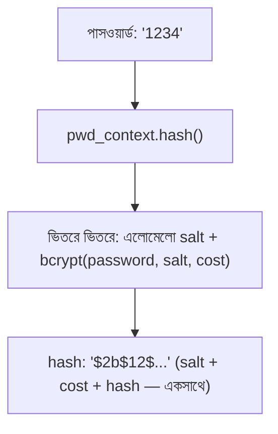

# ০৩. Username ও Password হ্যাশ করা

এবার তত্ত্ব থেকে বাস্তবে আসি। Python-এ পাসওয়ার্ড হ্যাশ করার জন্য built-in `hashlib` মডিউল থাকলেও, বাস্তব প্রজেক্টে সেটা সরাসরি ব্যবহার করা হয় না — কারণ salt ম্যানেজ করা, cost factor নিয়ন্ত্রণ করা, নিরাপদ তুলনা করা — এই সব খুঁটিনাটি নিজে হাতে সামলাতে গিয়ে ভুল হওয়ার সম্ভাবনা অনেক। তাই FastAPI ইকোসিস্টেমে সবচেয়ে জনপ্রিয় পদ্ধতি হলো `passlib` লাইব্রেরি, যেটা bcrypt (বা অন্য অ্যালগরিদম) দিয়ে হ্যাশিং-এর পুরো কাজটা কয়েকটা সহজ ফাংশনে মুড়ে দেয়।

```bash
pip install "passlib[bcrypt]"
```

`passlib` ব্যবহারের কেন্দ্রীয় ধারণা হলো `CryptContext` — এটা তোমাকে বলে দেয় কোন অ্যালগরিদম দিয়ে হ্যাশ করা হবে, আর ভবিষ্যতে অ্যালগরিদম বদলাতে হলে (যেমন bcrypt থেকে argon2-এ) কীভাবে পুরনো hash-গুলোকেও চেনা যাবে:

```python
from passlib.context import CryptContext

pwd_context = CryptContext(schemes=["bcrypt"], deprecated="auto")


def hash_password(password: str) -> str:
    return pwd_context.hash(password)


def verify_password(plain_password: str, hashed_password: str) -> bool:
    return pwd_context.verify(plain_password, hashed_password)


# ব্যবহার
stored = hash_password("mypassword123")
print("ডেটাবেসে জমা থাকবে:", stored)

print(verify_password("mypassword123", stored))  # True
print(verify_password("wrongpassword", stored))   # False
```

লক্ষ্য করো, আগের লেসনে বলা salt-এর বিষয়টা এখানে সম্পূর্ণ পর্দার আড়ালে চলে গেছে — `pwd_context.hash()` কল করলেই নিজে থেকে একটা এলোমেলো salt তৈরি হয়ে যায়, আর সেটা hash-এর সাথেই এক স্ট্রিং-এ (`$2b$12$...`) জমা হয়ে যায়। এই কারণেই `verify_password()`-এ আমাদের আলাদাভাবে salt বের করে দেয়ার দরকার নেই — `passlib` নিজেই hash স্ট্রিং থেকে salt আর cost factor বের করে নিয়ে আসল পাসওয়ার্ডটা একই পদ্ধতিতে হ্যাশ করে তুলনা করে। নীতিটা ঠিক আগের লেসনের মতোই — আমরা কখনো আসল পাসওয়ার্ড "ফেরত" পাচ্ছি না, শুধু নতুন ইনপুটকে একইভাবে হ্যাশ করে দুইটা hash তুলনা করছি।

`CryptContext(schemes=["bcrypt"], deprecated="auto")`-এর `deprecated="auto"` অংশটা একটা ছোট কিন্তু দরকারি ফিচার — ভবিষ্যতে যদি `schemes`-এ নতুন অ্যালগরিদম (যেমন `argon2`) যোগ করো, `passlib` পুরনো bcrypt-হ্যাশ করা পাসওয়ার্ডগুলোকেও এখনো ভেরিফাই করতে পারবে, আর প্রতিবার সফল লগইনে চাইলে নতুন অ্যালগরিদমে re-hash করে নিতে বলবে।



**একটা গুরুত্বপূর্ণ প্রোডাকশন নুয়ান্স** — bcrypt-এর `CryptContext(schemes=["bcrypt"])`-এ একটা "cost factor" (ডিফল্টভাবে ১২) থাকে, যেটা নির্ধারণ করে হ্যাশ করতে কতটা কম্পিউটেশনাল কাজ লাগবে। cost factor যত বেশি, হ্যাশ করতে তত বেশি সময় লাগে — যা ইচ্ছাকৃত, যাতে হ্যাকার প্রতি সেকেন্ডে অনেক পাসওয়ার্ড try করতে না পারে (brute-force আক্রমণ ধীর হয়ে যায়)। কিন্তু এই "ইচ্ছাকৃত ধীরতা"-টাই FastAPI-তে একটা সূক্ষ্ম কিন্তু গুরুত্বপূর্ণ সমস্যা তৈরি করতে পারে।

FastAPI একটা **asynchronous** framework — এটার async route handler-গুলো একটাই event loop-এ চলে, যেখানে একসাথে অনেক request পরিবেশন করার কথা। কিন্তু `pwd_context.hash()` বা `pwd_context.verify()` হলো **sync (blocking)** ফাংশন — bcrypt-এর হিসাব CPU-বাউন্ড, আর কয়েক মিলিসেকেন্ড থেকে শুরু করে বেশি cost factor-এ কয়েকশো মিলিসেকেন্ড পর্যন্ত সময় নিতে পারে। যদি তুমি এটা সরাসরি একটা `async def` route-এর ভেতরে কল করো:

```python
@app.post("/register")
async def register(username: str, password: str):
    hashed = pwd_context.hash(password)  # এই লাইন পুরো event loop-কে ব্লক করে দিচ্ছে!
    ...
```

তাহলে যতক্ষণ bcrypt হিসাব চলছে, ততক্ষণ event loop-এ থাকা **অন্য সব** request-ও অপেক্ষা করতে বাধ্য হয় — কারণ event loop একটাই থ্রেডে চলে, আর sync কাজ শেষ না হওয়া পর্যন্ত সে অন্য কোনো coroutine-কে সুযোগই দিতে পারে না। একজন ব্যবহারকারী রেজিস্টার করলে বাকি সবার request কয়েক মিলিসেকেন্ড থেমে থাকতে পারে — অ্যাপ যত বড় হবে, এই সমস্যা তত প্রকট হবে।

এর সমাধান হলো এই sync, ব্লকিং কাজটাকে একটা আলাদা থ্রেড-পুলে সরিয়ে দেয়া, যাতে event loop মুক্ত থাকে:

```python
import asyncio

@app.post("/register")
async def register(username: str, password: str):
    hashed = await asyncio.to_thread(pwd_context.hash, password)
    ...
```

`asyncio.to_thread()` ফাংশনটাকে একটা আলাদা ওয়ার্কার থ্রেডে চালায় আর event loop-কে মুক্ত রাখে, যতক্ষণ না সেই থ্রেড থেকে ফলাফল আসে। ছোট প্রজেক্টে বা লার্নিং-এর সময় সরাসরি sync কল করলেও চলবে (আমরা অ্যাসাইনমেন্টেও সরলতার জন্য সরাসরি কল করবো), কিন্তু বাস্তব প্রোডাকশন অ্যাপে, যেখানে একসাথে অনেক ব্যবহারকারী থাকে, এই `asyncio.to_thread` প্যাটার্নটা মাথায় রাখা জরুরি।

এখন আমরা জানি কীভাবে পাসওয়ার্ড নিরাপদে হ্যাশ করে রাখতে হয়। এই একই Hashing ধারণা ব্যবহার করেই JWT-র Signature তৈরি হয় — পরের লেসনে আমরা দেখবো কীভাবে এই জ্ঞান দিয়ে JWT সম্পূর্ণ Session-ভিত্তিক Authentication-এর একটা উন্নত বিকল্প হয়ে ওঠে।
