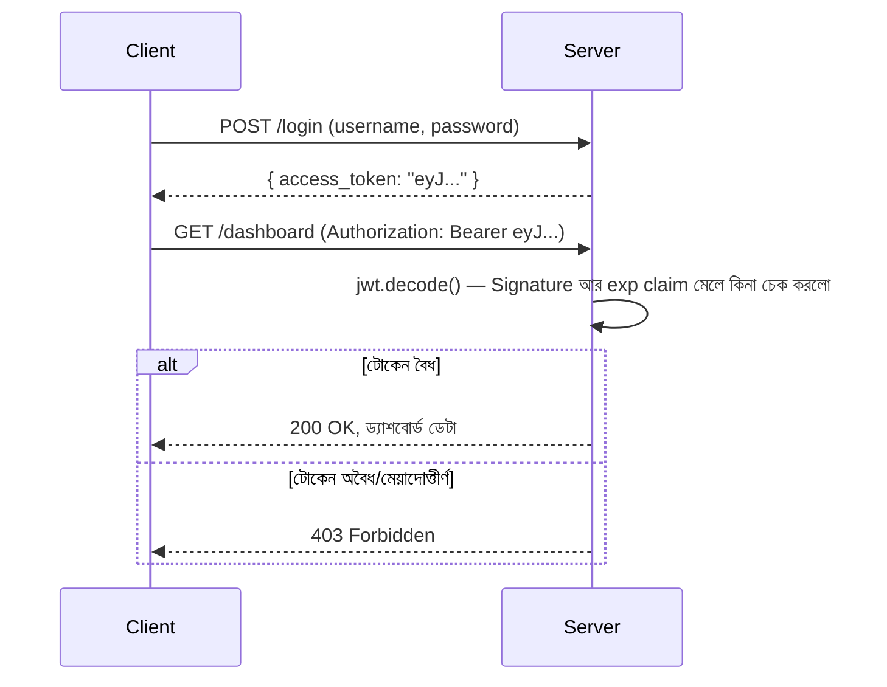

# ০৫. JWT হ্যান্ডস-অন — জেনারেট ও ভেরিফাই করা

তত্ত্ব এখন যথেষ্ট মজবুত — এবার হাতে-কলমে একটা সম্পূর্ণ JWT-ভিত্তিক Authentication সিস্টেম বানাই। আমরা `pyjwt` নামের জনপ্রিয় প্যাকেজ ব্যবহার করবো, যেটা লেসন ৪-এ শেখা Header-Payload-Signature গণনার পুরো কাজটা এক লাইনের ফাংশন কলে করে দেয়, আর FastAPI-এর `OAuth2PasswordBearer` ব্যবহার করবো যাতে `Authorization` header থেকে টোকেন বের করার কাজটা ফ্রেমওয়ার্ক নিজেই করে দেয়।

```bash
pip install fastapi uvicorn pyjwt "passlib[bcrypt]"
```

প্রথমে একটা বেসিক সেটআপ করি:

```python
from datetime import datetime, timedelta, timezone

import jwt
from fastapi import FastAPI, Depends, HTTPException, status
from fastapi.security import OAuth2PasswordBearer, OAuth2PasswordRequestForm

app = FastAPI()

SECRET_KEY = "amar-khub-goopon-chabi"  # বাস্তবে .env ফাইলে রাখা উচিত
ALGORITHM = "HS256"
ACCESS_TOKEN_EXPIRE_MINUTES = 60

# ভুয়া ইউজার তালিকা (Module 12-এর লেসন ৩-এর মতো, এখানে সরলতার জন্য plain রাখলাম)
users = [{"username": "arman", "password": "1234"}]

oauth2_scheme = OAuth2PasswordBearer(tokenUrl="login")
```

`OAuth2PasswordBearer(tokenUrl="login")` লাইনটা এখনই টোকেন যাচাই করছে না — এটা শুধু FastAPI-কে বলে দিচ্ছে, "টোকেনটা `Authorization: Bearer <token>` header থেকে বের করার নিয়মটা আমি জানি, আর Swagger UI-এ একটা 'Authorize' বাটন দেখাও যেখানে ইউজার লগইন করতে পারবে।" `tokenUrl="login"` বলছে কোন route থেকে টোকেন পাওয়া যাবে (এটা শুধু ডকুমেন্টেশনের জন্য, বাস্তবে অন্য কোনো route থেকেও টোকেন এলে চলবে)।

লগইন রুটে আমরা username/password যাচাই করবো, আর সফল হলে একটা JWT তৈরি করে ফেরত দেবো:

```python
def create_access_token(data: dict) -> str:
    to_encode = data.copy()
    expire = datetime.now(timezone.utc) + timedelta(minutes=ACCESS_TOKEN_EXPIRE_MINUTES)
    to_encode.update({"exp": expire})  # মেয়াদ শেষের সময়টাও payload-এর একটা claim
    return jwt.encode(to_encode, SECRET_KEY, algorithm=ALGORITHM)


@app.post("/login")
def login(form_data: OAuth2PasswordRequestForm = Depends()):
    user = next(
        (u for u in users if u["username"] == form_data.username and u["password"] == form_data.password),
        None,
    )

    if not user:
        raise HTTPException(status_code=401, detail="ভুল username অথবা password")

    # JWT তৈরি — payload-এ শুধু প্রয়োজনীয়, অ-সংবেদনশীল তথ্য রাখছি
    token = create_access_token({"username": user["username"]})

    return {"message": "লগইন সফল!", "access_token": token, "token_type": "bearer"}
```

লক্ষ্য করো, এখানে কোনো Cookie সেট হচ্ছে না, কোনো সার্ভার-সাইড session-স্টোরেজ তৈরি হচ্ছে না — শুধু একটা টোকেন স্ট্রিং ফেরত যাচ্ছে JSON response-এর মধ্যে। ক্লায়েন্ট (ব্রাউজার বা মোবাইল অ্যাপ) নিজের দায়িত্বে এই টোকেন জমা রাখবে। `OAuth2PasswordRequestForm` ব্যবহার করার কারণ হলো এটা Swagger UI-এর "Authorize" ফর্মের সাথে সরাসরি মিলে যায়, ফলে `/docs` পেজ থেকেই সরাসরি লগইন টেস্ট করা যায়।

এখন প্রোটেক্টেড রুটের জন্য একটা dependency বানাই, যেটা টোকেন যাচাই করবে (এটা Express-এর middleware-এর মতোই কাজ করে, শুধু FastAPI-তে এই প্যাটার্নকে বলা হয় **dependency**):

```python
def get_current_user(token: str = Depends(oauth2_scheme)) -> dict:
    credentials_exception = HTTPException(
        status_code=status.HTTP_403_FORBIDDEN,
        detail="টোকেন অবৈধ বা মেয়াদ শেষ",
    )
    try:
        payload = jwt.decode(token, SECRET_KEY, algorithms=[ALGORITHM])
        username = payload.get("username")
        if username is None:
            raise credentials_exception
        return {"username": username}
    except jwt.ExpiredSignatureError:
        raise credentials_exception
    except jwt.InvalidTokenError:
        raise credentials_exception


@app.get("/dashboard")
def dashboard(current_user: dict = Depends(get_current_user)):
    return {"message": f"স্বাগতম, {current_user['username']}! এটা তোমার ড্যাশবোর্ড।"}
```

`Depends(oauth2_scheme)` টোকেন থাকা-না-থাকা যাচাই করে (না থাকলে FastAPI নিজেই ৪০১ ফেরত দেয়), তারপর `get_current_user`-এর ভেতরে `jwt.decode()` ঠিক লেসন ৪-এ আঁকা diagram-টাই বাস্তবায়ন করছে — এটা টোকেনের Header আর Payload নিয়ে নিজে থেকে Signature আবার গণনা করে, তারপর টোকেনের ভেতরে থাকা Signature-এর সাথে তুলনা করে। না মিললে, বা মেয়াদ শেষ হয়ে গেলে, exception ওঠে আর আমরা ৪০৩ Status Code (Forbidden) ফেরত দিচ্ছি।



চাইলে `/docs` পেজে গিয়ে ডানদিকের "Authorize" বাটনে ক্লিক করে নিজে টেস্ট করে দেখতে পারো — `/login`-এ username/password দিয়ে অথোরাইজ করলে Swagger UI নিজেই বাকি সব request-এর সাথে টোকেন জুড়ে দেবে। এরপর টোকেনের একটা অক্ষর ম্যানুয়ালি বদলে (Postman দিয়ে) `/dashboard` হিট করলে দেখবে সার্ভার সাথে সাথে ধরে ফেলছে, ঠিক যেমন লেসন ৪-এ ব্যাখ্যা করা হয়েছিলো।

**একটা গুরুত্বপূর্ণ প্রোডাকশন নুয়ান্স, আর একটা সাধারণ ভুল** — উপরের কোডে `create_access_token`-এ আমরা payload-এ `exp` claim যুক্ত করেছি, আর `jwt.decode()` সেটা স্বয়ংক্রিয়ভাবেই চেক করে, মেয়াদ শেষ হলে `ExpiredSignatureError` তোলে। কিন্তু একটা সাধারণ ভুল হলো `exp` claim একেবারেই বাদ দিয়ে টোকেন বানানো — তখন টোকেনটা কার্যত **কখনো মেয়াদোত্তীর্ণ হয় না**, মানে কেউ একবার টোকেন হাতে পেলে সেটা চিরকাল বৈধ থেকে যায়, এমনকি ব্যবহারকারী পাসওয়ার্ড বদলালেও। তাই `exp` সবসময় সেট করা, আর ছোট মেয়াদ (মিনিট থেকে ঘণ্টার হিসাবে) রাখা জরুরি।

আরেকটা বড় সাধারণ ভুল হলো `SECRET_KEY`-এর মতো একটা দুর্বল বা অনুমানযোগ্য স্ট্রিং (যেমন `"secret"` বা `"1234"`) ব্যবহার করা, বা এটাকে সোর্স কোডে সরাসরি হার্ডকোড করে GitHub-এ পাবলিশ করে দেয়া। যেহেতু HMAC-SHA256-এর নিরাপত্তা সম্পূর্ণভাবে এই একটা গোপন চাবির উপরই নির্ভর করে, চাবিটা যদি দুর্বল হয় বা ফাঁস হয়ে যায়, তাহলে যে কেউ নিজের ইচ্ছামতো বৈধ-দেখতে টোকেন বানিয়ে ফেলতে পারবে (যেমন `{"username": "admin"}` দিয়ে) — Signature ঠিকঠাক মিলে যাবে, কারণ সে-ও একই চাবি জানে। বাস্তব প্রোডাকশনে `SECRET_KEY` একটা দীর্ঘ, র‍্যান্ডম-জেনারেটেড স্ট্রিং হওয়া উচিত, `.env` ফাইলে রাখা উচিত (আর `.env` কখনো git-এ কমিট করা উচিত না), এবং একাধিক সার্ভার ইনস্ট্যান্স চললেও সবাইকে একই চাবি শেয়ার করতে হবে যাতে যেকোনো ইনস্ট্যান্স যেকোনো টোকেন যাচাই করতে পারে।

এখন আমাদের হাতে সম্পূর্ণ, কার্যকর একটা JWT Authentication সিস্টেম আছে — Session বা Cookie ছাড়াই। পরের লেসনে এই সবকিছু ব্যবহার করে আমরা একটা সম্পূর্ণ প্রজেক্ট বানাবো — একটা অ্যাসাইনমেন্ট, যেখানে তুমি নিজে হাতে সব জোড়া লাগাবে।
