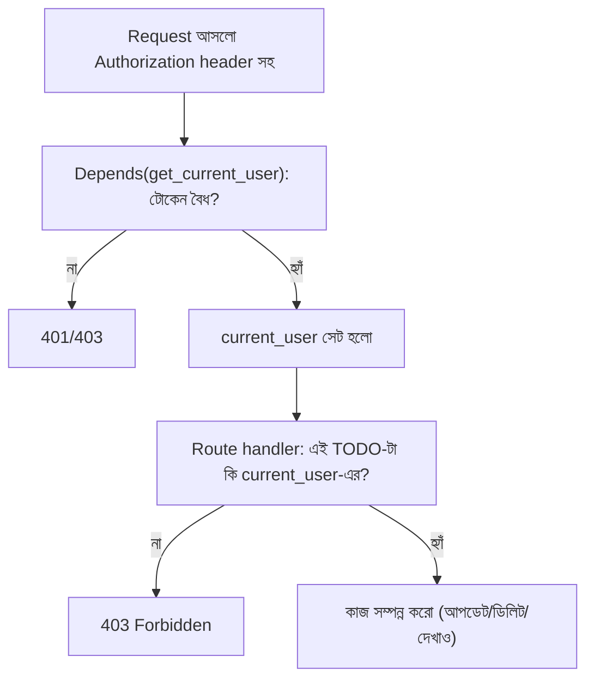

# ০৬. অ্যাসাইনমেন্ট: Authentication সহ পার্সোনাল TODO ম্যানেজার

এখন পর্যন্ত আমরা টুকরো টুকরো করে অনেক কিছু শিখেছি — Hashing দিয়ে পাসওয়ার্ড নিরাপদ রাখা, JWT দিয়ে ক্লায়েন্ট Authenticate করা, FastAPI-এ dependency দিয়ে route প্রোটেক্ট করা। এই লেসনটা নতুন কিছু শেখানোর জন্য নয় — বরং এতদিন যা শিখেছো তা একটা বাস্তব, ছোট কিন্তু সম্পূর্ণ প্রজেক্টে প্রয়োগ করার চ্যালেঞ্জ। ভাবো এটাকে একটা পরীক্ষা হিসেবে, যেখানে কোনো ধাপে ধাপে কোড দেয়া হবে না — শুধু কী বানাতে হবে আর কেন, তা বলা থাকবে। বাকিটা তোমার।

## প্রজেক্টের বর্ণনা

তুমি বানাবে একটা **Personal TODO Manager API** — FastAPI দিয়ে — যেখানে প্রতিটা ব্যবহারকারীর নিজস্ব, আলাদা TODO তালিকা থাকবে, আর কেউ অন্য কারো তালিকা দেখতে বা বদলাতে পারবে না, যদি না সে সেই ব্যবহারকারী হিসেবে লগইন করে থাকে। কোনো ডেটাবেস ব্যবহার করা যাবে না — সব ডেটা (ইউজার আর TODO দুটোই) সাধারণ Python লিস্ট/ডিকশনারিতে, সার্ভারের মেমরিতে জমা থাকবে। এটা ইচ্ছাকৃতভাবে সহজ রাখা হয়েছে, যাতে তুমি Authentication আর Authorization-এর লজিকের ওপর পুরো মনোযোগ দিতে পারো, ডেটাবেসের জটিলতা নিয়ে চিন্তা না করে।

## যা যা বানাতে হবে

**রেজিস্ট্রেশন ও লগইন।** `POST /register` route বানাও, যেখানে নতুন username/password দিয়ে রেজিস্ট্রেশন করা যাবে। পাসওয়ার্ড অবশ্যই plain text-এ রাখা যাবে না — লেসন ৩-এ শেখা `passlib`-এর `CryptContext` দিয়ে হ্যাশ করে রাখতে হবে। `POST /login` route বানাও, যেখানে সঠিক username/password দিলে একটা JWT (`access_token`) ফেরত আসবে। Pydantic দিয়ে রিকোয়েস্ট বডির জন্য একটা `BaseModel` বানানো ভালো অভ্যাস হবে (Module 4/৫-এ শেখা ধারণা কাজে লাগবে), যেমন:

```python
from pydantic import BaseModel

class UserCredentials(BaseModel):
    username: str
    password: str
```

**TODO CRUD, কিন্তু Authentication সহ।** নিচের route-গুলো বানাও, প্রতিটাই `Depends(get_current_user)`-এর মতো একটা dependency দিয়ে প্রোটেক্ট করা থাকতে হবে:

| Method | Route | কাজ |
|---|---|---|
| POST | `/todos` | নতুন TODO যোগ করা |
| GET | `/todos` | শুধুমাত্র নিজের সব TODO দেখা |
| PUT | `/todos/{todo_id}` | নিজের একটা TODO আপডেট করা (যেমন "done" মার্ক করা) |
| DELETE | `/todos/{todo_id}` | নিজের একটা TODO মুছে ফেলা |

**সবচেয়ে গুরুত্বপূর্ণ শর্ত** — প্রতিটা TODO যখন তৈরি হবে, সেটার সাথে কোন ব্যবহারকারী তৈরি করেছে সেই তথ্য (যেমন username) জমা রাখতে হবে। আর `GET /todos`, `PUT /todos/{todo_id}`, `DELETE /todos/{todo_id}` — এই route-গুলোতে অবশ্যই যাচাই করতে হবে যে request পাঠানো ব্যবহারকারীই সেই TODO-র মালিক, নাহলে ৪০৩ Forbidden ফেরত দিতে হবে (FastAPI-তে `raise HTTPException(status_code=403, ...)` দিয়ে)। এই অংশটাই মূল চ্যালেঞ্জ — শুধু "লগইন করা আছে কিনা" চেক করাই যথেষ্ট না, "এই নির্দিষ্ট রিসোর্সটা এই ব্যবহারকারীরই কিনা" সেটাও চেক করতে হবে।



## ইঙ্গিত ও পরামর্শ

ডেটা স্ট্রাকচার এরকম সহজ করে সাজাতে পারো:

```python
users: list[dict] = []  # [{ "username": ..., "hashed_password": ... }]
todos: list[dict] = []  # [{ "id": ..., "title": ..., "done": ..., "owner": ... }]
```

`id` তৈরি করার জন্য Python-এর built-in `uuid` মডিউলের `uuid.uuid4()` ব্যবহার করতে পারো। প্রতিটা এরর কেসে সঠিক Status Code ব্যবহার করতে ভুলো না — ৪০০ (ভুল ইনপুট), ৪০১ (লগইন করা নেই — এটা `OAuth2PasswordBearer` নিজেই দিয়ে দেয় টোকেন না থাকলে), ৪০৩ (পারমিশন নেই), ৪০৪ (TODO খুঁজে পাওয়া যায়নি)। Postman বা `/docs`-এর Swagger UI দিয়ে দুইটা আলাদা ব্যবহারকারী রেজিস্টার করে টেস্ট করো — নিশ্চিত হও যে ব্যবহারকারী A কখনোই ব্যবহারকারী B-র TODO দেখতে বা মুছতে পারছে না, এমনকি সে যদি সঠিক TODO `id` অনুমান করেও ফেলে।

একটা কাঠামোগত ইঙ্গিত — লেসন ৫-এ দেখানো `create_access_token` আর `get_current_user` ফাংশনগুলো প্রায় হুবহু এখানেও লাগবে, শুধু `SECRET_KEY` আর `ALGORITHM` একইভাবে রাখলেই চলবে। নতুন যা লাগবে তা হলো TODO-র owner-চেকের লজিকটা — সেটা কোনো library থেকে আসবে না, নিজেই লিখতে হবে।

## যাচাইয়ের চেকলিস্ট

- [ ] পাসওয়ার্ড কখনো plain text-এ সংরক্ষিত হচ্ছে না
- [ ] লগইন সফল হলে বৈধ JWT (`access_token`) ফেরত আসছে
- [ ] টোকেন ছাড়া প্রোটেক্টেড route হিট করলে ৪০১ আসছে
- [ ] ভুল/মেয়াদোত্তীর্ণ টোকেন দিলে ৪০৩ আসছে
- [ ] অন্য ব্যবহারকারীর TODO আপডেট/ডিলিট করার চেষ্টা করলে ৪০৩ আসছে
- [ ] প্রতিটা ব্যবহারকারী শুধু নিজের TODO তালিকাই দেখতে পাচ্ছে

## একটা এজ-কেস মাথায় রাখার মতো

`PUT /todos/{todo_id}` বা `DELETE /todos/{todo_id}`-তে একটা সাধারণ ভুল হলো owner-চেক আর "TODO খুঁজে পাওয়া যায়নি"-চেকের ক্রমটা উল্টে ফেলা, বা একে অপরের সাথে গুলিয়ে ফেলা। সঠিক ক্রম হলো — প্রথমে `todo_id` দিয়ে TODO-টা আদৌ আছে কিনা দেখো (না থাকলে ৪০৪), তারপর সেটা আছে থাকলে owner মিলছে কিনা দেখো (না মিললে ৪০৩)। এই ক্রমটা উল্টালে একটা সূক্ষ্ম তথ্য-ফাঁস (information leak) হতে পারে — যেমন আগে owner-চেক করে ৪০৩ ফেরত দিলে, একজন আক্রমণকারী এলোমেলো `id` চেষ্টা করে বুঝে ফেলতে পারে কোন `id`-গুলো আসলেই কোনো TODO-র সাথে মিলে (৪০৩ বনাম ৪০৪-এর পার্থক্য দেখেই), যা সে অন্যভাবে জানার কথা ছিলো না।

এই প্রজেক্টটা সম্পূর্ণ করতে পারলে বুঝবে তুমি Module 11 আর Module 12-এর মূল ধারণাগুলো — stateless HTTP, Cookie, Session, Hashing, JWT — শুধু বুঝোইনি, বাস্তবে প্রয়োগও করতে পারো। এই দুই মডিউলেই আমরা "ব্যবহারকারীকে চেনা" আর "তাকে বিশ্বাস করা"-র প্রশ্নটা সমাধান করেছি; সামনের Module 13-এ আমরা সরে যাবো সম্পূর্ণ ভিন্ন এক দিকে — TypeScript আর Object-Oriented Programming দিয়ে কোডকে আরও কাঠামোবদ্ধ, স্কেলযোগ্য করে তোলা।
