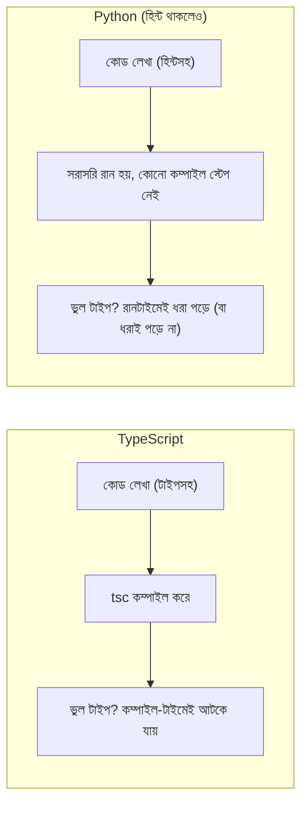

# ০১. Why Do We Need Type Hints in Python?

মডিউল ১২ পর্যন্ত আমরা যত Python কোড লিখেছি, সবই প্লেইন, ঢিলেঢালা Python — কোনো ভেরিয়েবলে যেকোনো কিছু রাখা যায়, কোনো বাধা ছাড়াই। এটা প্রথম প্রথম স্বাধীনতার মতো মনে হয়, কিন্তু প্রজেক্ট যত বড় হয়, এই স্বাধীনতাই ধীরে ধীরে সমস্যা হয়ে দাঁড়ায়।

একটা বাস্তব দৃশ্য কল্পনা করি। ধরো তুমি একটা ফাংশন লিখেছো যেটা একজন ইউজারের বয়স নিয়ে ছাড় হিসাব করে:

```python
def calculate_discount(age):
    if age > 60:
        return 20
    return 0
```

এখন তোমার টিমমেট, না জেনে, কোথাও থেকে `calculate_discount("ষাট")` — মানে সংখ্যার বদলে স্ট্রিং — পাঠিয়ে দিলো। Python কোনো অভিযোগ করবে না, কোড চলবে, আর `"ষাট" > 60` লাইনে গিয়ে একটা `TypeError` ছুঁড়বে — কিন্তু এই ভুলটা তুমি তখনই ধরবে যখন সেই নির্দিষ্ট লাইন **রান হবে**, মানে সেই কোড পাথ দিয়ে কোনো রিকোয়েস্ট গেলে। যদি এই ফাংশনটা কোনো এজ কেসে (যেমন কোনো বিশেষ প্রোমোশনাল ইউজারের জন্য) মাত্র মাসে একবার চলে, তাহলে বাগটা প্রোডাকশনে মাসখানেক ধরে ঘুমিয়ে থাকতে পারে, তারপর একদিন ফেটে পড়বে। এটাই প্লেইন Python-এর সবচেয়ে বড় দুর্বলতা — ভুলগুলো **রানটাইমে** ধরা পড়ে, আর সেই রানটাইমটা যদি প্রোডাকশন হয়, তাহলে ক্ষতি অনেক বেশি।

## টাইপ হিন্ট — Python-এর সমাধান

Python 3.5 থেকে একটা ফিচার এসেছে যাকে বলে **type hint** — ভেরিয়েবল আর ফাংশনের প্যারামিটারে তুমি বলে দিতে পারো এটা কী ধরনের ডেটা হওয়া উচিত:

```python
def calculate_discount(age: int) -> int:
    if age > 60:
        return 20
    return 0

calculate_discount("ষাট")  # Python নিজে থেকে এখনও আটকাবে না!
```

এখানেই সবচেয়ে গুরুত্বপূর্ণ, প্রায়ই ভুল বোঝা একটা সত্য আসে — **Python নিজে থেকে এই টাইপ হিন্ট এনফোর্স করে না**। উপরের কোডটা লিখলে, Python ইন্টারপ্রেটার `age: int` দেখে কিছুই যাচাই করবে না, তুমি ইচ্ছা করলে `calculate_discount("ষাট")` কল করলেও কোড ঠিক আগের মতোই রান হবে, আর একই জায়গায় ক্র্যাশ করবে। TypeScript-এর `tsc` কম্পাইলার যেভাবে ভুল টাইপ পাঠালে কম্পাইল-টাইমেই আটকে দেয়, Python-এর ইন্টারপ্রেটার তা করে না — কারণ Python-এ কোনো "কম্পাইল স্টেপ" নেই যেখানে এই চেকটা হতে পারে।



তাহলে প্রশ্ন আসে — টাইপ হিন্ট লিখে লাভ কী, যদি এটা কিছুই আটকায় না? লাভ তিনটা জায়গায়:

১. **এডিটর আর IDE-র সাহায্য** — VS Code-এর Pylance বা PyCharm টাইপ হিন্ট পড়ে autocomplete দেয়, ভুল টাইপ পাঠালে লাল দাগ দেখায় — এটা এডিটরের নিজের বিশ্লেষণ, Python রানটাইমের কিছু না।
২. **স্ট্যাটিক টাইপ চেকার** — `mypy` বা `pyright` নামের আলাদা টুল, যা কোড না চালিয়েই টাইপ হিন্ট পড়ে ভুল ধরিয়ে দেয় (পরের লেসনে বিস্তারিত)।
৩. **রানটাইম ভ্যালিডেশন লাইব্রেরি** — যেমন **Pydantic**, যা টাইপ হিন্ট পড়ে সত্যিকারের রানটাইম চেক করে, আর ভুল ডেটা এলে এক্সেপশন ছোঁড়ে (মডিউল ১৩ Lesson ৩-এ বিস্তারিত)।

## একটা প্রোডাকশন নুয়ান্স — এই তিনটাকে গুলিয়ে ফেলা একটা বাস্তব ভুল

নতুন Python ডেভেলপারদের সবচেয়ে সাধারণ একটা ভুল ধারণা হলো — "আমি ফাংশনে টাইপ হিন্ট লিখে দিয়েছি, তাই আমার ইনপুট এখন নিরাপদ।" এটা সত্য না। ধরো তুমি একটা ফাংশন লিখলে:

```python
def create_user(name: str, age: int) -> dict:
    return {"name": name, "age": age}
```

আর এটা একটা FastAPI রুটের ভেতরে কল হচ্ছে, যেখানে ইউজার JSON বডি থেকে `age` পাঠাচ্ছে `"২৫"` (স্ট্রিং হিসেবে, কারণ ফ্রন্টএন্ডে একটা ইনপুট ফিল্ড থেকে সরাসরি স্ট্রিং আসছিলো)। শুধু `age: int` লিখে রাখলে Python নিজে থেকে এটাকে int-এ রূপান্তর করে না, বা এরর ছোঁড়েও না — `age` ভেরিয়েবলে আসলে স্ট্রিং `"২৫"`-ই থেকে যাবে, আর `dict`-এ সেটাই সেভ হয়ে যাবে, নিঃশব্দে। এই বাগ ধরা পড়বে অনেক পরে, যখন কেউ `age + 5` করতে গিয়ে `TypeError` পাবে, অথবা আরও খারাপ — কখনোই ধরা পড়বে না, কারণ ডেটাবেজে ভুল টাইপের ডেটা জমা হয়েই যাচ্ছে।

এই কারণেই বাস্তব FastAPI প্রজেক্টে আমরা কখনো কাঁচা ফাংশন প্যারামিটারে টাইপ হিন্ট লিখে থেমে যাই না — আমরা **Pydantic model** ব্যবহার করি, যেটা টাইপ হিন্ট পড়ে সত্যিকারের রানটাইম ভ্যালিডেশন করে, আর ভুল টাইপ এলে অটোমেটিক ৪২২ এরর রেসপন্স পাঠায়। টাইপ হিন্ট নিজে শুধু একটা **ঘোষণা** (declaration) — "আমি চাই এটা int হোক" — বাস্তবে তা enforced হচ্ছে কিনা সেটা নির্ভর করে তুমি কোন টুল ব্যবহার করছো তার উপর।

## TypeScript কেন static typing বেছে নিলো — historical প্রেক্ষাপট

TypeScript তৈরিই হয়েছিলো এই সমস্যার সমাধান দিতে — Microsoft যখন দেখলো বড় বড় JavaScript কোডবেস (Angular-এর মতো ফ্রেমওয়ার্কে) ম্যানেজ করা কঠিন হয়ে যাচ্ছে কারণ কোনো কম্পাইল-টাইম গ্যারান্টি নেই, তখন তারা JavaScript-এর উপর একটা static type layer বসায়। ফলাফল — `tsc` কম্পাইলার প্রতিটা ভুল টাইপ ধরে ফেলে কোড রান করার আগেই।

Python-এর দর্শন ভিন্ন জায়গা থেকে এসেছে — Python মূলত স্ক্রিপ্টিং আর দ্রুত প্রোটোটাইপিং-এর জন্য ডিজাইন করা, যেখানে **dynamic typing** (রানটাইমে টাইপ ঠিক হওয়া) একটা সচেতন সিদ্ধান্ত ছিলো, নমনীয়তার জন্য। type hint যুক্ত হয়েছে অনেক পরে (PEP 484, 2015), মূলত বড় কোডবেসগুলোর (Dropbox, Instagram) চাহিদা মেটাতে — কিন্তু ভাষার মূল দর্শন বদলায়নি, তাই এটা **optional** থেকে গেছে, TypeScript-এর মতো বাধ্যতামূলক না।

| বিষয় | TypeScript | Python type hint |
|---|---|---|
| এনফোর্সমেন্ট | কম্পাইল-টাইমে বাধ্যতামূলক চেক | ঐচ্ছিক, নিজে থেকে কিছুই এনফোর্স হয় না |
| কম্পাইল স্টেপ | আছে (`tsc`) | নেই, সরাসরি ইন্টারপ্রেট হয় |
| রানটাইম প্রভাব | কম্পাইলের পর টাইপ মুছে যায় | কোনো প্রভাব নেই, শুধু metadata |
| রানটাইম-সেফটি পেতে | কম্পাইলারই যথেষ্ট | আলাদা টুল লাগে (mypy/pyright বা Pydantic) |

তাহলে সারকথা — dynamic vs static typing কোনো একটা "ভালো বা খারাপ" প্রশ্ন না, এটা একটা **trade-off**। Dynamic typing দ্রুত লেখা আর প্রোটোটাইপিং সহজ করে, কিন্তু বড় টিমে ভুল ধরা কঠিন করে। Static typing শুরুতে একটু বেশি লেখা লাগে, কিন্তু বড় প্রজেক্টে দীর্ঘমেয়াদে সময় বাঁচায়। Python type hint একটা মাঝামাঝি জায়গা তৈরি করে — dynamic ভাষার নমনীয়তা রেখে, চাইলে static-এর মতো সুরক্ষা যোগ করার সুযোগ দেয়।

পরের লেসনে আমরা দেখবো এই টাইপ হিন্টগুলোকে সত্যিকারের চেকে রূপান্তর করার টুল — `mypy` আর `pyright` — কীভাবে সেটআপ করে চালাতে হয়, আর একটা বাস্তব গোচা দেখবো যেখানে মাইপাই পাস করলেও কোড রানটাইমে ক্র্যাশ করে।
