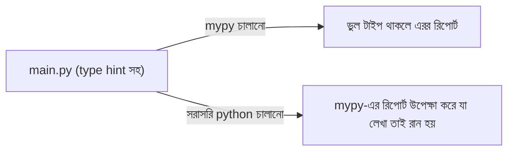

# ০২. Running a Type-Checked Python Project (mypy/pyright)

আগের লেসনে আমরা জেনেছি Python type hint নিজে থেকে কিছুই এনফোর্স করে না — এটাকে সত্যিকারের চেকে রূপান্তর করতে আলাদা একটা টুল লাগে। এই লেসনে আমরা হাতে-কলমে দেখবো এই সেটআপটা কীভাবে করতে হয়, ঠিক যেভাবে TypeScript-এ আমরা `ts-node` আর `tsconfig.json` দিয়ে সেটআপ করতাম।

## mypy সেটআপ করা

`mypy` হলো Python-এর সবচেয়ে পুরনো আর জনপ্রিয় static type checker — এটা একটা আলাদা প্যাকেজ, `pip` দিয়ে ইনস্টল হয়:

```bash
pip install mypy
```

এবার একটা ফাইল বানাই `main.py`:

```python
def calculate_discount(age: int) -> int:
    if age > 60:
        return 20
    return 0

calculate_discount("ষাট")
```

এখন এটাকে সরাসরি `python main.py` দিয়ে রান করলে, কোড আসলে ক্র্যাশ করবে (কারণ `"ষাট" > 60` তুলনা Python-এ `TypeError` দেয়)। কিন্তু `mypy` দিয়ে চেক করলে:

```bash
mypy main.py
```

আউটপুট আসবে:

```
main.py:6: error: Argument 1 to "calculate_discount" has incompatible type "str"; expected "int"  [arg-type]
Found 1 error in 1 file (checked 1 source file)
```

লক্ষ্য করো — `mypy` কোড **রান না করেই** ভুলটা ধরে ফেললো, ঠিক TypeScript-এর `tsc` যেভাবে করে। এটাই static analysis-এর শক্তি — এটা কোড না চালিয়ে, শুধু কোডের গঠন বিশ্লেষণ করেই ভুল খুঁজে পায়।



## pyright — আরেকটা অপশন

`pyright` হলো Microsoft-এর বানানো একটা টাইপ চেকার, যেটা VS Code-এর Pylance এক্সটেনশনের ভেতরেই বসানো থাকে — তাই এডিটরে লেখার সময়েই লাল দাগ দেখা যায়। কমান্ড লাইনে চালাতে:

```bash
npm install -g pyright
pyright main.py
```

`mypy` আর `pyright`-এর পার্থক্য মূলত গতি আর কড়াকড়ির মাত্রায় — `pyright` সাধারণত দ্রুত, আর ডিফল্টভাবে কিছুটা বেশি নমনীয়। বাস্তব টিমে দুটো থেকে একটা বেছে নেওয়াই যথেষ্ট, দুটো একসাথে চালানোর দরকার নেই — গুরুত্বপূর্ণ হলো যেটা বেছে নেওয়া হবে, সেটা CI পাইপলাইনে বাধ্যতামূলক ধাপ হিসেবে রাখা।

## strict mode — TypeScript-এর `strict: true`-এর সমতুল্য

TypeScript-এ আমরা `tsconfig.json`-এ `strict: true` সেট করতাম সবচেয়ে কড়া চেকিং পেতে। `mypy`-তেও একই ধারণা আছে, একটা কনফিগ ফাইলে:

```ini
# mypy.ini অথবা pyproject.toml-এর [tool.mypy] সেকশনে
[mypy]
strict = True
```

`strict = True` চালু করলে `mypy` এমন জিনিসও ধরিয়ে দেয় যেমন — কোনো ফাংশনে টাইপ হিন্ট না থাকলে (implicit `Any`), সেটাকেও এরর ধরবে। এটা শুরুতে বিরক্তিকর লাগতে পারে, কিন্তু নতুন প্রজেক্টে শুরু থেকেই `strict` চালু রাখা ভালো অভ্যাস — যেমন TypeScript-এও আমরা `strict: true` দিয়ে শুরু করতে বলেছিলাম।

## একটা বাস্তব গোচা — mypy পাস করলেও রানটাইমে ক্র্যাশ

এখানে একটা গুরুত্বপূর্ণ, বাস্তব প্রজেক্টে বারবার দেখা যাওয়া সমস্যা তুলে ধরা যাক। ধরো তুমি একটা ফাংশন লিখলে:

```python
from typing import Optional

def get_user_email(user: Optional[dict]) -> str:
    return user["email"]  # mypy এখানে ওয়ার্নিং দেবে, কিন্তু এড়ানোর অনেক উপায় আছে
```

আরও খারাপ, ধরো টাইপ হিন্টটাই ভুল লেখা হয়েছে, ইচ্ছাকৃত না হলেও:

```python
def get_user_age(user_id: int) -> int:
    # বাস্তবে এই ফাংশনটা একটা এক্সটার্নাল API কল করে, যেটা কখনো কখনো None ফেরত দেয়
    result = fetch_from_external_api(user_id)  # ধরি এটা Any টাইপ রিটার্ন করে
    return result.age
```

যদি `fetch_from_external_api`-এর রিটার্ন টাইপ কোথাও `Any` হিসেবে ঘোষিত থাকে (বা টাইপ হিন্টই না থাকে), `mypy` এই লাইনে কিছু বলবে না — কারণ `Any` টাইপকে `mypy` "সব কিছুর সাথে মিলে যায়" ধরে নেয়, এটা টাইপ চেকিং থেকে সম্পূর্ণ বাদ পড়ে যায়। ফাংশনের সিগনেচার বলছে এটা `int` রিটার্ন করবে, `mypy` পাস করে যাচ্ছে বিনা অভিযোগে, কিন্তু আসলে `result` যদি `None` হয় (API ডাউন থাকলে), তাহলে `result.age` লাইনে রানটাইমে `AttributeError: 'NoneType' object has no attribute 'age'` ছুঁড়বে — প্রোডাকশনে।

এই গোচাটার মূল কারণ — **`mypy` শুধু তোমার লেখা টাইপ হিন্টের সাথে কোডের সামঞ্জস্য চেক করে, বাস্তবে রানটাইমে কী ঘটছে তা যাচাই করে না।** যদি কোথাও একটা টাইপ হিন্ট ভুল বা অসম্পূর্ণ (`Any` দিয়ে চাপা দেওয়া) থাকে, পুরো চেইনটাই "false sense of security" দিয়ে দেয় — mypy সবুজ সিগন্যাল দেখাচ্ছে, কিন্তু প্রোডাকশনে ক্র্যাশ হচ্ছে। TypeScript-এও এই সমস্যা হতে পারে (`any` টাইপ ব্যবহার করলে), কিন্তু Python-এ এটা আরও বেশি ঘটে কারণ থার্ড-পার্টি লাইব্রেরির অনেক অংশে এখনও ভালো টাইপ হিন্ট নেই, তাই স্বয়ংক্রিয়ভাবেই অনেক জায়গা `Any` হয়ে যায়।

**শিক্ষণীয় বিষয়** — `mypy`/`pyright` পাস করা মানেই "কোড ১০০% নিরাপদ" না। এটা তোমাকে বলে "তুমি যা টাইপ হিন্ট লিখেছো, তার সাথে কোড সামঞ্জস্যপূর্ণ" — কিন্তু যদি হিন্টগুলোই অসম্পূর্ণ বা `Any`-তে ভরা হয়, চেকটার মূল্য কমে যায়। এই কারণেই বাস্তব FastAPI প্রজেক্টে আমরা টাইপ হিন্টের পাশাপাশি Pydantic-এর মতো রানটাইম ভ্যালিডেশনও রাখি — এটাই পরের লেসনের বিষয়।

পরের লেসনে আমরা দেখবো FastAPI অ্যাপ্লিকেশনে টাইপ হিন্ট আর Pydantic কীভাবে একসাথে কাজ করে সত্যিকারের রানটাইম সুরক্ষা দেয়, আর এটাকে TypeScript-এর Express অ্যাপ্লিকেশনের সাথে পাশাপাশি রেখে তুলনা করবো।
