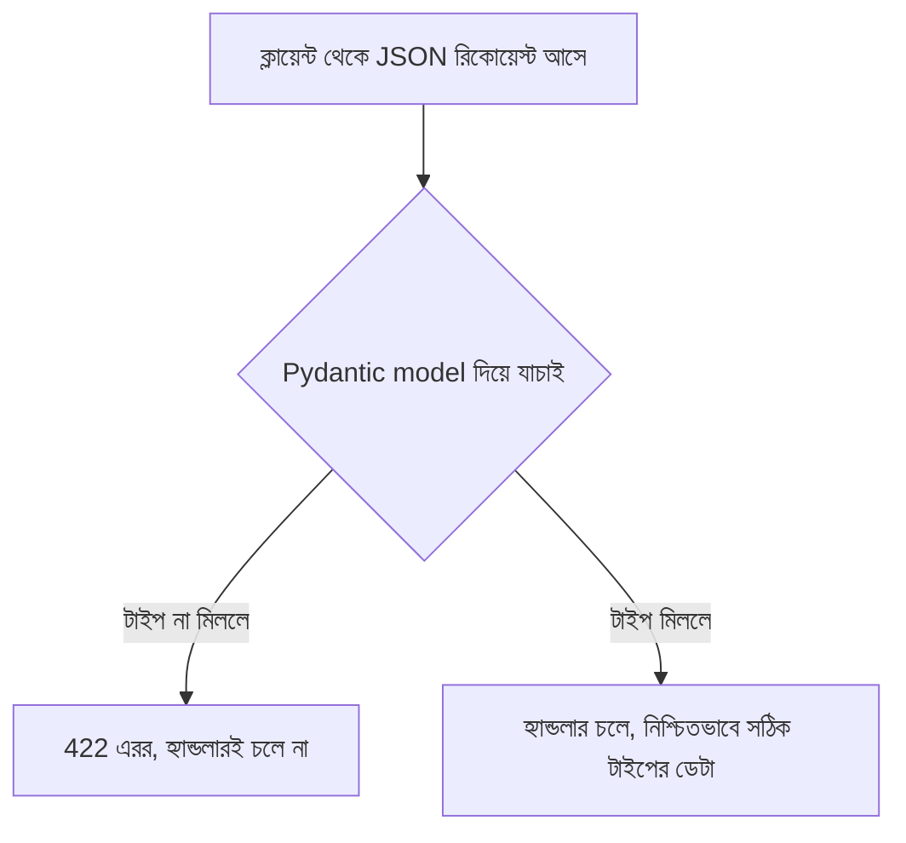

# ০৩. Type Hints and Pydantic in a FastAPI Application

আগের লেসনে আমরা দেখেছি `mypy`/`pyright` স্ট্যাটিক এনালাইসিস করে, কিন্তু রানটাইমে কিছু এনফোর্স করে না। এবার সময় এসেছে দেখার কীভাবে **Pydantic** এই ফাঁকটা পূরণ করে — টাইপ হিন্টকে সত্যিকারের রানটাইম ভ্যালিডেশনে রূপান্তর করে। এটাই FastAPI-এর সবচেয়ে বড় জাদু, আর একই সাথে TypeScript-এর Express অ্যাপ্লিকেশনের সাথে সবচেয়ে বড় পার্থক্যের জায়গা।

## Express.js-এ যা করতে হতো ম্যানুয়ালি

মডিউল ১৩ (পুরনো TypeScript ভার্সনে) আমরা দেখেছিলাম, Express-এ `req.body`-এর টাইপ ডিফল্টভাবে `any`, আর আমরা টাইপ অ্যানোটেশন দিয়ে বলে দিতাম এটা কী হবে:

```ts
app.post("/users", (req: Request, res: Response) => {
  const { name, age }: { name: string; age: number } = req.body;
  // কিন্তু এই অ্যানোটেশন শুধু কম্পাইল-টাইমে কাজ করে!
  // req.body-তে সত্যিকারের { name: "রহিম", age: "পঁচিশ" } (স্ট্রিং age) এলেও
  // TypeScript কিছু বলবে না, কারণ কম্পাইলের পর এই টাইপ তথ্য মুছে যায়
});
```

এখানে ভয়ংকর একটা সত্য আছে — `req.body`-এর টাইপ অ্যানোটেশন লেখা মানেই এটা যে সত্যিই সেই আকৃতির হবে, তার কোনো গ্যারান্টি নেই। TypeScript কম্পাইল-টাইমে যা লেখা আছে তার সাথে যাচাই করে, কিন্তু নেটওয়ার্ক থেকে সত্যিকারের JSON আসার সময় কেউ ভুল ডেটা পাঠালে (বা ইচ্ছাকৃতভাবে ম্যালিশাস ডেটা), TypeScript-এর টাইপ সিস্টেম **কম্পাইলের পর অস্তিত্বহীন** — রানটাইমে কোনো সুরক্ষা নেই, যদি না আলাদা করে `zod` বা `joi` দিয়ে ভ্যালিডেশন লেখা হয়।

## FastAPI-তে Pydantic — একই টাইপ হিন্ট, কিন্তু রানটাইমেও কাজ করে

FastAPI-তে আমরা একটা Pydantic model লিখি:

```python
from fastapi import FastAPI
from pydantic import BaseModel

app = FastAPI()

class UserCreate(BaseModel):
    name: str
    age: int

@app.post("/users")
def create_user(user: UserCreate):
    return {"message": f"{user.name}, বয়স {user.age}"}
```

এখানে `class UserCreate(BaseModel)`-এর ভেতরের `name: str` আর `age: int` দেখতে ঠিক আগের লেসনের মতো "নিছক টাইপ হিন্ট" মনে হতে পারে, কিন্তু **আসলে এগুলো একদম আলাদা জিনিস** — Pydantic এই হিন্টগুলো পড়ে, আর প্রতিটা রিকোয়েস্ট আসার সময় সত্যিকারের রানটাইম চেক চালায়। যদি কেউ `{"name": "রহিম", "age": "পঁচিশ"}` পাঠায় (স্ট্রিং `age`), FastAPI স্বয়ংক্রিয়ভাবে এই রিকোয়েস্ট **প্রত্যাখ্যান** করবে, `422 Unprocessable Entity` রেসপন্স দিয়ে, বিস্তারিত এরর মেসেজসহ — তোমার হ্যান্ডলার ফাংশনের ভেতরের একটা লাইনও রান হওয়ার আগে।



এটাই মৌলিক পার্থক্য: TypeScript-এর টাইপ হলো **compile-time-only, erased at runtime**। Pydantic-এর টাইপ হিন্ট হলো **compile-time hint + runtime enforcement**, দুটো একসাথে। একটা লাইব্রেরি (Pydantic) টাইপ হিন্টের metadata ব্যবহার করে সত্যিকারের ভ্যালিডেশন কোড রানটাইমে চালাচ্ছে — এটা Python-এর একটা বিশেষ ক্ষমতার কারণে সম্ভব, যাকে বলে **introspection** (রানটাইমে নিজের টাইপ হিন্ট পড়ার ক্ষমতা), যা TypeScript-এ সম্ভব না কারণ কম্পাইলের পর টাইপ তথ্যই থাকে না।

## পাশাপাশি তুলনা

| বিষয় | FastAPI + Pydantic | Express + TypeScript |
|---|---|---|
| টাইপ ঘোষণা | Pydantic `BaseModel` ক্লাসে | `interface`/type annotation |
| রানটাইম ভ্যালিডেশন | স্বয়ংক্রিয়, বিল্ট-ইন | নেই, আলাদা লাইব্রেরি (zod/joi) লাগে |
| ভুল ডেটা এলে | ৪২২ এরর, স্বয়ংক্রিয়ভাবে | হ্যান্ডলার চলে, ভুল ডেটা নিয়েই — ম্যানুয়াল চেক না থাকলে |
| ডকুমেন্টেশন | স্বয়ংক্রিয় (Swagger `/docs`-এ মডেল দেখা যায়) | আলাদা প্যাকেজ লাগে |
| টাইপ তথ্যের জীবনকাল | রানটাইমেও বেঁচে থাকে | কম্পাইলের পর মুছে যায় |

## একটা কমন ভুল — nested/optional ফিল্ড ভুল হ্যান্ডল করা

একটা বাস্তব প্রোডাকশন সমস্যা দেখা যাক। ধরো তুমি লিখলে:

```python
class UserCreate(BaseModel):
    name: str
    age: int
    referral_code: str = None  # ভুল! এটা mypy/pyright-এ এরর দেবে
```

এখানে `str = None` লেখা ভুল — `str` টাইপে `None` অনুমোদিত না, শুধু ডিফল্ট ভ্যালু `None` দিলে টাইপ চেকার অভিযোগ করবে। সঠিক উপায়:

```python
from typing import Optional

class UserCreate(BaseModel):
    name: str
    age: int
    referral_code: Optional[str] = None  # সঠিক — এখন None-ও গ্রহণযোগ্য
```

`Optional[str]` মানে "এটা `str` হতে পারে, অথবা `None` হতে পারে" — এটা লিখতে ভুলে গেলে Pydantic নিজে থেকে রানটাইমে এরর দেবে যখন কেউ `referral_code` ছাড়া রিকোয়েস্ট পাঠাবে (যদিও তুমি ডিফল্ট `None` দিতে চেয়েছিলে) — কিন্তু ডিফল্ট ভ্যালু `None` লেখার আগে `Optional` বাদ দিলে, mypy strict mode-এ এটা টাইপ এরর হিসেবে ধরা পড়বে, রান করার আগেই। এই প্যাটার্নটা এত সাধারণভাবে ভুল হয় যে এটাকে নিজের চেকলিস্টে রাখা উচিত — **যেকোনো ফিল্ডের ডিফল্ট ভ্যালু `None` হলে, তার টাইপ অবশ্যই `Optional[...]` হতে হবে।**

আরেকটা প্রোডাকশন নুয়ান্স — Pydantic ভ্যালিডেশন **এক্সট্রা ফিল্ড নিঃশব্দে উপেক্ষা করে**, ডিফল্টভাবে। মানে কেউ `{"name": "রহিম", "age": 25, "is_admin": true}` পাঠালে, `UserCreate` মডেলে `is_admin` না থাকলেও রিকোয়েস্ট রিজেক্ট হবে না, শুধু `is_admin` ফিল্ডটা উপেক্ষা করা হবে। এটা মনে হতে পারে নিরাপদ, কিন্তু বাস্তবে এটা একটা সিকিউরিটি রিস্কের জায়গা হতে পারে যদি তুমি ভুল করে ভাবো "extra ফিল্ড পাঠালে এরর হবে"। কড়া মোডে যেতে চাইলে Pydantic-এ `model_config = ConfigDict(extra="forbid")` সেট করা যায়, যা এক্সট্রা ফিল্ড এলে সরাসরি এরর ছোঁড়ে — প্রোডাকশন API-তে এটা প্রায়ই একটা ভালো ডিফল্ট সিদ্ধান্ত।

এখন আমরা দেখেছি কীভাবে Python-এর টাইপ হিন্ট, শুধু ডকুমেন্টেশন না থেকে, Pydantic-এর মাধ্যমে সত্যিকারের রানটাইম সুরক্ষায় রূপান্তরিত হয়। এই ভিত্তির উপর দাঁড়িয়ে, এখন আমরা একটা গভীর প্রশ্নে ঢুকবো — এই টাইপ ধারণাটা আসলে কোথা থেকে এলো, আর কেন এটা Object-Oriented Programming-এর সাথে এত ঘনিষ্ঠভাবে জড়িত।
