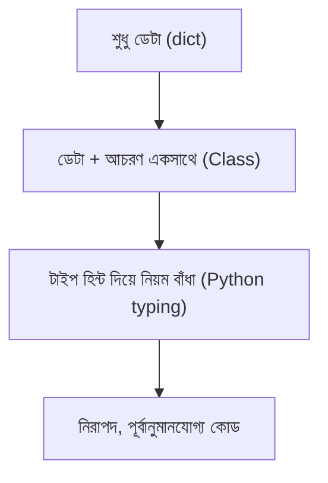

# ০৪. Introduction to Object Orientation: Why Do We Need Types?

এতদিন আমরা যা কোড লিখেছি, সেগুলো মূলত ফাংশন আর ডেটার আলাদা আলাদা টুকরো — একটা ফাংশন এখানে, একটা dict ওখানে, তাদের মধ্যে সম্পর্ক আমরা মনে মনে ধরে রাখতাম। প্রজেক্ট যত বড় হতে থাকে, এই "মনে মনে ধরে রাখা" ততই কঠিন হয়ে পড়ে। Object Orientation (বা সংক্ষেপে OOP) হলো একটা চিন্তাভাবনার ধরন, যেখানে আমরা কোডকে বাস্তব জগতের "বস্তু" (object) হিসেবে সাজাই — প্রতিটা বস্তুর নিজস্ব তথ্য (data) আর নিজস্ব আচরণ (behavior) থাকে, একসাথে বাঁধা।

একটা উদাহরণ দিয়ে শুরু করি। মডিউল ১৩ Lesson ৩-তে আমরা একটা `UserCreate` নিয়ে কাজ করেছিলাম, যার `name`, `age` ছিলো। বাস্তব জীবনে একজন ইউজার শুধু ডেটা না — তার কিছু আচরণও থাকে: সে লগইন করতে পারে, প্রোফাইল আপডেট করতে পারে, পাসওয়ার্ড পাল্টাতে পারে। প্লেইন Python-এ লিখলে আমরা ডেটা আর সেই ডেটার উপর কাজ করা ফাংশনগুলো আলাদা রাখি:

```python
user = {"id": 1, "name": "আরমান", "age": 28}

def update_age(user, new_age):
    user["age"] = new_age
```

এখানে সমস্যা হলো — `user` dict আর `update_age` ফাংশনের মধ্যে কোনো "আনুষ্ঠানিক" সম্পর্ক নেই। যে কেউ, যেকোনো জায়গা থেকে, `user["age"] = -50` লিখে সরাসরি বয়স নেগেটিভ করে দিতে পারে — কোনো বাধা নেই। বড় টিমে, বড় কোডবেসে, এই ধরনের "যেকোনো জায়গা থেকে যেকোনো কিছু পাল্টানো"-র স্বাধীনতা বাগের একটা বড় উৎস হয়ে দাঁড়ায়।

OOP এই সমস্যাটার সমাধান দেয় একটা নতুন কাঠামো দিয়ে — **Class**। একটা ক্লাস হলো একটা "নকশা" বা "ব্লুপ্রিন্ট", যেখানে আমরা বলে দিই একটা `User`-এর ঠিক কী কী ডেটা থাকবে, আর সেই ডেটার উপর কোন কোন কাজ (মেথড) করা যাবে — সব একসাথে, একই জায়গায়। এই লেসনে আমরা এখনও পুরো Class সিনট্যাক্সে ঢুকবো না (সেটা Lesson ৯-এ), কিন্তু বুঝে নেবো কেন এই কাঠামোর জন্য **Types** এত জরুরি একটা ভিত্তি।

ভাবো, তুমি যদি বলো "একটা `User`-এর `age` সবসময় একটা `int` হবে, আর কখনো ঋণাত্মক হবে না" — এটা বলার জন্য তোমার একটা ভাষা দরকার যেটা "ধরন" (type) বোঝাতে পারে। প্লেইন dict-ভিত্তিক Python-এ এই ধরনের কোনো ভাষা নেই — সবকিছুই ঢিলেঢালা। Python-এর টাইপ হিন্ট আর `class` সিনট্যাক্স ঠিক এই জায়গাতেই OOP-এর সাথে হাত মেলায়। Python-এর `class`-এর সাথে টাইপ হিন্ট যুক্ত করলে আমরা সুযোগ পাই বলার জন্য: "এই বস্তুটার গঠন ঠিক এরকম হবে, আর এভাবেই আচরণ করবে।"



একটা ছোট উদাহরণ দিয়ে এই পার্থক্যটা অনুভব করি। টাইপ ছাড়া:

```python
def create_account(balance):
    return {"balance": balance}

acc = create_account("হাজার টাকা")  # কোনো বাধা নেই, ভুল ডেটা ঢুকে গেলো
```

টাইপ হিন্টসহ (এখনও শুধু hint, enforced না — এটাই মনে রাখার জায়গা):

```python
def create_account(balance: float) -> dict:
    return {"balance": balance}

acc = create_account("হাজার টাকা")  # mypy/pyright ধরিয়ে দেবে, কিন্তু সরাসরি python চালালে চলেই যাবে
```

## TypeScript-এর `interface`-এর সাথে একটা গুরুত্বপূর্ণ পার্থক্য

TypeScript-এ আমরা `interface Account { balance: number }` লিখে একটা "চুক্তি" বেঁধে দিতাম, আর কম্পাইলার নিজেই নিশ্চিত করতো কেউ এই চুক্তি ভাঙলে কম্পাইল-টাইমেই আটকে যাবে। Python-এর প্লেইন টাইপ হিন্ট এই গ্যারান্টি দেয় না — যেটা আগের তিনটা লেসনে আমরা বারবার দেখেছি। তাই OOP-এর এই ভিত্তিটা বোঝার সময় একটা কথা মাথায় গেঁথে নেওয়া জরুরি — Python-এ "টাইপ" ধারণাটা সাহায্যকারী, বাধ্যতামূলক না, যতক্ষণ না তুমি Pydantic-এর মতো লাইব্রেরি বা `dataclass`-এর মতো টুল দিয়ে সেটাকে জোরদার করছো।

এখানে একটা প্র্যাকটিক্যাল পার্থক্যও আছে — TypeScript-এর `interface` হলো **structural typing**-এর একটা রূপ (কোনো অবজেক্ট যদি ঠিক সেই আকৃতির হয়, তাহলে সেটা সেই `interface`-এর, নাম ছাড়াই)। Python-এর ক্লাস-ভিত্তিক টাইপিং সাধারণত **duck typing**-এর দিকে ঝোঁকে ("যদি এটা হাঁসের মতো হাঁটে আর হাঁসের মতো কোয়াক করে, তাহলে এটা হাঁস") — একটা অবজেক্টের ঠিক কোন ক্লাস থেকে এসেছে সেটা নিয়ে Python কম মাথা ঘামায়, বরং তার কী মেথড/অ্যাট্রিবিউট আছে সেটাই গুরুত্বপূর্ণ। এই দুটো দর্শনের গভীর পার্থক্য আমরা মডিউল ১৪-এ Protocol নিয়ে বিস্তারিত দেখবো, যেখানে Python-এর `Protocol` (structural, duck-typing-ভিত্তিক) আর TypeScript-এর `interface` (structural, কিন্তু কম্পাইল-টাইমে বাধ্যতামূলক) — দুটোকে আলাদা ধারণা হিসেবে শেখা হবে, একটাকে অন্যটার "অনুবাদ" না ভেবে।

তাহলে সারকথা হলো — Types আমাদের বলার ভাষা দেয় "একটা বস্তু ঠিক কেমন হবে", আর OOP সেই ভাষা ব্যবহার করে বাস্তব জগতের বস্তুগুলোকে কোডে মডেল করে। Python-এ এই ভাষাটা ঐচ্ছিক আর সাহায্যকারী, TypeScript-এ এটা বাধ্যতামূলক আর কম্পাইলার-এনফোর্সড — এই পার্থক্যটা মনে রেখে এগোনো গুরুত্বপূর্ণ। এখন আমরা প্রস্তুত OOP-এর আসল কাঠামোয় ঢোকার জন্য — পরের লেসনে আমরা দেখবো OOP-এর চারটা মূল স্তম্ভ কী কী, আর তারা একসাথে কীভাবে কাজ করে।
