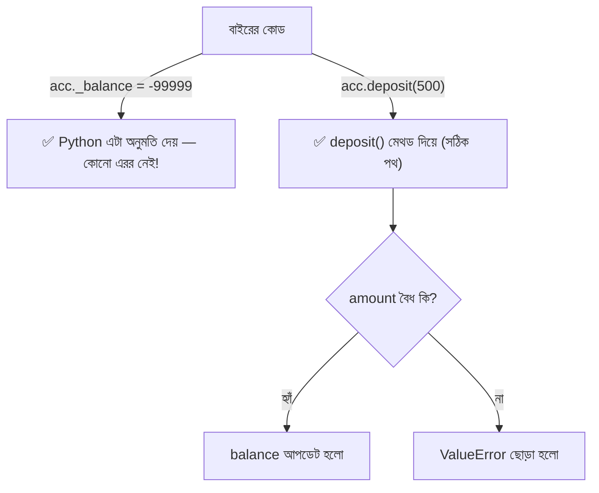

# ০৬. Encapsulation: First Pillar of OOP

আগের লেসনে আমরা ব্যাংক অ্যাকাউন্টের উদাহরণ দিয়ে বুঝেছি Encapsulation মানে ডেটা আর আচরণ একসাথে বেঁধে বাইরের হস্তক্ষেপ আটকানো। এই লেসনে আমরা সেটাকে বাস্তব Python কোডে রূপ দেবো, যদিও পুরোপুরি `class` সিনট্যাক্স আমরা Lesson ৯-এ শিখবো — এখন শুধু Python-এর অ্যাক্সেস কন্ট্রোল কনভেনশনগুলোতে ফোকাস করি।

মডিউল ১৩ Lesson ৪-এ আমরা দেখেছিলাম প্লেইন dict-এ যেকোনো জায়গা থেকে সরাসরি ডেটা পাল্টানো যায়:

```python
account = {"balance": 1000}
account["balance"] = -99999  # কোনো বাধা নেই!
```

Python-এ ক্লাস প্রোপার্টি "লুকানোর" জন্য আমরা আন্ডারস্কোর কনভেনশন ব্যবহার করি:

```python
class BankAccount:
    def __init__(self, initial_balance: float):
        self._balance = initial_balance  # একক আন্ডারস্কোর: "protected", কনভেনশন

    def deposit(self, amount: float) -> None:
        if amount <= 0:
            raise ValueError("জমার পরিমাণ শূন্য বা ঋণাত্মক হতে পারবে না")
        self._balance += amount

    def withdraw(self, amount: float) -> None:
        if amount > self._balance:
            raise ValueError("অপর্যাপ্ত ব্যালেন্স")
        self._balance -= amount

    def get_balance(self) -> float:
        return self._balance


acc = BankAccount(1000)
acc.deposit(500)
print(acc.get_balance())  # 1500

acc._balance = -99999  # ⚠️ এটা কোনো এরর দেয় না! Python এটা আটকায় না
print(acc.get_balance())  # -99999 — সরাসরি বদলে ফেলা সফল হলো
```

## এখানেই Python আর TypeScript-এর সবচেয়ে গুরুত্বপূর্ণ পার্থক্যটা

উপরের কোডের শেষ দুই লাইন লক্ষ্য করো — `acc._balance = -99999` লেখাটা **সম্পূর্ণ বৈধ Python কোড**, কোনো এরর নেই, কোনো ওয়ার্নিং নেই। TypeScript-এ যেখানে `private balance` লিখলে `acc.balance = -99999` কম্পাইল-টাইমেই এরর দিতো, Python-এ এরকম কোনো সুরক্ষা নেই। এই সত্যটা এত গুরুত্বপূর্ণ যে বারবার জোর দিয়ে বলা দরকার — **Python-এ কোনো সত্যিকারের `private` কীওয়ার্ড নেই**। যা আছে, তা হলো কিছু নামকরণ কনভেনশন, যেগুলো ডেভেলপারদের প্রতি একটা "ভদ্র অনুরোধ", কোনো ভাষাগত বাধা না।



## Python-এর তিনটা স্তর — কনভেনশন, কিন্তু এনফোর্সমেন্ট না

Python-এ তিনটা "স্তর" আছে, সব কনভেনশন, কোনোটাই ভাষাগতভাবে সম্পূর্ণ বন্ধ না:

```python
class Example:
    def __init__(self):
        self.public_var = "যেকেউ অ্যাক্সেস করতে পারে"
        self._protected_var = "কনভেনশন: 'এটা ইন্টারনাল, ছুঁয়ো না' — কিন্তু বাধা নেই"
        self.__private_var = "নাম-ম্যাংগলিং হয়, কিন্তু তবুও অ্যাক্সেস করা সম্ভব"
```

- **`public_var`** — সাধারণ প্রোপার্টি, TypeScript-এর `public`-এর মতোই, সবার জন্য খোলা।
- **`_protected_var`** — একক আন্ডারস্কোর, এটা একটা **কনভেনশন মাত্র**। এর মানে "এই প্রোপার্টিটা ইন্টারনাল ব্যবহারের জন্য, বাইরে থেকে অ্যাক্সেস করা উচিত না" — কিন্তু Python ইন্টারপ্রেটার এটা আটকায় না, তুমি ইচ্ছা করলে `obj._protected_var` লিখে অ্যাক্সেস করতে পারবে, কোনো এরর ছাড়াই।
- **`__private_var`** — দ্বৈত আন্ডারস্কোর, এটাতে একটা মেকানিজম আছে যাকে বলে **name mangling**। Python ভেতরে ভেতরে এই নামটাকে বদলে দেয় `_Example__private_var`-এ। এটা সরাসরি `obj.__private_var` লিখে অ্যাক্সেস আটকায় (কারণ নামটাই বদলে গেছে), কিন্তু `obj._Example__private_var` লিখলে **এখনও অ্যাক্সেস করা সম্ভব** — এটা কোনো সত্যিকারের ভাষাগত সিকিউরিটি না, শুধু "দুর্ঘটনাক্রমে ভুল নাম মিলে যাওয়া" এড়ানোর একটা মেকানিজম, বিশেষ করে Inheritance-এর সময় নাম সংঘর্ষ এড়াতে।

```python
class BankAccount:
    def __init__(self, initial_balance: float):
        self.__balance = initial_balance

    def get_balance(self) -> float:
        return self.__balance


acc = BankAccount(1000)
print(acc.__balance)               # ❌ AttributeError — সরাসরি নাম দিয়ে পাওয়া যায় না
print(acc._BankAccount__balance)   # ✅ কাজ করে! name mangling-এর আসল নাম জানলে ভাঙা সম্ভব
```

এটাই সেই "একটা বাস্তব পার্থক্য" যা মনে রাখা জরুরি — TypeScript-এর `private` কম্পাইল-টাইমে ১০০% এনফোর্স হয় (কম্পাইলের আগে), Python-এর `__` name mangling এমনকি রানটাইমেও পুরোপুরি আটকায় না, এটা শুধু "দুর্ঘটনাক্রমে অ্যাক্সেস" আরও কঠিন করে দেয়, ইচ্ছাকৃত অ্যাক্সেস না। Python-এর দর্শনটাই এরকম — কমিউনিটিতে একটা প্রচলিত কথা আছে: **"we're all consenting adults here"** — মানে Python বিশ্বাস করে ডেভেলপারদের একে অপরের কোডের প্রতি সম্মান দেখানো উচিত কনভেনশন মেনে, ভাষার জোর করে বাধা দেওয়ার বদলে।

## প্রোডাকশন নুয়ান্স — কেন এটা বাস্তবে গুরুত্বপূর্ণ

এই পার্থক্যটা নিছক থিওরিটিক্যাল না — বাস্তব প্রোডাকশন সিস্টেমে এর সরাসরি প্রভাব আছে। ধরো তুমি একটা লাইব্রেরি লিখছো, আর `_internal_cache` নামে একটা প্রোটেক্টেড প্রোপার্টি রেখেছো, ভাবছো "এটা তো protected, কেউ ছুঁবে না।" কিন্তু বাস্তবে অনেক Python ডেভেলপার (বিশেষ করে ডেটা সায়েন্স বা কুইক-স্ক্রিপ্টিং ব্যাকগ্রাউন্ড থেকে আসা) সরাসরি `_` দিয়ে শুরু হওয়া প্রোপার্টি অ্যাক্সেস করে ফেলে, বিশেষ করে ডিবাগিং করার সময় বা কোনো শর্টকাট খুঁজতে গিয়ে। যদি তোমার লাইব্রেরির পরবর্তী ভার্সনে তুমি `_internal_cache`-এর গঠন বদলে দাও (যেহেতু এটা "ইন্টারনাল" বলে ভেবেছিলে), যেসব ব্যবহারকারী এটাকে সরাসরি অ্যাক্সেস করছিলো, তাদের কোড ভেঙে যাবে — অথচ TypeScript-এ এই সমস্যা কখনো হতো না কারণ `private` লেখা প্রোপার্টি বাইরে থেকে অ্যাক্সেসই করা যেত না, কম্পাইলার নিজেই আটকে দিতো।

তাই বাস্তব Python প্রজেক্টে Encapsulation ডিজাইন করার সময় শুধু নামকরণ যথেষ্ট না — যদি সত্যিই নিশ্চিত হতে চাও কেউ ভুলভাবে কোনো ডেটা পাল্টাতে পারবে না, তোমাকে রানটাইম চেক (যেমন `@property` দিয়ে getter/setter-এ ভ্যালিডেশন, যা পরের লেসনে দেখবো) বা ইমিউটেবল ডেটা স্ট্রাকচার ব্যবহার করতে হবে — নাম দিয়ে "লুকিয়ে রাখা" যথেষ্ট সুরক্ষা না।

এখন আমরা Encapsulation-এর মূল ধারণা আর Python-এর বিশেষ সীমাবদ্ধতা কোডে দেখেছি। পরের লেসনে আমরা এই একই উদাহরণটাকে আরেকটু ঝালিয়ে নেবো, `@property` ব্যবহার করে একটা আরও নিয়ন্ত্রিত প্যাটার্ন দেখবো, আর কিছু সাধারণ ভুল দেখবো।
