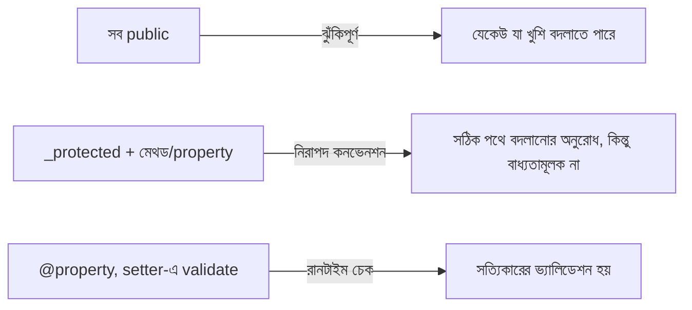

# ০৭. Encapsulation Recap

আগের লেসনে আমরা `BankAccount` ক্লাস দিয়ে Encapsulation দেখেছি — আন্ডারস্কোর কনভেনশন আর তার সীমাবদ্ধতা। এই লেসনে আমরা একটু থেমে, জিনিসগুলো ঝালিয়ে নেবো, `@property` ডেকোরেটর দিয়ে একটা আরও শক্তিশালী প্যাটার্ন শিখবো, আর কিছু বাস্তব প্র্যাকটিস প্যাটার্ন দেখবো।

সবচেয়ে সাধারণ ভুলটা হলো — সবকিছু পাবলিক রেখে দেয়া "সুবিধার জন্য":

```python
class BankAccount:
    def __init__(self, balance: float):
        self.balance = balance  # ভুল অভ্যাস — সরাসরি পাবলিক প্রোপার্টি
```

এটা টাইপ চেক পাস করবে ঠিকই, কিন্তু Encapsulation-এর পুরো উদ্দেশ্যই নষ্ট হয়ে যায় — যে কেউ যেকোনো জায়গা থেকে `acc.balance = -1000000` লিখতে পারবে, কোনো নিয়ম মানা ছাড়াই। এখানে মনে রাখার নিয়ম সহজ — **যদি ডেটা এমন কিছু হয় যেটা নিয়ন্ত্রিতভাবে পাল্টানো উচিত, সেটা `_` দিয়ে চিহ্নিত করো, আর একটা নির্দিষ্ট মেথডের মাধ্যমে অ্যাক্সেস দাও।**

## `@property` — Python-এর getter/setter

Python-এ একটা প্যাটার্ন আছে যেটা প্রায়ই ব্যবহার হয়, `@property` ডেকোরেটর দিয়ে — এটা মেথডকে "প্রোপার্টির মতো" ব্যবহার করার সুযোগ দেয়, TypeScript-এর `get`/`set`-এর সমতুল্য:

```python
class BankAccount:
    def __init__(self, balance: float):
        self._balance = balance

    @property
    def balance(self) -> float:
        """শুধু পড়ার জন্য — getter"""
        return self._balance

    @balance.setter
    def balance(self, value: float) -> None:
        """লেখার সময় নিয়ম চাপানোর জন্য — setter"""
        if value < 0:
            raise ValueError("ব্যালেন্স ঋণাত্মক হতে পারবে না")
        self._balance = value


acc = BankAccount(2000)
print(acc.balance)      # ফাংশন কল না, প্রোপার্টির মতো ব্যবহার — বন্ধনী () লাগে না
acc.balance = 3000       # setter চলে, ভ্যালিডেশন হয়
acc.balance = -500        # ❌ ValueError ছোড়া হবে
```

লক্ষ্য করো — `acc.balance` পড়ার সময় বন্ধনী লাগে না, দেখতে সাধারণ প্রোপার্টির মতো লাগে, কিন্তু ভেতরে আসলে `balance()` getter মেথড চলছে। আর `acc.balance = -500` লেখার সময়, সরাসরি অ্যাসাইনমেন্ট দেখতে লাগলেও, ভেতরে `@balance.setter`-এ যে ভ্যালিডেশন লেখা আছে সেটা চলে। এটাই `@property`-এর শক্তি — TypeScript-এর `private balance` + `deposit()`/`withdraw()` মেথডের মতো একই নিয়ন্ত্রণ পাওয়া যায়, কিন্তু ব্যবহারকারীর কাছে ইন্টারফেসটা একটা সরল প্রোপার্টির মতোই দেখায়।

**গুরুত্বপূর্ণ**: `@property` লেখাটাও এনফোর্সমেন্ট, নাম-কনভেনশনের চেয়ে ভিন্ন লেভেলে। যদি কেউ চায়, তারা তখনও `acc._balance = -500` লিখে সরাসরি ইন্টারনাল ভেরিয়েবল বদলে দিতে পারবে, `setter`-এর ভ্যালিডেশন এড়িয়ে — কারণ `_balance` নিজেই একটা কনভেনশন-ভিত্তিক নাম, আসল সুরক্ষা `@property`-এর ভ্যালিডেশন লজিকে, `_` চিহ্নে না। এটা আগের লেসনের মূল শিক্ষার পুনরাবৃত্তি — Python-এ সুরক্ষা সবসময় "কতটা কঠিন করে দেওয়া হয়েছে ভুল করে অ্যাক্সেস করা" প্রশ্ন, "সম্পূর্ণ অসম্ভব করে দেওয়া" প্রশ্ন না।

## DTO-এর মতো ক্ষেত্রে Encapsulation দরকার নাও হতে পারে

মডিউল ১৩ Lesson ৩-এ আমরা যে Pydantic `UserCreate` মডেল লিখেছিলাম, সেখানে কোনো Encapsulation ছিলো না — কারণ সেটা শুধু ডেটা বহন করার জন্য (এরকম গঠনকে বলে **DTO — Data Transfer Object**)। কিন্তু যদি আমরা একটা `UserAccount` ক্লাস বানাতাম যেখানে পাসওয়ার্ড থাকতো, সেটা অবশ্যই প্রোটেক্টেড হওয়া উচিত হতো:

```python
class UserAccount:
    def __init__(self, email: str, password: str):
        self._email = email
        self.__password = password  # সবচেয়ে সংবেদনশীল ডেটা — দ্বৈত আন্ডারস্কোর

    @property
    def email(self) -> str:
        return self._email

    def check_password(self, attempt: str) -> bool:
        return attempt == self.__password
```

এখানে `email`-এর জন্য শুধু getter দেওয়া হয়েছে, কোনো setter নেই — মানে এটা একবার সেট হওয়ার পর বাইরে থেকে সরাসরি পাল্টানো যাবে না, TypeScript-এর `readonly`-এর সমতুল্য একটা প্যাটার্ন। `__password`-এ দ্বৈত আন্ডারস্কোর ব্যবহার করা হয়েছে, কারণ পাসওয়ার্ডের মতো সংবেদনশীল ডেটার জন্য অতিরিক্ত সতর্কতা ভালো, যদিও (আগের লেসনে যেমন দেখেছি) এটাও পুরোপুরি অভেদ্য না।



## বাস্তব ভুল যা এড়ানো উচিত — mutable default argument

Encapsulation নিয়ে কথা বলার সময় একটা সম্পর্কিত, খুবই সাধারণ Python-নির্দিষ্ট বাগও উল্লেখ করা জরুরি — **mutable default argument**। ধরো তুমি লিখলে:

```python
class ShoppingCart:
    def __init__(self, items: list = []):  # ⚠️ ভয়ংকর বাগ!
        self.items = items

cart1 = ShoppingCart()
cart1.items.append("বই")

cart2 = ShoppingCart()
print(cart2.items)  # ['বই'] — অথচ cart2 খালি হওয়া উচিত ছিলো!
```

এখানে যা ঘটছে তা হলো — Python-এ ফাংশনের ডিফল্ট আর্গুমেন্ট (`= []`) মাত্র **একবার** তৈরি হয়, ফাংশন ডেফিনিশনের সময়, প্রতিবার কল হওয়ার সময় না। ফলে সব `ShoppingCart` instance, যারা `items` না দিয়ে বানানো হয়েছে, একই লিস্ট অবজেক্ট শেয়ার করে — একটাতে যোগ করলে সবগুলোতেই দেখা যায়। এটা Encapsulation ভাঙার একটা সূক্ষ্ম, কুখ্যাত Python গোচা, TypeScript-এ যার কোনো সমতুল্য নেই। সঠিক প্যাটার্ন:

```python
class ShoppingCart:
    def __init__(self, items: list | None = None):
        self.items = items if items is not None else []
```

সংক্ষেপে, Encapsulation-এর ব্যবহারিক নিয়ম: এক, ডেটা যেটা নিয়ন্ত্রণ দরকার সেটা `_`/`__` দিয়ে চিহ্নিত করো। দুই, `@property` দিয়ে নিয়ন্ত্রিত, ভ্যালিডেটেড অ্যাক্সেস দাও। তিন, মনে রাখো নাম-কনভেনশন কখনো ১০০% সিকিউরিটি না — বাস্তব সুরক্ষা আসে ভ্যালিডেশন লজিক থেকে। চার, mutable default argument-এর মতো Python-নির্দিষ্ট গোচা এড়িয়ে চলো।

Encapsulation দিয়ে আমরা শিখলাম কীভাবে ভেতরের ডেটা সুরক্ষিত রাখতে হয়, আর Python-এ এর সীমাবদ্ধতা কী। পরের লেসনে আমরা দেখবো এর পাশের ধারণা — Abstraction — যেখানে প্রশ্নটা হবে ডেটা সুরক্ষার বদলে, জটিলতা কীভাবে লুকানো যায়, আর Python-এর `ABC` মডিউল কীভাবে এটাকে বাস্তবায়ন করে।
