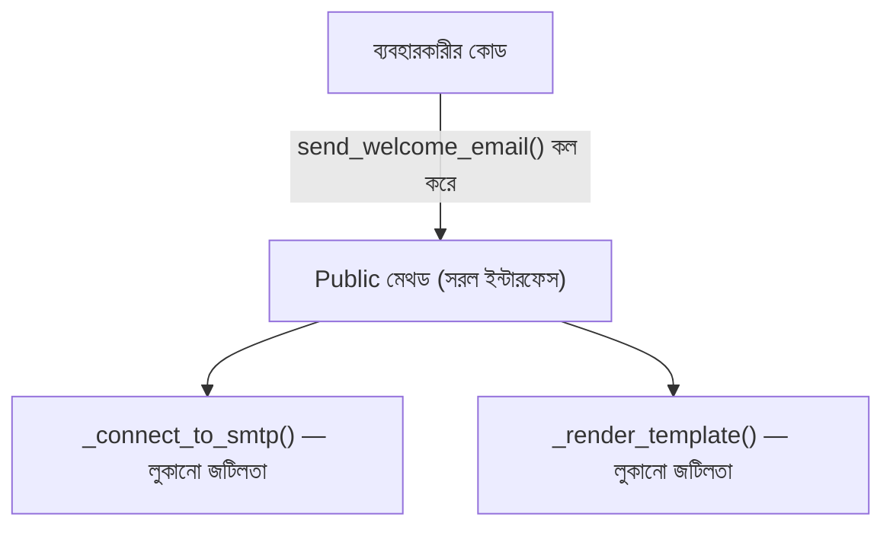

# ০৮. Abstraction - OOP (Python-এর ABC মডিউল)

Encapsulation আর Abstraction অনেক সময় গুলিয়ে ফেলা হয়, কারণ দুটোই "কিছু একটা লুকানো"-র সাথে জড়িত। পার্থক্যটা স্পষ্ট করে নেই — Encapsulation লুকায় **ডেটা**কে অনধিকার প্রবেশ থেকে বাঁচানোর জন্য (আগের দুই লেসনে যা দেখেছি), আর Abstraction লুকায় **জটিলতা**কে, ব্যবহারকারীর জীবন সহজ করার জন্য। একই কাজ, কিন্তু উদ্দেশ্য আলাদা।

মডিউল ১১-১২-এর প্রেক্ষাপটে (JWT, কুকি) মনে করো — JWT ভেরিফাই করার জন্য আমরা `jwt.decode(token, secret, algorithms=["HS256"])` লিখতাম। এই একটা লাইনের পেছনে কতটা জটিলতা লুকিয়ে আছে ভাবো — টোকেনকে তিন ভাগে ভাঙা, base64 ডিকোড করা, ক্রিপ্টোগ্রাফিক সিগনেচার যাচাই করা, এক্সপায়ারি চেক করা। কিন্তু আমাদের এসবের একটাও জানতে হয়নি — লাইব্রেরি এই জটিলতাকে **abstract** করে দিয়েছে, আমাদের হাতে দিয়েছে একটা সহজ ফাংশন কল।

এখন নিজেরাই এরকম একটা abstraction বানাই।

```python
class EmailService:
    def __init__(self, smtp_host: str, smtp_port: int):
        self._smtp_host = smtp_host
        self._smtp_port = smtp_port

    def _connect_to_smtp(self) -> None:
        print(f"SMTP সার্ভার {self._smtp_host}:{self._smtp_port}-এ সংযোগ করা হচ্ছে...")

    def _render_template(self, template_name: str, data: dict) -> str:
        return f'[টেমপ্লেট "{template_name}" রেন্ডার হলো ডেটাসহ: {data}]'

    def send_welcome_email(self, to: str, user_name: str) -> None:
        self._connect_to_smtp()
        body = self._render_template("welcome", {"user_name": user_name})
        print(f"ইমেইল পাঠানো হলো {to} ঠিকানায়:\n{body}")


emailer = EmailService("smtp.example.com", 587)
emailer.send_welcome_email("arman@example.com", "আরমান")
```

লক্ষ্য করো — `EmailService` ব্যবহার করা কতটা সহজ। যে কেউ শুধু `send_welcome_email(to, user_name)` কল করলেই যথেষ্ট। ভেতরে `_connect_to_smtp()` আর `_render_template()` মেথড দুটোকে ইচ্ছাকৃতভাবে আন্ডারস্কোর দিয়ে চিহ্নিত করা হয়েছে — এগুলো implementation-এর "কীভাবে" অংশ, ব্যবহারকারীর জানার দরকার নেই।



## Python-এর `ABC` মডিউল — বাধ্যতামূলক চুক্তি বানানো

TypeScript-এর `abstract class` ধারণাটার সরাসরি সমতুল্য Python-এ আছে, `abc` মডিউলের মাধ্যমে:

```python
from abc import ABC, abstractmethod


class PaymentMethod(ABC):
    @abstractmethod
    def process_payment(self, amount: float) -> None:
        """শুধু ঘোষণা, বাস্তবায়ন নেই"""
        ...

    def log_transaction(self, amount: float) -> None:
        print(f"লেনদেন লগ হলো: ৳{amount}")


payment = PaymentMethod()  # ❌ TypeError: Can't instantiate abstract class
```

এখানে `PaymentMethod(ABC)` লিখে ক্লাসটাকে `ABC` (Abstract Base Class) থেকে ইনহেরিট করানো হয়েছে, আর `@abstractmethod` ডেকোরেটর দিয়ে বলে দেওয়া হয়েছে `process_payment` মেথডটা অবশ্যই কোনো সাবক্লাসে বাস্তবায়ন করতে হবে। এখন যদি কেউ `PaymentMethod()` দিয়ে সরাসরি instance বানাতে চায়, Python **রানটাইমে** `TypeError` ছোঁড়ে — এটা লক্ষ্য করার মতো একটা গুরুত্বপূর্ণ পার্থক্য।

## একটা গুরুত্বপূর্ণ প্রোডাকশন নুয়ান্স — এই এনফোর্সমেন্ট কম্পাইল-টাইমে না, রানটাইমে

TypeScript-এ `abstract class PaymentMethod`-কে সরাসরি `new PaymentMethod()` দিয়ে instantiate করার চেষ্টা করলে, এটা **কম্পাইল-টাইমেই** এরর ধরে — কোড রান হওয়ার সুযোগই পায় না। Python-এ `ABC` ব্যবহার করে একই আচরণ পাওয়া গেলেও, এই চেকটা ঘটে **রানটাইমে**, যখন `PaymentMethod()` লাইনটা কার্যকর হয়। মানে ধরো একটা শর্তসাপেক্ষ কোড পাথে (যেমন কোনো নির্দিষ্ট এজ কেসে) কেউ ভুল করে `PaymentMethod()` সরাসরি instantiate করে, আর সেই কোড পাথ রেয়ারলি ট্রিগার হয় — এই বাগটা প্রোডাকশনে অনেকদিন লুকিয়ে থাকতে পারে, ঠিক যেভাবে আগের লেসনগুলোতে আমরা দেখেছি টাইপ-সম্পর্কিত ভুল রানটাইমে ধরা পড়ে।

আরও সূক্ষ্ম একটা এজ কেস — যদি একটা সাবক্লাস `abstractmethod`-এর **সবগুলো** বাস্তবায়ন না করে, Python তখনও সেই সাবক্লাসের instance বানাতে দেবে না:

```python
class CashPayment(PaymentMethod):
    pass  # process_payment বাস্তবায়ন করা হয়নি!

cash = CashPayment()  # ❌ TypeError: Can't instantiate abstract class CashPayment with abstract method process_payment
```

এই এরর মেসেজটা সহায়ক, কিন্তু এটাও রানটাইমে আসে — যদি `CashPayment` ক্লাসটা কোথাও রেয়ারলি ব্যবহৃত হয় (যেমন একটা টেস্ট স্যুটে যা সব কোড পাথ কভার করে না), এই ভুলটা প্রোডাকশন ডিপ্লয়মেন্ট পর্যন্ত না ধরা পড়ে থেকে যেতে পারে। এই কারণেই বাস্তব প্রজেক্টে যেখানে `ABC` ব্যবহার হয়, প্রতিটা সাবক্লাসের জন্য অন্তত একটা instantiation টেস্ট রাখা একটা ভালো অভ্যাস — শুধু মেথড টেস্ট করা যথেষ্ট না, ক্লাসটা আসলে instantiate হতে পারে কিনা সেটাও যাচাই করা জরুরি।

| বিষয় | TypeScript `abstract class` | Python `ABC` + `@abstractmethod` |
|---|---|---|
| এনফোর্সমেন্ট সময় | কম্পাইল-টাইম | রানটাইম |
| সরাসরি instantiate করার চেষ্টা | কম্পাইল এরর | `TypeError` (কোড রান হওয়ার পরে) |
| অসম্পূর্ণ সাবক্লাস | কম্পাইল এরর | `TypeError` instantiate করার সময় |
| শেয়ার্ড implementation | সাধারণ মেথড লেখা যায় | সাধারণ মেথড লেখা যায় (একই রকম) |

## Encapsulation বনাম Abstraction — একই টুল, আলাদা উদ্দেশ্য

এখানে একটা গুরুত্বপূর্ণ প্রশ্ন আসে — Encapsulation-এর আন্ডারস্কোর কনভেনশন আর Abstraction কি তাহলে একই টুল দিয়ে হয়? উত্তর হলো — অনেকটা হ্যাঁ, টুলটা (আন্ডারস্কোর) একই, কিন্তু চিন্তাভাবনার কোণ আলাদা। `self._balance` লেখার সময় তুমি ভাবছো "কেউ যেন ভুল করে ব্যালেন্স নষ্ট না করে" (Encapsulation — সুরক্ষা)। `self._connect_to_smtp` লেখার সময় তুমি ভাবছো "ব্যবহারকারীর এই ডিটেইল জানার দরকার নেই, এটা তাকে বিভ্রান্ত করবে" (Abstraction — সরলীকরণ)। `ABC`/`abstractmethod` একটা তৃতীয়, আরও কড়া টুল — এটা বলে "এই চুক্তিটা মানতেই হবে, নাহলে ক্লাসটাই তৈরি করা যাবে না।"

Abstraction শেখার পর এখন আমরা প্রস্তুত মূল কাঠামোতে — Class ঠিক কী, আর কীভাবে লেখা হয় — সেটা গভীরভাবে বোঝার জন্য। পরের লেসনে আমরা Class-এর বেসিক অ্যানাটমি নিয়ে বিস্তারিত আলোচনা করবো।
