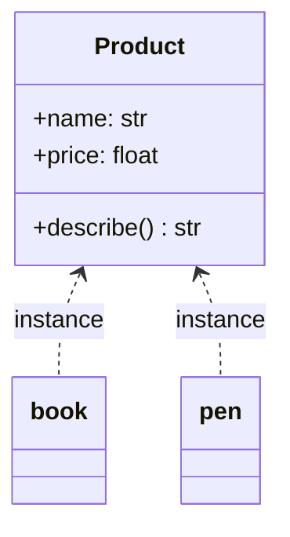

# ০৯. What Is a Class? Basics of Class

গত চারটা লেসনে আমরা বারবার `class` কীওয়ার্ড ব্যবহার করেছি, উদাহরণ দিয়ে দিয়ে Encapsulation আর Abstraction বুঝেছি। এবার সময় এসেছে থেমে, `class`-এর অ্যানাটমিটা টুকরো টুকরো করে বোঝার।

সহজ ভাষায়, একটা **class** হলো একটা নকশা বা ছাঁচ (blueprint/template), যেটা দিয়ে আমরা একই ধরনের একাধিক বস্তু (object) বানাতে পারি। ধরো তুমি একটা মিষ্টির ছাঁচ কিনলে — ছাঁচটা নিজে মিষ্টি না, কিন্তু ওই ছাঁচ দিয়ে তুমি একই আকারের অনেকগুলো মিষ্টি বানাতে পারো। ক্লাস হলো সেই ছাঁচ, আর প্রতিটা মিষ্টি হলো একটা **instance** (বা object) — ক্লাস থেকে বানানো একটা বাস্তব বস্তু।

```python
class Product:
    def __init__(self, name: str, price: float):
        self.name = name
        self.price = price

    def describe(self) -> str:
        return f"{self.name} — মূল্য ৳{self.price}"


book = Product("বই", 250)
pen = Product("কলম", 15)

print(book.describe())  # বই — মূল্য ৳250
print(pen.describe())   # কলম — মূল্য ৳15
```

এখানে `Product` হলো ক্লাস (ছাঁচ), আর `book`, `pen` হলো দুটো আলাদা instance — একই ছাঁচ থেকে বানানো, কিন্তু আলাদা আলাদা ডেটাসহ। `Product(...)` লিখে আমরা ক্লাস থেকে একটা নতুন instance তৈরি করি — একে বলে **instantiation**। TypeScript-এ `new Product(...)` লিখতে হতো — Python-এ `new` কীওয়ার্ড লাগে না, সরাসরি ক্লাসের নাম ফাংশনের মতো কল করলেই instance তৈরি হয়ে যায়।

`__init__` হলো একটা বিশেষ মেথড (একে বলে **dunder method**, "double underscore" থেকে), যেটা `Product(...)` লেখার মুহূর্তে স্বয়ংক্রিয়ভাবে চলে — এটা TypeScript-এর `constructor`-এর সমতুল্য। এর কাজ হলো নতুন instance-টাকে শুরুতে দরকারি মান দিয়ে সাজিয়ে দেয়া — যাকে বলে **initialization**।

## `self` — Python-এর একটা নিজস্ব বৈশিষ্ট্য

লক্ষ্য করো, `__init__`-এর প্রথম প্যারামিটার `self` — এটা TypeScript/JavaScript-এর `this`-এর সমতুল্য, কিন্তু একটা গুরুত্বপূর্ণ পার্থক্য আছে। TypeScript-এ `this` স্বয়ংক্রিয়ভাবে ইঞ্জিন দিয়ে বসানো, তোমাকে ফাংশন সিগনেচারে লিখতে হয় না। Python-এ **প্রতিটা** ইনস্ট্যান্স মেথডের প্রথম প্যারামিটার হিসেবে `self` স্পষ্টভাবে লিখতে হয় — এটা Python-এর ডিজাইন দর্শন ("explicit is better than implicit")-এর একটা উদাহরণ। এই `self` না লিখলে বা ভুল জায়গায় ব্যবহার করলে Python একটা `TypeError` ছুঁড়বে, প্যারামিটার সংখ্যা না মিললে বলে।



## `dataclass` — Python-এর নিজস্ব শর্টকাট

TypeScript-এ constructor-এর ভেতরে বারবার `this.x = x` লেখার ঝামেলা কমাতে **parameter property** শর্টকাট ছিলো। Python-এর সমতুল্য শর্টকাটটা আরও শক্তিশালী — `dataclass`:

```python
from dataclasses import dataclass


@dataclass
class Product:
    name: str
    price: float

    def describe(self) -> str:
        return f"{self.name} — মূল্য ৳{self.price}"


book = Product("বই", 250)
```

`@dataclass` ডেকোরেটর স্বয়ংক্রিয়ভাবে `__init__` বানিয়ে দেয় (উপরের `name`, `price` অ্যাট্রিবিউট থেকে), সাথে `__repr__` (প্রিন্ট করার জন্য সুন্দর ফরম্যাট) আর `__eq__` (দুটো instance তুলনা করার জন্য) মেথডও তৈরি করে দেয়, যেগুলো প্লেইন ক্লাসে নিজে হাতে লিখতে হতো। এটা এতটাই সাধারণ প্যাটার্ন যে বাস্তব প্রজেক্টে "শুধু ডেটা রাখার" ক্লাসগুলোর জন্য `dataclass` ডিফল্ট পছন্দ হয়ে ওঠে।

## `class` বনাম Pydantic `BaseModel` বনাম `dataclass`

এখানে একটা কমন প্রশ্ন আসে — মডিউল ১৩ Lesson ৩-এ আমরা Pydantic `BaseModel` দেখেছি, এখানে `dataclass`, আর সাধারণ `class`। পার্থক্যটা স্পষ্ট করে নেওয়া জরুরি, কারণ ভুল টুল বেছে নেওয়া বাস্তব প্রজেক্টে সমস্যা তৈরি করে:

| টুল | কখন ব্যবহার | রানটাইম ভ্যালিডেশন |
|---|---|---|
| সাধারণ `class` | কাস্টম লজিক, মেথড, Encapsulation দরকার | না, নিজে হাতে লিখতে হয় |
| `dataclass` | শুধু ডেটা বহন, ইন্টারনাল ব্যবহার | না |
| Pydantic `BaseModel` | বাইরের জগত থেকে ডেটা আসছে (API রিকোয়েস্ট) | হ্যাঁ, স্বয়ংক্রিয় |

একটা সাধারণ ভুল হলো `dataclass` ব্যবহার করে API-এর ইনপুট ভ্যালিডেট করার চেষ্টা করা — `dataclass` টাইপ হিন্ট থেকে `__init__` বানায় ঠিকই, কিন্তু **রানটাইমে টাইপ চেক করে না**:

```python
@dataclass
class UserInput:
    age: int

user = UserInput(age="পঁচিশ")  # কোনো এরর নেই! dataclass টাইপ এনফোর্স করে না
print(user.age)  # "পঁচিশ" — স্ট্রিং-ই থেকে গেলো
```

এই কারণেই বাইরের জগত থেকে ডেটা আসা মাত্রই (API রিকোয়েস্ট বডি, ফর্ম ইনপুট) `dataclass` না, Pydantic `BaseModel` ব্যবহার করা হয় — শুধু ইন্টারনাল, ট্রাস্টেড ডেটার জন্য `dataclass` যথেষ্ট।

## `interface` বনাম `class` — Python-এ কী পরিবর্তন হয়

মডিউল ১৩ Lesson ৯-এর পুরনো TypeScript ভার্সনে আমরা প্রশ্ন তুলেছিলাম `interface` আর `class`-এর পার্থক্য কী। Python-এ প্লেইনভাবে `interface` নামে কিছু নেই — এই ধারণাটা Python-এ দুই ভাগে ভাগ হয়ে যায়: গঠন-নির্দিষ্ট চুক্তির জন্য `Protocol` (মডিউল ১৪-এ বিস্তারিত), আর বাস্তবায়নসহ ব্লুপ্রিন্টের জন্য `class`/`ABC`। এই বিভাজনটা কেন গুরুত্বপূর্ণ, তা আমরা মডিউল ১৪-তে গভীরভাবে দেখবো, যেখানে TypeScript-এর `interface` আর Python-এর `Protocol`-কে দুটো ভিন্ন ধারণা হিসেবে শেখা হবে, একটাকে অন্যটার সরল অনুবাদ না ভেবে।

একটা ক্লাসে **static**-এর সমতুল্য সদস্যও থাকতে পারে, Python-এ `classmethod`/class-level attribute হিসেবে:

```python
class Product:
    category = "সাধারণ পণ্য"  # class attribute, সব instance শেয়ার করে

    def __init__(self, name: str, price: float):
        self.name = name
        self.price = price


print(Product.category)  # instance ছাড়াই সরাসরি অ্যাক্সেস, TypeScript-এর static-এর মতোই
```

এখন আমরা ক্লাসের মূল অ্যানাটমি জানি — অ্যাট্রিবিউট, `__init__`, মেথড, class attribute, আর `dataclass` শর্টকাট। পরের লেসনে আমরা দেখবো কীভাবে একটা ক্লাস আরেকটা ক্লাসের বৈশিষ্ট্য "উত্তরাধিকার" সূত্রে পেতে পারে — Inheritance।
