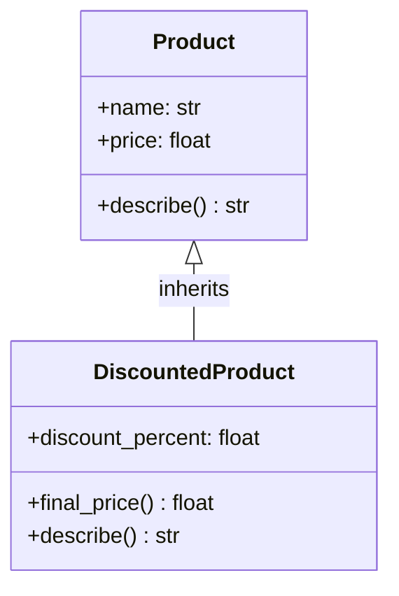

# ১০. Inheritance in OOP

আগের লেসনে আমরা `Product` ক্লাস বানিয়েছি — `name`, `price`, আর `describe()` মেথডসহ। ধরো এখন আমাদের একটা `DiscountedProduct` দরকার, যেটা `Product`-এর সবকিছুই রাখবে, কিন্তু সাথে একটা ছাড়ের হার (`discount_percent`) যোগ করবে, আর দাম হিসাব করার নিয়মও একটু আলাদা হবে। এখানেই OOP-এর চতুর্থ (তবে ক্রমানুসারে আমাদের তৃতীয়) স্তম্ভ — **Inheritance** — কাজে আসে।

Inheritance-এর মূল ভাব হলো — একটা ক্লাস (বলা হয় **child class** বা **subclass**) আরেকটা ক্লাসের (বলা হয় **parent class** বা **superclass**) সব প্রোপার্টি আর মেথড স্বয়ংক্রিয়ভাবে পেয়ে যায়, আর তার উপর নিজের নতুন কিছু যোগ করতে পারে। Python-এ এটা লেখা হয় ক্লাস ডেফিনিশনের বন্ধনীর ভেতরে parent-এর নাম দিয়ে:

```python
class Product:
    def __init__(self, name: str, price: float):
        self.name = name
        self.price = price

    def describe(self) -> str:
        return f"{self.name} — মূল্য ৳{self.price}"


class DiscountedProduct(Product):
    def __init__(self, name: str, price: float, discount_percent: float):
        super().__init__(name, price)  # parent class-এর __init__ কল করা
        self.discount_percent = discount_percent

    def final_price(self) -> float:
        return self.price - (self.price * self.discount_percent) / 100

    def describe(self) -> str:
        return f"{super().describe()} ({self.discount_percent}% ছাড়ে, চূড়ান্ত দাম ৳{self.final_price()})"


regular = Product("বই", 250)
sale = DiscountedProduct("কলম", 100, 20)

print(regular.describe())  # বই — মূল্য ৳250
print(sale.describe())     # কলম — মূল্য ৳100 (20% ছাড়ে, চূড়ান্ত দাম ৳80)
```

এখানে বেশ কিছু নতুন জিনিস আছে, একে একে দেখি। `class DiscountedProduct(Product)` মানে হলো `DiscountedProduct`, `Product`-এর সব প্রোপার্টি (`name`, `price`) আর মেথড (`describe`) পেয়ে যাচ্ছে বিনা পরিশ্রমে। `super().__init__(name, price)` হলো parent class-এর `__init__`-কে কল করার উপায় — TypeScript-এর `super(name, price)`-এর সমতুল্য। এখানে একটা পার্থক্য মনে রাখা জরুরি — Python-এ `super().__init__()` কল করা **বাধ্যতামূলক না**, TypeScript-এর মতো কম্পাইলার জোর করে না। যদি ভুলে যাও, Python কোনো এরর দেবে না, কিন্তু `self.name`, `self.price` কখনো সেট হবে না, আর পরে যখন `self.name` অ্যাক্সেস করার চেষ্টা হবে, `AttributeError` আসবে — অনেক পরে, ঠিক সেই লাইনে যেখানে সমস্যা প্রথম দেখা দেয়, `__init__`-এ না।

`describe()` মেথডটা `DiscountedProduct`-এ আবার লেখা হয়েছে — এটাকে বলে **method overriding**, মানে parent-এর মেথডকে child class নিজের মতো করে পুনর্লিখন করছে। `super().describe()` কল করে parent-এর মূল বর্ণনাটাও ব্যবহার করা হয়েছে, শুধু তার সাথে বাড়তি তথ্য জুড়ে — পুরোপুরি নতুন করে না লিখে, পুরনোটাকে "বাড়িয়ে" ব্যবহার করা হয়েছে।



## `protected` কনভেনশন Inheritance-এর সাথে

মডিউল ১৩ Lesson ৬-এ আমরা দেখেছিলাম একক আন্ডারস্কোর (`_`) হলো "protected"-এর Python কনভেনশন। ধরো `Product`-এ আমরা `price`-কে একক আন্ডারস্কোর দিয়ে চিহ্নিত করি:

```python
class Product:
    def __init__(self, name: str, price: float):
        self.name = name
        self._price = price  # protected কনভেনশন


class DiscountedProduct(Product):
    def final_price(self, discount_percent: float) -> float:
        return self._price - (self._price * discount_percent) / 100  # ✅ child class অ্যাক্সেস করতে পারছে, কনভেনশন মেনেই


p = DiscountedProduct("কলম", 100)
print(p._price)  # ⚠️ TypeScript-এ এটা কম্পাইল এরর হতো, Python-এ এটা কাজ করে, কোনো এরর নেই!
```

এখানে সেই পুরনো সত্যটাই আবার — TypeScript-এ `protected price` লিখলে ক্লাসের বাইরে থেকে `p.price` অ্যাক্সেস করার চেষ্টা কম্পাইল-টাইমেই এরর দিতো। Python-এ `self._price` ঠিক সেই একই "protected" বোঝানোর জন্য লেখা হলেও, `p._price` লেখা সম্পূর্ণ বৈধ, কোনো এরর ছাড়াই চলে — এখানেও এনফোর্সমেন্ট নেই, কনভেনশনই সব।

## Multiple Inheritance — Python-এ আছে, TypeScript-এ নেই

এখানে একটা গুরুত্বপূর্ণ পার্থক্য উল্লেখ করা জরুরি যা TypeScript-এর সাথে সরাসরি তুলনীয় না — Python একটা ক্লাসকে **একাধিক** parent class থেকে ইনহেরিট করার অনুমতি দেয় (multiple inheritance), যেখানে TypeScript-এ একটা ক্লাস `extends` দিয়ে মাত্র **একটা** parent class-ই পেতে পারে (একাধিক `interface` `implements` করা যায়, কিন্তু একাধিক ক্লাস `extends` করা যায় না):

```python
class Loggable:
    def log(self, message: str) -> None:
        print(f"[LOG] {message}")


class Serializable:
    def to_dict(self) -> dict:
        return self.__dict__


class Product(Loggable, Serializable):  # দুটো parent class!
    def __init__(self, name: str, price: float):
        self.name = name
        self.price = price


p = Product("বই", 250)
p.log("প্রোডাক্ট তৈরি হলো")     # Loggable থেকে
print(p.to_dict())              # Serializable থেকে
```

এটা শক্তিশালী মনে হলেও, একটা বাস্তব প্রোডাকশন সমস্যার উৎস হতে পারে — যদি `Loggable` আর `Serializable` দুটোতেই একই নামের মেথড থাকে (ধরো দুটোতেই `describe()` থাকতো), Python কোনটা ব্যবহার করবে তা ঠিক করে **MRO (Method Resolution Order)** নামের একটা নিয়ম দিয়ে — বাম থেকে ডানে যে ক্লাস আগে লেখা হয়েছে, তার মেথডই আগে অগ্রাধিকার পায়। এই "কোন মেথড আসলে চলছে" প্রশ্নটা multiple inheritance যত জটিল হয়, তত অস্পষ্ট হয়ে যায় — একে বলা হয় **diamond problem**, আর এটা এত সমস্যাজনক যে অনেক Python স্টাইল গাইড (এবং বাস্তব প্রোডাকশন টিম) multiple inheritance এড়িয়ে চলার পরামর্শ দেয়, শুধু ছোট, ফোকাসড "মিক্সিন" ক্লাসের জন্য (যেমন `Loggable`) ব্যতিক্রম রাখে। TypeScript এই সমস্যা এড়িয়ে গেছে ডিজাইনের সময়ই, শুধু single inheritance অনুমতি দিয়ে, আর একাধিক চুক্তির জন্য `interface implements` (কোনো কোড শেয়ার হয় না, শুধু গঠন) আলাদা রেখে।

Inheritance আমাদের কোড পুনর্ব্যবহার (code reuse) করতে দেয়, একই কাঠামোর উপর ভিন্ন ভিন্ন বিশেষায়িত ক্লাস বানাতে দেয়। কিন্তু একটা প্রশ্ন থেকেই যায় — যদি `Product`, `DiscountedProduct`, আর ভবিষ্যতে হয়তো `SubscriptionProduct` — এই সবগুলোর `describe()` মেথড থাকে, কিন্তু প্রত্যেকটার আচরণ ভিন্ন, তাহলে আমরা কীভাবে এদের সবাইকে "একই ধরনের জিনিস" হিসেবে একসাথে ব্যবহার করবো, একটা লিস্টে রেখে লুপ চালাবো? এই প্রশ্নের উত্তরই হলো Polymorphism — আর সেটা নিয়েই শুরু হবে পরের মডিউল, মডিউল ১৪ — Protocols And Polymorphism, যেখানে আমরা Python-এর `Protocol` আর TypeScript-এর `interface`-এর মধ্যে গুরুত্বপূর্ণ দর্শনগত পার্থক্যও দেখবো।
