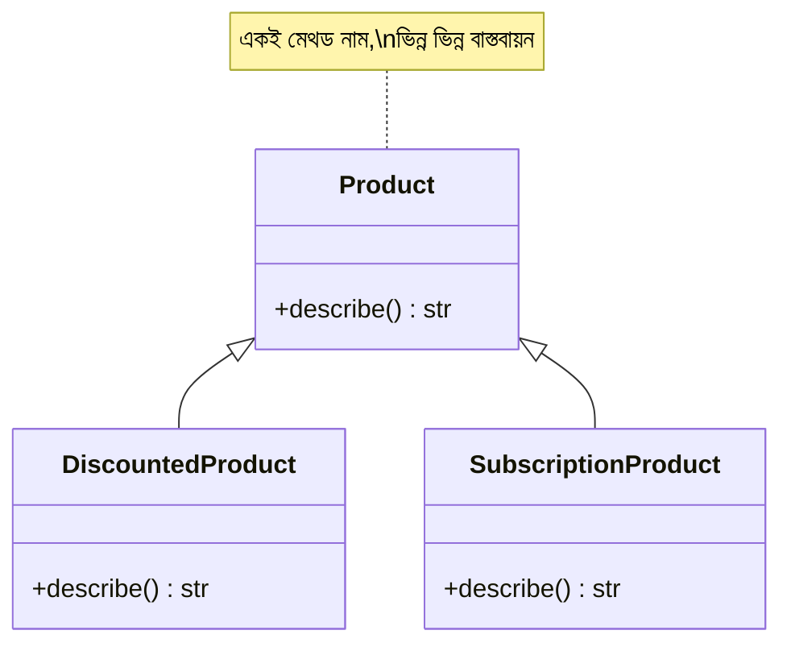

# ০১. Introduction to Polymorphism

মডিউল ১৩-এর শেষ লেসনে আমরা `Product` আর `DiscountedProduct` বানিয়েছিলাম — `DiscountedProduct`, `Product`-কে ইনহেরিট করে নিজের `describe()` মেথড দিয়ে parent-এর মেথড override করেছিলো। লেসনের শেষে একটা প্রশ্ন রেখে এসেছিলাম — যদি আমাদের কাছে `Product`, `DiscountedProduct`, আর ভবিষ্যতে হয়তো `SubscriptionProduct`-এর মতো একাধিক ধরনের পণ্য থাকে, আর সবগুলোর `describe()` মেথড আছে কিন্তু আলাদা আচরণ করে, তাহলে আমরা কীভাবে এদের সবাইকে "একই গোত্রের জিনিস" হিসেবে একসাথে ট্রিট করবো? এই প্রশ্নের উত্তরই হলো **Polymorphism**।

গ্রিক শব্দ Polymorphism-এর অর্থ "বহু রূপ" (poly = বহু, morph = রূপ)। প্রোগ্রামিং-এ এর মানে হলো — একই নামের একটা মেথড কল করলে, কোন ধরনের বস্তু (object) সেটা কল করছে তার উপর ভিত্তি করে আলাদা আলাদা আচরণ হতে পারে। আগের লেসনের কোডটা আসলে polymorphism-এরই প্রথম উদাহরণ ছিলো — শুধু আমরা তখন নামটা বলিনি। এখন সেটা আরও স্পষ্টভাবে দেখি:

```python
class Product:
    def __init__(self, name: str, price: float):
        self.name = name
        self.price = price

    def describe(self) -> str:
        return f"{self.name} — মূল্য ৳{self.price}"


class DiscountedProduct(Product):
    def __init__(self, name: str, price: float, discount_percent: float):
        super().__init__(name, price)
        self.discount_percent = discount_percent

    def describe(self) -> str:
        return f"{self.name} — ৳{self.price} থেকে {self.discount_percent}% ছাড়ে"


class SubscriptionProduct(Product):
    def __init__(self, name: str, price: float, billing_cycle: str):
        super().__init__(name, price)
        self.billing_cycle = billing_cycle

    def describe(self) -> str:
        return f"{self.name} — ৳{self.price}/{self.billing_cycle}"


catalog: list[Product] = [
    Product("বই", 250),
    DiscountedProduct("কলম", 100, 20),
    SubscriptionProduct("স্ট্রিমিং সাবস্ক্রিপশন", 199, "মাস"),
]

for item in catalog:
    print(item.describe())
# বই — মূল্য ৳250
# কলম — ৳100 থেকে 20% ছাড়ে
# স্ট্রিমিং সাবস্ক্রিপশন — ৳199/মাস
```

এখানে জাদুকরী ব্যাপারটা লক্ষ্য করো — `catalog` লিস্টটার টাইপ হিন্ট `list[Product]`, কিন্তু ভেতরে আসলে তিন রকমের ভিন্ন ভিন্ন ক্লাসের instance রাখা আছে। `for` লুপের ভেতরে আমরা একটা লাইনই লিখেছি — `item.describe()` — অথচ প্রতিটা item নিজের ক্লাস অনুযায়ী আলাদা ফলাফল দিচ্ছে। আমাদের `if isinstance(item, DiscountedProduct): ... elif ...` লেখার দরকারই হয়নি। Python রানটাইমে নিজে থেকেই বুঝে নেয় প্রতিটা `item`-এর আসল ক্লাস কী, আর সেই ক্লাসের `describe()` মেথডটাই চালায়। এই আচরণকে বলে **runtime polymorphism** বা **dynamic dispatch**।



## একটা গুরুত্বপূর্ণ প্রোডাকশন এজ কেস — টাইপ হিন্ট এখানে কী গ্যারান্টি দেয় (আর দেয় না)

`list[Product]` লেখার সময় একটা সাধারণ ভুল ধারণা হয় যে এটা রানটাইমে চেক হয় — কিন্তু মডিউল ১৩-তে যা শিখেছি তা এখানেও সত্য। যদি কেউ ভুল করে `catalog`-এ একটা সম্পূর্ণ অসম্পর্কিত অবজেক্ট যোগ করে (ধরো একটা প্লেইন `dict`, `{"name": "ভুল আইটেম"}`), `mypy`/`pyright` এটা ধরে ফেলবে স্ট্যাটিক অ্যানালাইসিসে, কিন্তু যদি সরাসরি `python` দিয়ে রান করা হয়, কোনো এরর ছাড়াই কোড চলবে — যতক্ষণ না `for` লুপে `item.describe()` কল হয়, আর সেই `dict`-এর কোনো `describe` মেথড নেই বলে `AttributeError` ছোঁড়ে। এই এররটা লুপের ঠিক সেই আইটেমে গিয়ে আটকাবে, পুরো লিস্ট প্রসেস হওয়ার আগেই — মানে যদি `catalog`-এ ১০০টা আইটেম থাকে আর ভুল আইটেমটা ৫০ নম্বরে থাকে, প্রথম ৪৯টা প্রসেস হয়ে যাবে, তারপর পুরো অপারেশন ক্র্যাশ করবে, আংশিক ফলাফল রেখে — এটা প্রোডাকশনে ডেটা ইনকনসিস্টেন্সির একটা সাধারণ কারণ।

Polymorphism-এর আসল সুবিধা কোথায়, সেটা বোঝা যায় যখন আমরা নতুন একটা ধরন যোগ করি। ধরো ভবিষ্যতে আমরা `BundleProduct` নামে আরেকটা ক্লাস যোগ করলাম, `Product`-কে ইনহেরিট করে, নিজের `describe()` লিখে। আমাদের `for` লুপের কোড **এক অক্ষরও পাল্টাতে হবে না** — কারণ লুপটা কখনোই জানতো না ঠিক কোন কোন ক্লাস আছে, সে শুধু জানতো "এরা সবাই `Product`, আর সবার `describe()` আছে।" এটাই Polymorphism-এর মূল শক্তি — কোডকে ভবিষ্যতের পরিবর্তনের জন্য প্রস্তুত রাখা, নতুন ধরন যোগ হলেও পুরনো কোড অক্ষত থাকা।

এই ধারণাটা FastAPI-এর রুট হ্যান্ডলারের সাথেও তুলনা করা যায় — FastAPI-এর `@app.get()`, `@app.post()` প্রতিটাই "একই প্যাটার্নের" ফাংশন আশা করে, কিন্তু প্রতিটা রুটের ভেতরের লজিক সম্পূর্ণ ভিন্ন হতে পারে। এটাও এক ধরনের polymorphic চিন্তাভাবনা — একটা কমন "আকৃতি" মেনে চললে, ভেতরের বাস্তবায়ন যা খুশি হতে পারে।

এখন আমরা Polymorphism-এর মূল ধারণা বুঝেছি — একই ইন্টারফেসের পেছনে ভিন্ন ভিন্ন আচরণ, আর সেই সাথে একটা গুরুত্বপূর্ণ প্রোডাকশন সতর্কতা যে টাইপ হিন্ট নিজে থেকে রানটাইমে কিছু গ্যারান্টি করে না। পরের লেসনে আমরা আরও একটা concrete উদাহরণ দিয়ে এটাকে অনুশীলন করবো, আর সেখানেই ঢুকবো Python-এর `Protocol` আর TypeScript-এর `interface`-এর মধ্যে একটা গুরুত্বপূর্ণ দর্শনগত পার্থক্যে।
