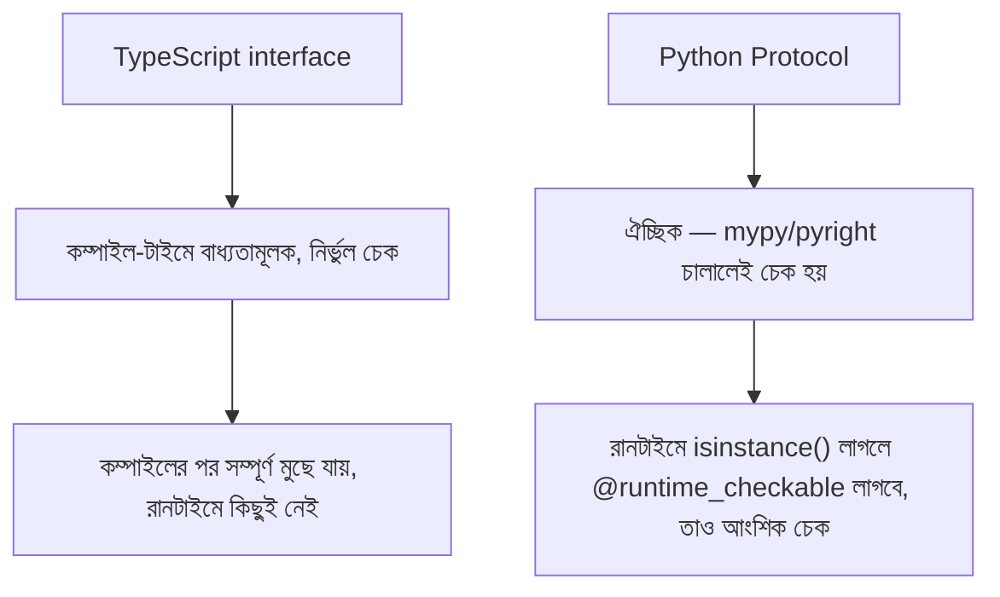

# ০২. Example with Class: Polymorphism হাতে-কলমে, আর Protocol বনাম Interface

আগের লেসনে আমরা `Product`-এর তিনটা সাবক্লাস দিয়ে দেখেছি কীভাবে একই মেথড নাম ভিন্ন ভিন্ন আচরণ করতে পারে। এই লেসনে আমরা আরেকটা বাস্তবসম্মত উদাহরণ দিয়ে বিষয়টা আরও গভীরভাবে অনুশীলন করবো — একটা **আকৃতি (Shape) হিসাব করার সিস্টেম** — আর তারপর একটা মৌলিক প্রশ্নে ঢুকবো যেটা এড়িয়ে যাওয়া ঠিক হবে না: Python-এর `Protocol` আর TypeScript-এর `interface` — এই দুটো কি একই জিনিস? উত্তর হলো, না — এবং এই পার্থক্যটা বোঝা জরুরি।

## প্রথমে ABC দিয়ে Polymorphism (Inheritance-ভিত্তিক পথ)

```python
from abc import ABC, abstractmethod
import math


class Shape(ABC):
    @abstractmethod
    def calculate_area(self) -> float:
        ...

    def describe(self) -> str:
        return f"{self.__class__.__name__}-এর ক্ষেত্রফল: {self.calculate_area():.2f}"


class Circle(Shape):
    def __init__(self, radius: float):
        self.radius = radius

    def calculate_area(self) -> float:
        return math.pi * self.radius ** 2


class Rectangle(Shape):
    def __init__(self, width: float, height: float):
        self.width = width
        self.height = height

    def calculate_area(self) -> float:
        return self.width * self.height


class Triangle(Shape):
    def __init__(self, base: float, height: float):
        self.base = base
        self.height = height

    def calculate_area(self) -> float:
        return (self.base * self.height) / 2


shapes: list[Shape] = [Circle(5), Rectangle(4, 6), Triangle(3, 8)]

total_area = 0.0
for shape in shapes:
    print(shape.describe())
    total_area += shape.calculate_area()

print(f"মোট ক্ষেত্রফল: {total_area:.2f}")
```

আউটপুট হবে:

```
Circle-এর ক্ষেত্রফল: 78.54
Rectangle-এর ক্ষেত্রফল: 24.00
Triangle-এর ক্ষেত্রফল: 12.00
মোট ক্ষেত্রফল: 114.54
```

এখানে `total_area += shape.calculate_area()` লাইনটা কোনোভাবেই জানে না ভেতরে বৃত্ত না আয়তক্ষেত্র না ত্রিভুজ চলছে — এটা `dynamic method dispatch`, আগের লেসনে যা দেখেছি। এই পর্যন্ত সবকিছু মডিউল ১৩-এর `ABC`-এর সরাসরি ধারাবাহিকতা — এই পথে polymorphism পেতে হলে সাবক্লাসকে অবশ্যই `Shape` থেকে **ইনহেরিট** করতে হবে।

```mermaid
sequenceDiagram
    participant Loop as for লুপ
    participant C as Circle
    participant R as Rectangle
    Loop->>C: calculate_area()
    C-->>Loop: 78.54 (π × r²)
    Loop->>R: calculate_area()
    R-->>Loop: 24.00 (width × height)
```

## এখন Protocol দিয়ে — Inheritance ছাড়াই একই ফলাফল

এখানেই Python একটা সম্পূর্ণ ভিন্ন পথ দেয়, যেটার TypeScript-এ সরাসরি সমতুল্য নেই ঠিক এই রূপে। `typing.Protocol` দিয়ে আমরা একটা "চুক্তি" লিখতে পারি, কিন্তু কোনো ক্লাসকে সেই Protocol থেকে **ইনহেরিট করতে হয় না**:

```python
from typing import Protocol


class HasArea(Protocol):
    def calculate_area(self) -> float:
        ...


class Coin:  # লক্ষ্য করো — HasArea থেকে ইনহেরিট করা হয়নি, কোনো implements-ও লেখা নেই!
    def __init__(self, radius: float):
        self.radius = radius

    def calculate_area(self) -> float:
        return 3.1416 * self.radius ** 2


def print_area(shape: HasArea) -> None:
    print(f"ক্ষেত্রফল: {shape.calculate_area():.2f}")


print_area(Coin(2))  # ✅ কাজ করে! Coin কখনো HasArea-এর কথা "জানেই না", কিন্তু মিলে যায়
```

`Coin` ক্লাসটা `HasArea` নামটাই কখনো দেখেনি, কোনো `implements`/`extends`-এর মতো সম্পর্কও ঘোষণা করেনি — অথচ `print_area(Coin(2))` কাজ করছে, কারণ `Coin`-এর একটা `calculate_area() -> float` মেথড আছে, আর তাতেই `HasArea` চুক্তি পূর্ণ হয়ে যাচ্ছে। এটাকে বলে **structural typing** বা প্রচলিতভাবে **duck typing**: "যদি এটা হাঁসের মতো হাঁটে আর হাঁসের মতো কোয়াক করে, তাহলে (টাইপ চেকারের চোখে) এটা হাঁস" — নাম বা বংশ-পরিচয় দিয়ে বিচার হয় না, শুধু আকৃতি/আচরণ দিয়ে।

## Protocol বনাম TypeScript `interface` — কেন এগুলো একই জিনিস না

TypeScript-এর `interface`-এও স্ট্রাকচারাল টাইপিং আছে (কোনো ক্লাসকে explicit `implements` লিখতে হয় না, শুধু আকৃতি মিললেই চলে) — তাই প্রথম দেখায় মনে হতে পারে Python `Protocol` = TypeScript `interface`, শুধু ভাষা আলাদা। কিন্তু এটা ভুল ধারণা, আর এই কোর্সে আমরা ইচ্ছাকৃতভাবে দুটোকে **আলাদা ধারণা** হিসেবে শেখাচ্ছি, একটাকে অন্যটার অনুবাদ না ভেবে। পার্থক্যগুলো নিচে:

| বিষয় | TypeScript `interface` | Python `Protocol` |
|---|---|---|
| চেক হয় কখন | কম্পাইল-টাইমে, বাধ্যতামূলকভাবে | শুধু স্ট্যাটিক চেকার (mypy/pyright) ব্যবহার করলে |
| রানটাইমে অস্তিত্ব | নেই — কম্পাইলের পর সম্পূর্ণ মুছে যায় | আছে (এটা একটা প্রকৃত Python ক্লাস) কিন্তু ডিফল্টভাবে `isinstance()` কাজ করে না |
| এনফোর্সমেন্ট | কম্পাইলার নিজে জোর করে চেক করে, এড়ানোর সুযোগ কম | সম্পূর্ণ ঐচ্ছিক — টাইপ চেকার না চালালে কোনো চেকই হয় না |
| `isinstance()` দিয়ে রানটাইম চেক | প্রযোজ্য না (টাইপ রানটাইমে নেই) | ডিফল্টভাবে না, `@runtime_checkable` ছাড়া |

শেষ পয়েন্টটা গুরুত্বপূর্ণ, আর এটাই সবচেয়ে বড় ব্যবহারিক পার্থক্য। যদি তুমি রানটাইমে চেক করতে চাও কোনো অবজেক্ট `HasArea` মেনে চলে কিনা:

```python
isinstance(Coin(2), HasArea)  # ❌ TypeError: Protocols cannot be used with isinstance()
```

এটা ডিফল্টভাবে এরর দেবে! Protocol-কে রানটাইমে `isinstance()`-এর সাথে ব্যবহার করতে হলে, স্পষ্টভাবে `@runtime_checkable` ডেকোরেটর যুক্ত করতে হয়:

```python
from typing import Protocol, runtime_checkable


@runtime_checkable
class HasArea(Protocol):
    def calculate_area(self) -> float:
        ...


print(isinstance(Coin(2), HasArea))  # ✅ True — এখন কাজ করে
```

এমনকি `@runtime_checkable` দিয়েও, `isinstance()` চেক শুধু মেথডের **নাম** আছে কিনা দেখে, প্যারামিটারের টাইপ বা রিটার্ন টাইপ মিলছে কিনা তা যাচাই করে না — এটা একটা আংশিক, "কাঠামোগতভাবে খুবই ঢিলেঢালা" রানটাইম চেক। TypeScript-এ `interface`-এর সাথে এই তুলনাটা কম্পাইল-টাইমে সম্পূর্ণ, নির্ভুল চেক দেয় — সব ফিল্ডের টাইপ, সব মেথডের সিগনেচার, একদম মিলিয়ে দেখে।



## একটা প্রোডাকশন নুয়ান্স — কখন এই পার্থক্যটা কামড় দেয়

ধরো তুমি একটা সিস্টেম বানিয়েছো যেখানে `Protocol` দিয়ে "পেমেন্ট প্রসেসর"-এর চুক্তি বেঁধেছো, আর একটা ফাংশন সেই টাইপ হিন্ট নিয়ে কাজ করছে। ডেভেলপমেন্টে `mypy` চালিয়ে সব ঠিকঠাক দেখাচ্ছে। কিন্তু প্রোডাকশনে, কেউ যদি ভুল করে একটা অবজেক্ট পাঠায় যার `process_payment` মেথড **আছে কিন্তু ভুল প্যারামিটার নিচ্ছে** (ধরো `amount: str` নিচ্ছে, `float` না), এই ভুলটা `mypy` স্ট্যাটিকভাবে ধরবে যদি CI-তে চালানো থাকে — কিন্তু যদি কেউ CI বাইপাস করে বা টাইপ চেকার আসলে চালানো না হয়, Python রানটাইমে কিছুই আটকাবে না, কোড রান হয়ে চলবে, ভুল ফলাফল দিয়ে বা রানটাইম এররে ক্র্যাশ করে। TypeScript-এ এই একই ভুল কম্পাইলই হতো না — বিল্ড পাইপলাইনের প্রথম ধাপেই আটকে যেত। এই কারণেই Python প্রজেক্টে টাইপ চেকিংকে CI-এর একটা **বাধ্যতামূলক, বাইপাস-অযোগ্য** ধাপ বানানো এত গুরুত্বপূর্ণ — কারণ ভাষা নিজে থেকে সেই নিশ্চয়তা দেয় না।

এই পার্থক্যটা মাথায় রেখে, দুটো ধারণা মনে রাখার সহজ নিয়ম — TypeScript `interface` শেখাচ্ছে "কম্পাইলার তোমাকে বাঁচাবে, রানটাইমে কোনো ট্রেস থাকবে না।" Python `Protocol` শেখাচ্ছে "এটা একটা সহায়ক ডকুমেন্টেশন + ঐচ্ছিক স্ট্যাটিক চেক, কিন্তু আসল রানটাইম বিশ্বাসটা duck typing-এর উপর, আর তুমি নিজেই ঠিক করো কতটা কড়াকড়ি চাও।"

Polymorphism ছাড়া আমাদের প্রতিটা নতুন আকৃতির জন্য if-else চেইন লিখতে হতো, যা সম্প্রসারণযোগ্য না। পরের লেসনে আমরা দেখবো বাস্তব ব্যাকএন্ড সিস্টেমে — যেমন পেমেন্ট গেটওয়ে বা নোটিফিকেশন সার্ভিসে — Protocol আর Polymorphism একসাথে কীভাবে বাস্তব, সম্প্রসারণযোগ্য কোড তৈরি করে।
