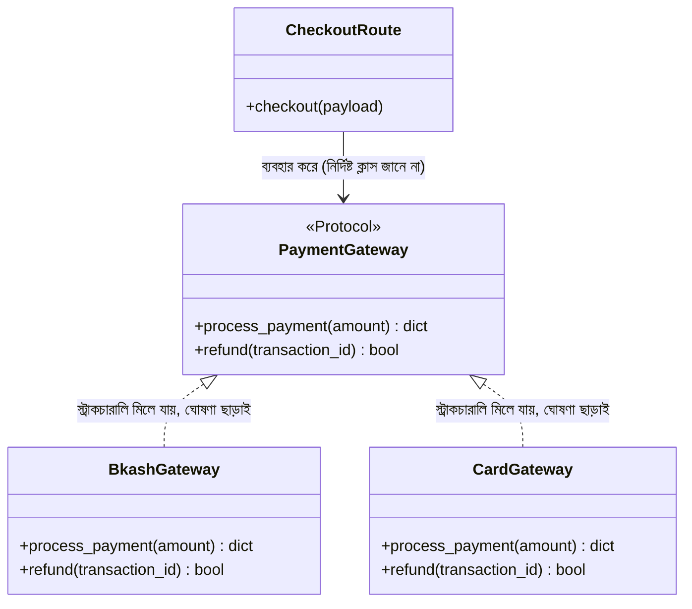

# ০৩. Real Life Use Case of Protocol/Interface and Polymorphism

আগের দুই লেসনে আমরা `ABC` আর `Protocol` — দুটো পথেই polymorphism দেখিয়েছি। কিন্তু বাস্তব ব্যাকএন্ড ডেভেলপমেন্টে, বিশেষ করে যখন ক্লাসগুলোর মধ্যে কোনো ভাগাভাগি করা কোড (shared implementation) থাকে না, শুধু একটা "চুক্তি" (contract) দরকার হয় — তখন `ABC`-এর চেয়ে **`Protocol`** বেশি উপযুক্ত, ঠিক যেভাবে TypeScript-এ `abstract class`-এর চেয়ে `interface` বেশি উপযুক্ত ছিলো একই পরিস্থিতিতে। এই লেসনে আমরা একটা বাস্তব সমস্যা দিয়ে দেখবো — একটা ই-কমার্স সিস্টেমে একাধিক পেমেন্ট গেটওয়ে (bKash, Card, PayPal) সাপোর্ট করা।

## Protocol দিয়ে চুক্তি বেঁধে দেওয়া

```python
from typing import Protocol


class PaymentGateway(Protocol):
    async def process_payment(self, amount: float) -> dict:
        ...

    async def refund(self, transaction_id: str) -> bool:
        ...
```

এই `PaymentGateway` Protocol-টা একটা প্রতিশ্রুতি — "যে কেউ এই টাইপ হিন্ট জায়গায় পাস হতে চাইবে, তার অবশ্যই `process_payment` আর `refund` মেথড থাকতে হবে, ঠিক এই সিগনেচার অনুযায়ী" — কিন্তু (আগের লেসনে যেমন দেখেছি) কোনো ক্লাসকে explicit ঘোষণা করতে হবে না যে সে এই চুক্তি মানছে। এখন তিনটা আলাদা গেটওয়ে বাস্তবায়ন করি:

```python
import time


class BkashGateway:  # লক্ষ্য করো — PaymentGateway থেকে ইনহেরিট বা কোনো explicit ঘোষণা নেই
    async def process_payment(self, amount: float) -> dict:
        print(f"bKash দিয়ে ৳{amount} প্রসেস করা হচ্ছে...")
        return {"success": True, "transaction_id": f"BKS-{int(time.time())}"}

    async def refund(self, transaction_id: str) -> bool:
        print(f"bKash রিফান্ড হচ্ছে: {transaction_id}")
        return True


class CardGateway:
    async def process_payment(self, amount: float) -> dict:
        print(f"কার্ড দিয়ে ৳{amount} চার্জ করা হচ্ছে...")
        return {"success": True, "transaction_id": f"CARD-{int(time.time())}"}

    async def refund(self, transaction_id: str) -> bool:
        print(f"কার্ড রিফান্ড হচ্ছে: {transaction_id}")
        return True
```

এবার FastAPI দিয়ে একটা চেকআউট রুট বানাই, যেখানে গেটওয়ে ইউজারের পছন্দ অনুযায়ী নির্ধারিত হয়:

```python
from fastapi import FastAPI
from pydantic import BaseModel

app = FastAPI()


class CheckoutRequest(BaseModel):
    amount: float
    method: str


def get_gateway(method: str) -> PaymentGateway:
    if method == "bkash":
        return BkashGateway()
    if method == "card":
        return CardGateway()
    raise ValueError("অজানা পেমেন্ট পদ্ধতি")


@app.post("/checkout")
async def checkout(payload: CheckoutRequest):
    gateway: PaymentGateway = get_gateway(payload.method)
    result = await gateway.process_payment(payload.amount)
    return result
```

এখানেই polymorphism আর Protocol একসাথে কাজ করার আসল সৌন্দর্যটা দেখা যায়। `/checkout` রুটের ভেতরের কোড `gateway.process_payment(...)` লেখার সময় জানেই না — এমনকি জানার দরকারও নেই — এটা `BkashGateway` না `CardGateway`। যতক্ষণ কোনো ক্লাসে `process_payment`/`refund` মেথড ঠিক এই সিগনেচারে আছে, ততক্ষণ সেটা এই রুটে ব্যবহারযোগ্য — কোনো `implements` লেখা লাগে না, কোনো কমন parent class লাগে না।



এই প্যাটার্নটার একটা প্রচলিত নাম আছে সফটওয়্যার ডিজাইনে — **Strategy Pattern** — যেখানে একটা কাজ করার একাধিক "কৌশল" (strategy) থাকে, আর রানটাইমে ঠিক কোন কৌশল ব্যবহার হবে তা নির্ধারিত হয়, কিন্তু বাকি সিস্টেম সেই পার্থক্য নিয়ে মাথা ঘামায় না।

## একটা বাস্তব এজ কেস — টাইপো যা Protocol ধরতে পারে না, কিন্তু ধরা উচিত ছিলো

এখানে একটা গুরুত্বপূর্ণ, বাস্তবে ঘটা প্রোডাকশন সমস্যা দেখা যাক। ধরো কেউ তৃতীয় একটা গেটওয়ে লিখলো, কিন্তু মেথডের নামে একটা ছোট টাইপো করলো:

```python
class NagadGateway:
    async def process_payment(self, amount: float) -> dict:
        print(f"Nagad দিয়ে ৳{amount} প্রসেস করা হচ্ছে...")
        return {"success": True, "transaction_id": "NGD-123"}

    async def refnd(self, transaction_id: str) -> bool:  # টাইপো! refund না, refnd
        return True
```

এখন `get_gateway` ফাংশনে `NagadGateway` যোগ করার পর, `mypy` চালালে এটা ধরিয়ে দেবে — "`NagadGateway` `PaymentGateway` Protocol মেনে চলছে না, কারণ `refund` মেথড নেই।" কিন্তু যদি টিমের CI পাইপলাইনে `mypy` চালানো বাধ্যতামূলক না থাকে, বা কেউ শুধু `python main.py` দিয়ে টেস্ট করে দেখে "প্রসেস পেমেন্ট তো কাজ করছে," তাহলে এই বাগটা প্রোডাকশন পর্যন্ত পৌঁছাতে পারে — আর যখন কোনো ইউজার প্রথমবার রিফান্ড চাইবে Nagad দিয়ে, তখনই `AttributeError: 'NagadGateway' object has no attribute 'refund'` ছুঁড়ে সিস্টেম ক্র্যাশ করবে, প্রোডাকশনে, লাইভ ইউজারের সামনে।

এই একই বাগ TypeScript-এ `implements PaymentGateway` লিখলে **কখনোই** কম্পাইলই হতো না — `tsc` প্রথম চেষ্টাতেই "Class 'NagadGateway' incorrectly implements interface 'PaymentGateway'" বলে আটকে দিতো। এটাই সেই মূল্য যা Protocol-এর "ঐচ্ছিক, ইনহেরিটেন্স-ছাড়া" নমনীয়তার বিনিময়ে দিতে হয় — নমনীয়তা পাওয়া যায়, কিন্তু নিশ্চয়তা কমে যায়, যদি না টাইপ চেকিং টিমের ওয়ার্কফ্লোতে বাধ্যতামূলকভাবে গেঁথে দেওয়া হয়।

## যেখানে এই একই প্যাটার্ন আরও কাজে লাগবে

এই একই প্যাটার্ন নোটিফিকেশন সিস্টেমেও (SMS, Email, Push Notification) হুবহু কাজ করবে — একটা `Notifier` Protocol, যার `send(message: str) -> bool` মেথড থাকবে, আর `SmsNotifier`, `EmailNotifier` আলাদা আলাদা বাস্তবায়ন, কোনোটাই একে অপরকে ইনহেরিট করবে না। যেকোনো জায়গায় যেখানে "একাধিক ধরনের বাস্তবায়ন থাকতে পারে, কিন্তু ব্যবহারকারী কোড সবগুলোকে একইভাবে ট্রিট করতে চায়, আর ক্লাসগুলোর মধ্যে কোনো শেয়ার্ড কোড নেই" — সেখানেই Protocol আর Polymorphism একসাথে এই সমাধান দেয়।

**সংক্ষিপ্ত সিদ্ধান্তের নিয়ম** — যদি সাবক্লাসগুলোর মধ্যে শেয়ার করা কোনো বাস্তবায়ন থাকে (যেমন `log_transaction()`-এর মতো একটা কমন মেথড যা সব সাবক্লাস একইভাবে ব্যবহার করবে), `ABC` ব্যবহার করো — Inheritance দিয়ে সেই শেয়ার্ড কোড একবার লিখে সবাইকে দেওয়া যায়। যদি প্রতিটা বাস্তবায়ন সম্পূর্ণ স্বাধীন, শুধু একটা "আকৃতি" মিললেই যথেষ্ট, `Protocol` ব্যবহার করো — এটা looser coupling দেয়, থার্ড-পার্টি ক্লাসের সাথেও (যেগুলো তুমি নিজে লেখোনি, তাই ইনহেরিট করানো সম্ভব না) কাজ করে।

এই তিন লেসনের মধ্য দিয়ে আমরা Python-এর টাইপ সিস্টেম, `ABC`, আর `Protocol` ব্যবহার করে OOP-এর চারটা স্তম্ভ — Encapsulation, Abstraction, Inheritance, আর Polymorphism — একসাথে প্রয়োগ করে বাস্তব, সম্প্রসারণযোগ্য ব্যাকএন্ড কোড লেখা শিখলাম, আর প্রতিটা ধাপে দেখলাম Python-এর ঐচ্ছিক, রানটাইম-নির্ভর টাইপ দর্শন TypeScript-এর বাধ্যতামূলক, কম্পাইল-টাইম দর্শন থেকে ঠিক কোথায় আলাদা। এখন পর্যন্ত আমাদের সব ডেটা (users, products, transactions) মেমোরিতে অস্থায়ীভাবে রাখা হয়েছে — সার্ভার রিস্টার্ট করলেই সব হারিয়ে যায়। পরের মডিউলে আমরা এই সমস্যার সমাধান করবো — Database পরিচিতি দিয়ে, যেখানে আমরা শিখবো কীভাবে ডেটা স্থায়ীভাবে সংরক্ষণ করতে হয়।
