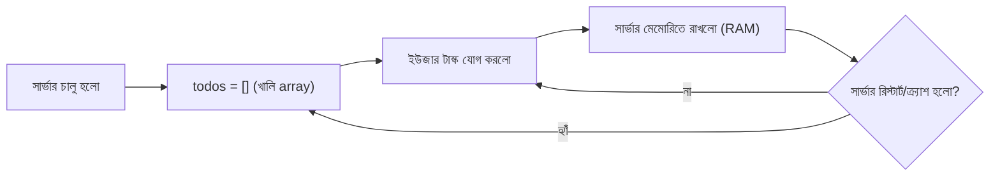
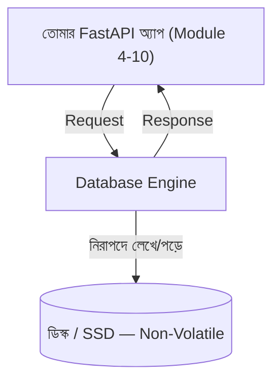

# ০১. Introduction to Database Systems

Module 12-এ আমরা একটা অ্যাসাইনমেন্ট করেছিলাম — JWT দিয়ে অথেন্টিকেশন সহ একটা পার্সোনাল TODO Manager বানানো। অ্যাসাইনমেন্টের নামের শেষে ছোট্ট একটা বন্ধনী ছিলো, যেটা তখন হয়তো তেমন গুরুত্ব দিয়ে খেয়াল করোনি: **"No Database"**। আজকে এই লেসনটা শুরুই হচ্ছে সেই বন্ধনীটা দিয়ে — কারণ ঠিক ওখানেই আমাদের আজকের গল্পের বীজ লুকানো।

তুমি যদি সেই TODO Manager-টা চালাও, ব্যবহার করো, কয়েকটা টাস্ক অ্যাড করো — সব ঠিকঠাক কাজ করবে। কিন্তু একটা জিনিস করে দেখো: সার্ভারটা বন্ধ করে আবার চালু করো। কী দেখলে? তোমার সবগুলো TODO উধাও! কেন? কারণ আমরা ডেটা রেখেছিলাম একটা সাধারণ Python list-এ, মেমরিতে (RAM-এ) — যেটা প্রোগ্রামের কোডেই লেখা ছিলো:

```python
# আমাদের পুরোনো TODO Manager-এর ভেতরের অবস্থা
todos = []
```

RAM-এর একটা মৌলিক বৈশিষ্ট্য আছে — এটা **volatile**, মানে বিদ্যুৎ/প্রসেস বন্ধ হয়ে গেলে RAM-এ থাকা সবকিছু মুছে যায়। এটা অনেকটা তোমার হাতে ধরে রাখা একটা কাগজের নোটের মতো — যতক্ষণ হাতে ধরে আছো ততক্ষণ আছে, হাত ছেড়ে দিলেই বাতাসে উড়ে যায়। প্রোগ্রামটা যতক্ষণ চলছে ততক্ষণ লিস্টটা বেঁচে থাকে; প্রোগ্রাম বন্ধ মানেই সেই লিস্ট শূন্য থেকে আবার শুরু।



বাস্তব দুনিয়ায় এটা মেনে নেয়া যায় না। ফেসবুকে তুমি একটা পোস্ট লিখলে, সেটা তোমার ফোন বন্ধ করলেও, এমনকি ফেসবুকের সার্ভার রিস্টার্ট হলেও, হারিয়ে যায় না। ব্যাংকের অ্যাকাউন্টে তোমার ব্যালেন্স সার্ভার ক্র্যাশ করলেই শূন্য হয়ে যায় না। এই "চিরস্থায়ীভাবে ডেটা রেখে দেয়া"-র ক্ষমতাকে বলে **persistence** (স্থায়িত্ব), আর যে সিস্টেম এই কাজটা করে সেটাই **database** (ডেটাবেজ)।

তাহলে ডেটাবেজ আসলে কী? সহজ ভাষায় — ডেটাবেজ হলো এমন একটা সংগঠিত সিস্টেম, যেখানে ডেটা ডিস্কে (হার্ডডিস্ক/SSD-তে) স্থায়ীভাবে লেখা থাকে, RAM-এর মতো উবে যায় না। ডিস্ক হলো volatile নয় — **non-volatile** স্টোরেজ, অনেকটা কাগজে কালি দিয়ে লেখার মতো — বিদ্যুৎ চলে গেলেও লেখাটা মুছে যায় না। ডেটাবেজ ইঞ্জিন (যেমন PostgreSQL, MySQL) মূলত এই ডিস্কে ডেটা গুছিয়ে রাখা আর দ্রুত খুঁজে বের করার একটা বিশেষজ্ঞ সফটওয়্যার।

কিন্তু প্রশ্ন উঠতে পারে — আমরা তো Python-এর সাধারণ ফাইল I/O (`open()` ফাংশন) দিয়ে সরাসরি একটা ফাইলেও তো ডেটা লিখে রাখতে পারি! কেন আলাদা করে "ডেটাবেজ" নামের জিনিস দরকার? উত্তরটা বুঝতে একটা উদাহরণ নেই।

ধরো তোমার TODO অ্যাপে এখন হাজার হাজার ইউজার, প্রত্যেকের হাজার হাজার টাস্ক। তুমি যদি এসব একটা সাধারণ JSON ফাইলে রাখো, তাহলে কিছু সমস্যা তৈরি হবে:

- **একসাথে অনেকে লিখতে চাইলে** (concurrent writes) — দুইজন ইউজার একই সময়ে টাস্ক অ্যাড করলে ফাইলটা করাপ্ট হয়ে যেতে পারে, কারণ ফাইল সিস্টেম একসাথে দুইটা লেখাকে নিরাপদে সামলাতে পারে না।
- **খোঁজাখুঁজি ধীরগতির** — "আমার সব টাস্কের মধ্যে যেগুলো এখনো শেষ হয়নি" — এই প্রশ্নের উত্তর পেতে পুরো ফাইলটা প্রতিবার শুরু থেকে পড়তে হবে।
- **সম্পর্ক (relationship) রাখা কঠিন** — একজন ইউজারের সাথে তার টাস্কগুলোর সম্পর্ক, একটা টাস্কের সাথে ট্যাগের সম্পর্ক — এসব ম্যানুয়ালি সামলানো দ্রুত জটিল হয়ে ওঠে।
- **নিরাপত্তা ও নিয়ম মানা** — টাকা-পয়সার হিসাব হলে (যেমন ব্যাংক ট্রান্সফার), হয় পুরো অপারেশন সফল হবে, নয়তো পুরোটাই বাতিল হবে — মাঝামাঝি অবস্থায় থামা চলবে না। এই নিশ্চয়তা (যাকে বলে **ACID guarantee**) সাধারণ ফাইলে পাওয়া প্রায় অসম্ভব।

ডেটাবেজ ইঞ্জিনগুলো এই সবগুলো সমস্যা দশকের পর দশক ধরে গবেষণা করে সমাধান করেছে, আর সেই সমাধানটা আমাদের হাতে দিয়েছে একটা সহজ ইন্টারফেসের পেছনে — ঠিক যেমন Python-এর built-in মডিউলগুলো OS-এর জটিলতা লুকিয়ে রাখে, ডেটাবেজ ইঞ্জিনও ডিস্কে ডেটা রাখা-খোঁজার জটিলতা লুকিয়ে রাখে।



দুই ধরনের ডেটাবেজের নাম তুমি সামনে বারবার শুনবে — **relational database** (যেমন PostgreSQL, MySQL), যেখানে ডেটা টেবিলের সারি-কলামে গোছানো থাকে অনেকটা এক্সেল শিটের মতো; আর **NoSQL database** (যেমন MongoDB), যেখানে ডেটা JSON-এর মতো নমনীয় ডকুমেন্ট আকারে থাকে। এই মডিউল আর পরের কয়েকটা মডিউলে আমরা মূলত relational database নিয়ে কাজ করবো, কারণ এটাই বেশিরভাগ ব্যাকএন্ড সিস্টেমের ভিত্তি, আর এখানকার ধারণাগুলো (টেবিল, সম্পর্ক, স্কিমা) শিখে ফেললে NoSQL বোঝা অনেক সহজ হয়ে যায়।

তাহলে এখন লক্ষ্য পরিষ্কার — আমাদের সেই "No Database" TODO Manager-কে আমরা ধীরে ধীরে একটা আসল, স্থায়ী ডেটাবেজ-চালিত অ্যাপ্লিকেশনে রূপান্তর করবো। কিন্তু তার আগে দরকার একটা ডেটাবেজ ইঞ্জিন — যেটা আসলে ইনস্টল করে নিজের কম্পিউটারে চালু করতে হবে, ঠিক যেমন Module 1-এ Python ইনস্টল করেছিলে। পরের লেসনে আমরা ঠিক সেটাই করবো।
