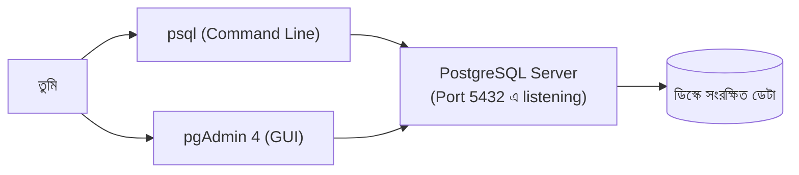

# ০২. Install a Database Engine in Windows

গত লেসনে আমরা বুঝেছি কেন ডেটাবেজ দরকার। এখন হাতেকলমে কাজ — নিজের Windows কম্পিউটারে একটা ডেটাবেজ ইঞ্জিন ইনস্টল করবো, ঠিক যেভাবে Module 1-এ Python আর VS Code ইনস্টল করেছিলে সেভাবেই ধাপে ধাপে।

আমরা বেছে নিচ্ছি **PostgreSQL** — একটা ফ্রি, ওপেন-সোর্স, খুবই শক্তিশালী relational database engine, যেটা ছোট প্রজেক্ট থেকে শুরু করে বড় বড় কোম্পানি (Instagram, Spotify-এর মতো) পর্যন্ত ব্যবহার করে। মনে রাখো, PostgreSQL একটা **প্রোগ্রাম** — ঠিক তোমার FastAPI অ্যাপের মতোই — যেটা তোমার কম্পিউটারে ব্যাকগ্রাউন্ডে একটা সার্ভিস হিসেবে চলবে, request-এর অপেক্ষায় বসে থাকবে (Module 2-তে শেখা "listening" ধারণাটা মনে আছে? এখানেও একই জিনিস, শুধু HTTP request-এর বদলে ডেটাবেজ query শুনবে)।

চলো ধাপে ধাপে ইনস্টল করি:

**ধাপ ১ — ইনস্টলার ডাউনলোড করা।** ব্রাউজারে যাও `https://www.postgresql.org/download/windows/` — এখান থেকে EDB-এর তৈরি Windows installer ডাউনলোড করো (সর্বশেষ স্টেবল ভার্সন, যেমন PostgreSQL 16 বা তার পরের)।

**ধাপ ২ — ইনস্টলার চালানো।** ডাউনলোড হওয়া `.exe` ফাইলে ডাবল ক্লিক করো। ইনস্টলার তোমাকে কয়েকটা প্রশ্ন করবে:

- **Installation Directory** — ডিফল্ট রাখাই ভালো (`C:\Program Files\PostgreSQL\16`)।
- **Components** — PostgreSQL Server, pgAdmin 4 (গ্রাফিক্যাল ম্যানেজমেন্ট টুল), Command Line Tools — সবগুলো টিক দিয়ে রাখো।
- **Data Directory** — এটাই সেই জায়গা যেখানে PostgreSQL আসলে তোমার সব ডেটা ডিস্কে লিখে রাখবে। ডিফল্ট রাখো।
- **Password** — এখানে `postgres` নামের সুপারইউজারের জন্য একটা পাসওয়ার্ড দিতে বলবে। এটা মনে রাখা **অত্যন্ত জরুরি** — এই পাসওয়ার্ডটাই পরে আমরা Python থেকে কানেক্ট করার সময় ব্যবহার করবো।
- **Port** — ডিফল্ট `5432` রেখে দাও। এটা অনেকটা Module 2-তে শেখা port ধারণার মতোই — PostgreSQL এই পোর্টে "কান পেতে" বসে থাকবে।

**ধাপ ৩ — ইনস্টলেশন শেষে যাচাই করা।** ইনস্টল শেষ হলে Windows-এর Start মেনু থেকে **SQL Shell (psql)** খুঁজে বের করো। এটা চালু করলে তোমাকে কয়েকটা প্রশ্ন করবে (Server, Database, Port, Username) — সবগুলোতে এন্টার চাপো (ডিফল্ট মেনে নিতে), শুধু পাসওয়ার্ডের জায়গায় ধাপ ২-এ সেট করা পাসওয়ার্ডটা দাও। যদি এমন কিছু দেখো —

```
postgres=#
```

— তাহলে অভিনন্দন, তুমি সফলভাবে PostgreSQL সার্ভারের সাথে কানেক্ট হয়েছো! এই `postgres=#` প্রম্পটটা অনেকটা Python-এর ইন্টারেক্টিভ শেল (`python`/`ipython`)-এর মতো — এখানে তুমি সরাসরি SQL কমান্ড লিখতে পারো।

একটা সহজ কমান্ড দিয়ে টেস্ট করো:

```sql
SELECT version();
```

এটা তোমাকে PostgreSQL-এর ভার্সন নাম্বার ফিরিয়ে দেবে, প্রমাণ হিসেবে যে ইঞ্জিনটা সত্যিই চলছে এবং তোমার সাথে "কথা বলছে"।

**ধাপ ৪ — pgAdmin দিয়ে গ্রাফিক্যালি দেখা।** কমান্ড লাইন সবসময় আরামদায়ক নাও লাগতে পারে। তাই ইনস্টলারের সাথে আসা **pgAdmin 4** খুলো — এটা একটা ব্রাউজার-ভিত্তিক গ্রাফিক্যাল টুল যেখানে তুমি ভিজুয়ালি টেবিল, ডেটা, কানেকশন দেখতে পারবে। এটা অনেকটা তোমার VS Code-এর মতো, শুধু কোডের বদলে ডেটাবেজের জন্য।



লক্ষ্য করো — psql আর pgAdmin দুটোই আসলে **client** (Module 2-তে শেখা client-server মডেল মনে আছে?), যারা একই PostgreSQL **server**-এর সাথে কথা বলছে। ঠিক যেমন ব্রাউজার আর curl দুটোই একই ওয়েব সার্ভারের সাথে কথা বলতে পারে।

তুমি চাইলে PostgreSQL-এর বদলে **MySQL**-ও ইনস্টল করতে পারো (`https://dev.mysql.com/downloads/installer/` থেকে) — কনসেপ্ট প্রায় একই, শুধু কমান্ডের সিনট্যাক্সে সামান্য পার্থক্য থাকবে। এই কোর্সে আমরা মূলত PostgreSQL-এর উদাহরণ ব্যবহার করবো, কারণ এটা আজকের দিনে ব্যাকএন্ড ডেভেলপমেন্টে সবচেয়ে জনপ্রিয় পছন্দগুলোর একটা।

এখন আমাদের কম্পিউটারে একটা সত্যিকারের ডেটাবেজ ইঞ্জিন চলছে, শুনছে, অপেক্ষা করছে। পরের লেসনে আমরা এই ইঞ্জিনটাকে আমাদের Python/FastAPI ব্যাকএন্ডের (Module 4-10) সাথে কানেক্ট করবো।
