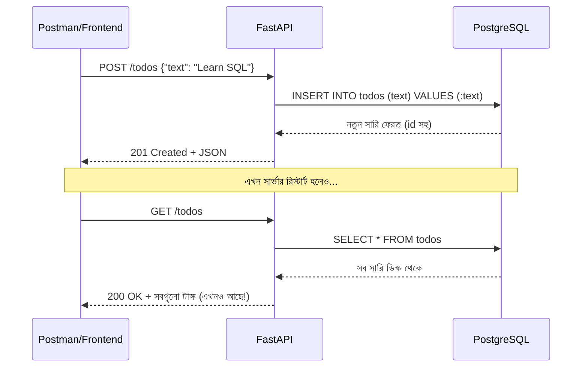

# ০৪. Fullstack Application Part 2

আগের লেসনে আমরা কানেকশন বানিয়েছি আর প্রমাণ করেছি এটা কাজ করে। এখন সময় এসেছে সেই প্রতিশ্রুতি পূরণ করার — Module 12-এর "No Database" TODO Manager-কে একটা আসল, স্থায়ী ডেটাবেজ-চালিত অ্যাপ্লিকেশনে রূপান্তর করা।

মনে করিয়ে দেই, আগের ভার্সনে আমাদের কোড এরকম ছিলো:

```python
# পুরোনো ভার্সন — মেমোরিতে ডেটা
todos = []

@app.post("/todos")
def create_todo(body: dict):
    todo = {"id": len(todos) + 1, "text": body["text"], "done": False}
    todos.append(todo)
    return todo


@app.get("/todos")
def list_todos():
    return todos
```

এই কোডের সমস্যা আমরা লেসন ১-এ বুঝেছি — সার্ভার রিস্টার্ট হলেই `todos` লিস্ট খালি হয়ে যায়। আজকে আমরা `todos` লিস্টটাকেই সরিয়ে দিচ্ছি, তার জায়গায় বসাচ্ছি ডেটাবেজ query।

প্রথমে একটা টেবিল বানাতে হবে ডেটাবেজে (SQL-এর বিস্তারিত পরের লেসনে শিখবো, আপাতত শুধু চালাই)। psql বা pgAdmin খুলে চালাও:

```sql
CREATE TABLE todos (
  id SERIAL PRIMARY KEY,
  text VARCHAR(255) NOT NULL,
  done BOOLEAN DEFAULT false
);
```

এই কমান্ডটা PostgreSQL-কে বলছে — "একটা `todos` নামের টেবিল বানাও, যেখানে প্রতিটা সারিতে থাকবে একটা `id` (স্বয়ংক্রিয়ভাবে বেড়ে যাওয়া নম্বর), একটা `text` (লেখা), আর একটা `done` (হয়েছে কিনা, ডিফল্ট false)।" এটা অনেকটা তোমার আগের Python dict `{"id": ..., "text": ..., "done": ...}`-এর টেবিল-ভার্সন, শুধু এবার এটা ডিস্কে স্থায়ীভাবে থাকবে, RAM-এ নয়।

এবার FastAPI রুটগুলো নতুন করে লিখি, `engine`-এর সাথে raw SQL চালিয়ে। প্রথমে একটা Pydantic মডেল দিয়ে রিকোয়েস্ট বডি ভ্যালিডেট করি (Module 6-7-এ শেখা):

```python
from fastapi import FastAPI, HTTPException
from sqlalchemy import text
from pydantic import BaseModel
from db import engine

app = FastAPI()


class TodoCreate(BaseModel):
    text: str


# নতুন টাস্ক তৈরি
@app.post("/todos", status_code=201)
def create_todo(body: TodoCreate):
    with engine.begin() as conn:
        result = conn.execute(
            text("INSERT INTO todos (text) VALUES (:text) RETURNING id, text, done"),
            {"text": body.text},
        )
        row = result.mappings().first()
    return dict(row)


# সব টাস্ক দেখা
@app.get("/todos")
def list_todos():
    with engine.connect() as conn:
        result = conn.execute(text("SELECT id, text, done FROM todos ORDER BY id"))
        rows = result.mappings().all()
    return [dict(r) for r in rows]


# একটা টাস্ক আপডেট করা (done = true করা)
@app.put("/todos/{todo_id}")
def update_todo(todo_id: int):
    with engine.begin() as conn:
        result = conn.execute(
            text("UPDATE todos SET done = true WHERE id = :id RETURNING id, text, done"),
            {"id": todo_id},
        )
        row = result.mappings().first()
    if row is None:
        raise HTTPException(status_code=404, detail="Todo not found")
    return dict(row)


# একটা টাস্ক ডিলিট করা
@app.delete("/todos/{todo_id}", status_code=204)
def delete_todo(todo_id: int):
    with engine.begin() as conn:
        conn.execute(text("DELETE FROM todos WHERE id = :id"), {"id": todo_id})
    return None
```

কয়েকটা জিনিস খেয়াল করার মতো এখানে। প্রথমত, `:text` আর `:id` — এগুলো **named placeholder** (Prepared Statement Parameter)। আমরা কখনোই সরাসরি ইউজারের ইনপুট স্ট্রিং হিসেবে জোড়া লাগিয়ে (concatenate/f-string করে) SQL বানাই না, যেমন `text(f"INSERT INTO todos VALUES ('{body.text}')")`। এটা করলে **SQL Injection** নামের একটা ভয়ংকর নিরাপত্তা ফাঁক তৈরি হয়, যেখানে একজন দুষ্ট ইউজার `text`-এর জায়গায় ক্ষতিকর SQL কোড ঢুকিয়ে পুরো ডেটাবেজ মুছে দিতে পারে (যেমন টেক্সট ফিল্ডে `'; DROP TABLE todos; --` পাঠিয়ে)। নামযুক্ত প্লেসহোল্ডার আর একটা dict (`{"text": body.text}`) ব্যবহার করলে SQLAlchemy আর underlying driver (`psycopg2`) নিজেই নিরাপদভাবে ভ্যালুগুলো বসিয়ে দেয়, বিপদ ছাড়াই — ভ্যালুটা কখনোই SQL স্ট্রিং-এর অংশ হয় না, একটা আলাদা প্যারামিটার চ্যানেলে পাঠানো হয়।

দ্বিতীয়ত, `RETURNING id, text, done` — এটা PostgreSQL-এর একটা সুবিধাজনক ফিচার, যেটা INSERT বা UPDATE করার পর সাথে সাথে নতুন সারিটা ফেরত দেয়, যাতে আমাদের আলাদা করে আবার SELECT করতে না হয়।

তৃতীয়ত, `engine.connect()` বনাম `engine.begin()` — লক্ষ্য করো `GET`/`SELECT`-এর জন্য আমরা `engine.connect()` ব্যবহার করেছি, কিন্তু `INSERT`/`UPDATE`/`DELETE`-এর জন্য `engine.begin()`। `begin()` একটা **transaction** শুরু করে আর ব্লক সফলভাবে শেষ হলে অটোমেটিক `commit()` করে, আর কোনো এক্সসেপশন হলে অটোমেটিক `rollback()` করে। এটা ভুলে `connect()` দিয়ে ডেটা পরিবর্তনের query চালালে, ডিফল্ট আচরণে পরিবর্তনটা কমিট না হয়েই থেকে যেতে পারে — একটা কমন, বিভ্রান্তিকর বাগ যেখানে INSERT "সফল" দেখায় কিন্তু ডেটাবেজে আসলে সেভ হয় না।



এখন টেস্ট করার পালা — Postman দিয়ে কয়েকটা টাস্ক POST করো, তারপর সার্ভারটা বন্ধ করে আবার চালাও, তারপর GET করে দেখো। আগের মতো খালি লিস্ট না, বরং তোমার সব টাস্ক ঠিক আগের মতোই আছে — কারণ ডেটা এখন RAM-এ নয়, ডিস্কে বসে আছে PostgreSQL-এর মধ্যে।

এই মুহূর্তে যদি JWT অথেন্টিকেশন (Module 12) আবার যোগ করতে চাও, তাহলে FastAPI dependency (`Depends(...)`, Module 7-এ শেখা) দিয়ে প্রতিটা রুটের আগে টোকেন যাচাই করে নিতে পারো, ঠিক আগের মতোই — শুধু পার্থক্য হলো এখন `todos` একটা লিস্ট না, ডেটাবেজের একটা টেবিল, আর প্রতিটা টাস্কের সাথে `user_id` কলাম যোগ করে বুঝতে পারবে কোন টাস্ক কার (এই সম্পর্কের ধারণা নিয়ে বিস্তারিত আসবে Module 18-এ)।

**একটা প্রোডাকশন সতর্কতা** — উপরের কোডে আমরা প্রতিটা রুটে সরাসরি `engine.connect()`/`engine.begin()` কল করেছি, যা এই ছোট উদাহরণে ঠিক আছে। কিন্তু বাস্তব প্রজেক্টে (Module 24-এ দেখবে) সাধারণত `Depends(get_db)` দিয়ে একটা request-scoped session ইনজেক্ট করা হয়, যাতে কানেকশন ম্যানেজমেন্ট, ট্রানজেকশন সীমানা, আর টেস্টে mock করা — সবকিছু একটা কেন্দ্রীয় জায়গা থেকে নিয়ন্ত্রণ করা যায়। এখানে আমরা raw `engine` সরাসরি ব্যবহার করেছি যাতে SQL আর কানেকশনের সম্পর্কটা কোনো abstraction-এর আড়ালে না গিয়ে সরাসরি দেখা যায়।

আমাদের "No Database" অ্যাপটা এখন সত্যিকার অর্থেই একটা database-backed fullstack application। কিন্তু এতক্ষণ আমরা SQL কমান্ড (`CREATE TABLE`, `INSERT`, `SELECT`, `UPDATE`, `DELETE`) ব্যবহার করলাম না বুঝেই, শুধু কপি করে চালিয়েছি। পরের লেসনে থামি, আর বুঝি — SQL আসলে কী, এটা কীভাবে একটা ভাষা হিসেবে কাজ করে।
