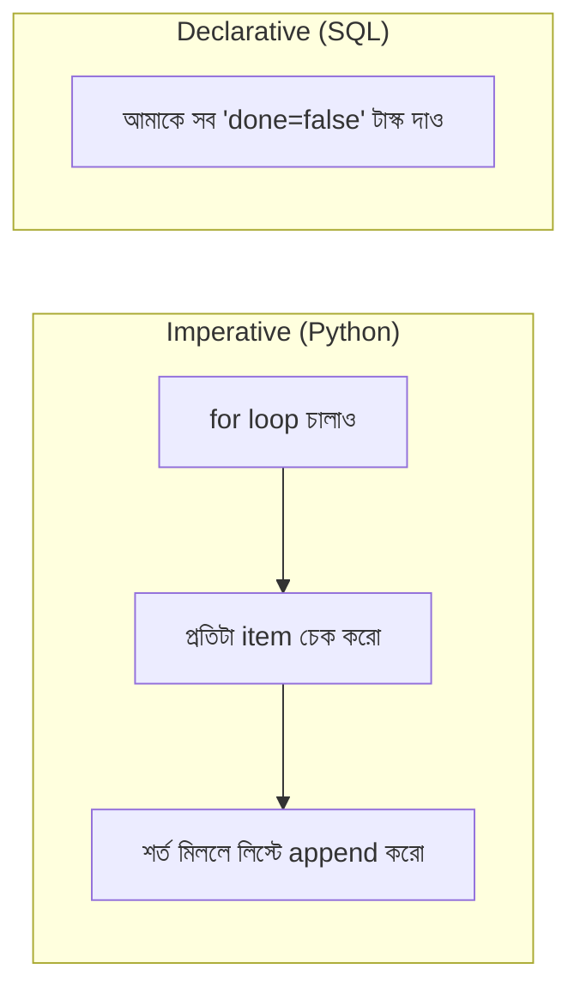
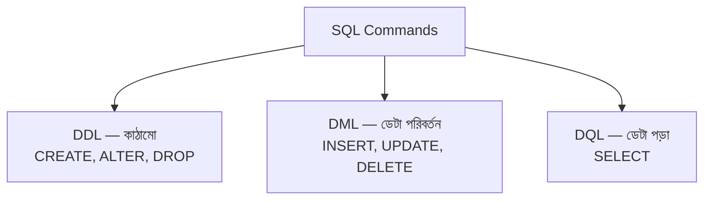

# ০৫. What Is SQL?

আগের লেসনে আমরা লিখেছিলাম `CREATE TABLE`, `INSERT INTO`, `SELECT`, `UPDATE`, `DELETE` — এবং কাজ করিয়ে ফেলেছিলাম, না বুঝেই ঠিক কেন এই শব্দগুলো এভাবে সাজানো। এই লেসনে আমরা থামি আর বুঝি — এই কমান্ডগুলো আসলে কোন ভাষার অংশ, আর সেই ভাষাটা কীভাবে চিন্তা করতে শেখায়।

এই ভাষার নাম **SQL** — Structured Query Language। খেয়াল করো, এটাকে "ভাষা" বলা হচ্ছে Python-এর (Module 4-9) মতোই, কিন্তু এটা Python-এর চেয়ে সম্পূর্ণ ভিন্ন ধরনের ভাষা। Python হলো **imperative** — মানে তুমি কম্পিউটারকে ধাপে ধাপে বলে দাও ঠিক *কীভাবে* কাজ করতে হবে (লুপ চালাও, এই ভ্যারিয়েবলে যোগ করো, তারপর...)। SQL হলো **declarative** — তুমি শুধু বলে দাও তুমি *কী* চাও, ইঞ্জিন নিজে বের করে নেয় কীভাবে সেটা পাওয়া যাবে।



উদাহরণ দিয়ে পার্থক্যটা স্পষ্ট করি। Python-এ (Module 9-এ শেখা list comprehension/higher-order function দিয়ে) যদি তুমি অসম্পূর্ণ টাস্কগুলো খুঁজতে চাও:

```python
pending = [t for t in todos if t["done"] is False]
```

এখানে তুমি নিজে বলে দিচ্ছো *কীভাবে* — একটা comprehension দিয়ে, প্রতিটা এলিমেন্ট ঘুরে ঘুরে চেক করে। SQL-এ একই কাজ:

```sql
SELECT * FROM todos WHERE done = false;
```

এখানে তুমি শুধু বলছো *কী চাও* — "todos টেবিল থেকে যেখানে done = false, সেগুলো দাও"। কীভাবে খুঁজবে (পুরো টেবিল স্ক্যান করবে নাকি ইনডেক্স ব্যবহার করবে) সেই সিদ্ধান্ত PostgreSQL ইঞ্জিন নিজে নেয়।

SQL কমান্ডগুলোকে সাধারণত তিনটা প্রধান দলে ভাগ করা হয়, আর এই ভাগগুলো চেনা থাকলে সামনে যেকোনো নতুন SQL কমান্ড দেখলে তুমি বুঝতে পারবে সেটা কোন ধরনের কাজ করছে:

- **DDL (Data Definition Language)** — টেবিলের গঠন (structure) নিয়ে কাজ করে। `CREATE TABLE`, `ALTER TABLE`, `DROP TABLE` — এগুলো ডেটা নয়, টেবিলের "কাঠামো" তৈরি/পরিবর্তন/মুছে ফেলে। আগের লেসনে আমরা `CREATE TABLE todos (...)` লিখেছিলাম — এটা DDL।
- **DML (Data Manipulation Language)** — টেবিলের ভেতরের আসল ডেটা নিয়ে কাজ করে। `INSERT`, `UPDATE`, `DELETE` — এগুলো সারি (row) যোগ/পরিবর্তন/মুছে ফেলে। আগের লেসনের `INSERT INTO todos ...` আর `UPDATE todos SET done = true ...` — এগুলো DML।
- **DQL (Data Query Language)** — শুধু ডেটা পড়ার জন্য। `SELECT` — এই একটামাত্র কমান্ড, কিন্তু এটাই সবচেয়ে বেশি ব্যবহৃত হয়, আর Module 17-এ আমরা এটা নিয়ে গভীরভাবে শিখবো।



চলো কয়েকটা মৌলিক SQL statement একটু গভীরভাবে দেখি। প্রথমে একটা সাধারণ `INSERT`:

```sql
INSERT INTO todos (text, done) VALUES ('Learn PostgreSQL', false);
```

এখানে গঠনটা লক্ষ্য করো — `INSERT INTO <টেবিলের নাম> (<কলামগুলো>) VALUES (<মানগুলো>)`। এটা প্রায় Python dict/JSON structure-এর (Module 8-এ শেখা) সাথে খুব মিল — শুধু `{"text": "Learn PostgreSQL", "done": False}` লেখার বদলে, কলামের নাম আর ভ্যালু আলাদা বন্ধনীতে লিখতে হয়।

এবার একটা `SELECT` একটু বিস্তারিত শর্তসহ:

```sql
SELECT id, text FROM todos WHERE done = false ORDER BY id DESC;
```

এই একটা লাইনে চারটা অংশ আছে, প্রতিটার নিজস্ব কাজ:

- `SELECT id, text` — কোন কোন কলাম চাই (সব চাইলে `*`)
- `FROM todos` — কোন টেবিল থেকে
- `WHERE done = false` — কোন শর্ত মেনে
- `ORDER BY id DESC` — কী অনুযায়ী সাজানো (DESC মানে descending, বড় থেকে ছোট)

এই কাঠামোটা — SELECT-FROM-WHERE-ORDER BY — সারা SQL জীবনে বারবার ফিরে আসবে, শুধু জটিলতা বাড়বে (Module 17, 20-এ JOIN, GROUP BY-সহ আরও শক্তিশালী query শিখবো)।

একটা গুরুত্বপূর্ণ পার্থক্য মনে রাখা দরকার — SQL কমান্ডে প্রতিটা statement সাধারণত সেমিকোলন (`;`) দিয়ে শেষ হয়, ঠিক অনেক প্রোগ্রামিং ভাষার মতোই একটা লাইন/statement শেষ করার নিয়ম (Python-এ যেটা newline দিয়েই হয়ে যায়), কিন্তু এখানে এটা প্রায় বাধ্যতামূলক, কারণ একই সাথে একাধিক statement পাঠানো সম্ভব:

```sql
INSERT INTO todos (text) VALUES ('Buy milk');
INSERT INTO todos (text) VALUES ('Walk the dog');
SELECT * FROM todos;
```

এই তিনটা লাইন একসাথে চালালে, প্রথমে দুটো নতুন টাস্ক যোগ হবে, তারপর সবগুলো দেখানো হবে — একদম স্ক্রিপ্টের মতোই, উপর থেকে নিচে ধাপে ধাপে।

এতক্ষণে আমরা SQL-কে একটা ভাষা হিসেবে চিনেছি — এর তিনটা প্রধান শ্রেণী (DDL/DML/DQL), আর basic statement-এর গঠন। কিন্তু আমরা এখনও টেবিল *ডিজাইন* করা নিয়ে গভীরে যাইনি — কীভাবে ঠিক করবো কোন কলাম দরকার, কোন টাইপ ব্যবহার করবো, কীভাবে বাস্তব সমস্যাকে টেবিলে রূপান্তর করবো। পরের মডিউলে, একদম শূন্য থেকে শুরু করে, আমরা ঠিক এটাই শিখবো — ডেটাবেজ ডিজাইনের চিন্তাপদ্ধতি।
