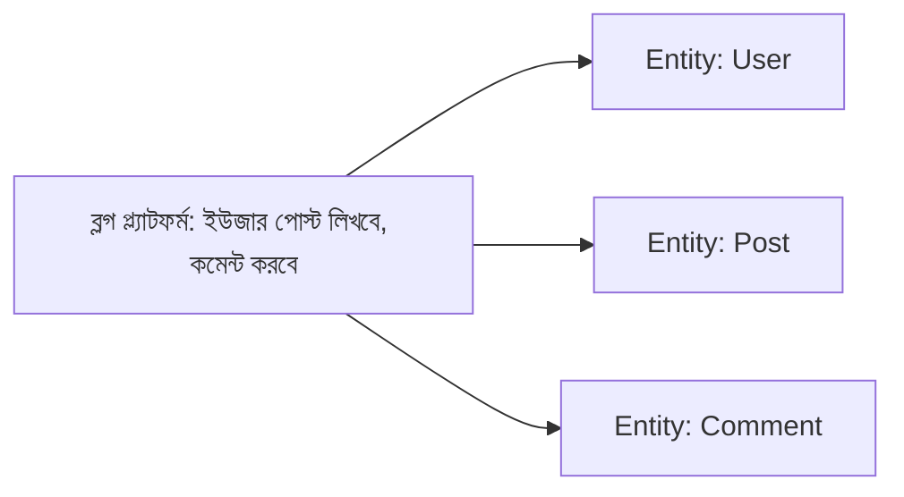
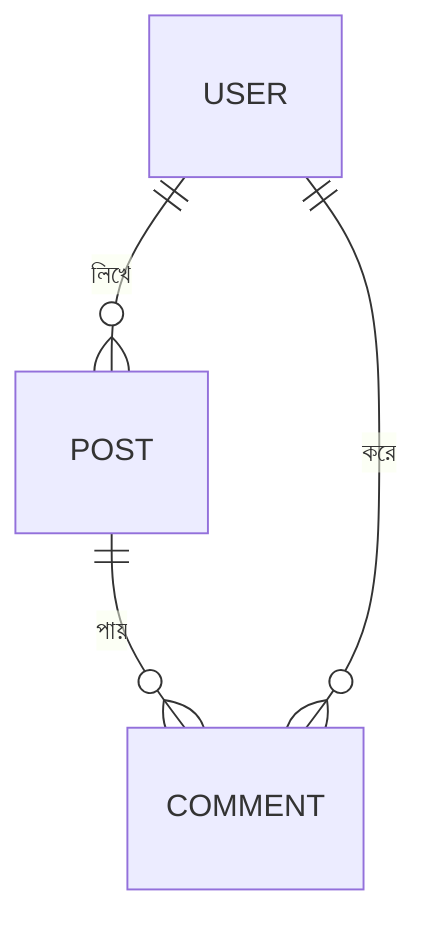

# ০১. Thinking Approach for Database Design — Start from Zero

মডিউল ১৫-এ আমরা `CREATE TABLE todos (id, text, done)` লিখেছিলাম, প্রায় সরাসরি — কারণ টেবিলটা এতই সহজ ছিলো যে ডিজাইন নিয়ে ভাবার দরকারই পড়েনি। কিন্তু বাস্তব প্রজেক্টে জিনিসটা এত সহজ হয় না। এই লেসনে আমরা শিখবো, একটা বাস্তব সমস্যাকে কীভাবে টেবিল আর কলামে রূপান্তর করতে হয় — সেই চিন্তাপদ্ধতিটা।

ধরো তোমাকে একটা নতুন প্রজেক্ট দেয়া হলো — "একটা ব্লগ প্ল্যাটফর্ম বানাও, যেখানে ইউজার পোস্ট লিখতে পারবে, কমেন্ট করতে পারবে।" শুরুতে এটা একটা ভাষার (English/বাংলা) সমস্যার মতো মনে হতে পারে, কিন্তু আসলে এটা একটা মডেলিং সমস্যা — ঠিক যেমন Module 8-এ আমরা "Data Modeling" শিখেছিলাম JSON দিয়ে, এখানেও একই মৌলিক চিন্তা কাজ করে, শুধু এবার টার্গেট হলো SQL টেবিল।

চিন্তার প্রক্রিয়াটা কয়েকটা ধাপে ভাঙা যায়:

**ধাপ ১ — বিশেষ্য (Noun) খুঁজে বের করো।** সমস্যার বর্ণনা পড়ে যত বিশেষ্য পাও, লিখে ফেলো: "ইউজার", "পোস্ট", "কমেন্ট"। প্রতিটা স্বতন্ত্র বিশেষ্য সাধারণত একটা সম্ভাব্য **entity** — মানে ভবিষ্যতে একটা টেবিল হতে পারে এমন কিছু।



**ধাপ ২ — প্রতিটা entity-র বৈশিষ্ট্য (attribute) ভাবো।** একটা User-এর কী কী তথ্য জানা দরকার? নাম, ইমেইল, পাসওয়ার্ড (Module 12-এ শেখা হ্যাশ করা পাসওয়ার্ড), তৈরি হওয়ার তারিখ। একটা Post-এর? টাইটেল, বডি, কে লিখলো, কবে লিখলো। এই ভাবনাটা ঠিক Module 8-এর JSON ডিজাইনের মতোই — মনে করো তুমি যদি এটা JSON দিয়ে মডেল করতে:

```json
{
  "user": { "name": "Arman", "email": "arman@example.com" },
  "post": { "title": "SQL শেখা", "body": "...", "authorId": 1 }
}
```

এই JSON-এর প্রতিটা key-ই ভবিষ্যতে একটা টেবিলের কলাম হবে।

**ধাপ ৩ — সম্পর্ক (relationship) চিহ্নিত করো।** একজন ইউজার একাধিক পোস্ট লিখতে পারে — এটা "one-to-many" সম্পর্ক (এই বিষয়ে গভীর আলোচনা হবে Module 18-এ)। একটা পোস্টে একাধিক কমেন্ট থাকতে পারে — এটাও one-to-many। আপাতত শুধু বুঝে রাখো যে সম্পর্ক আছে, বিস্তারিত ইমপ্লিমেন্টেশন পরে শিখবো।



**ধাপ ৪ — প্রতিটা attribute-এর জন্য উপযুক্ত ডেটা টাইপ ভাবো।** নাম টেক্সট, বয়স সংখ্যা, "প্রকাশিত কিনা" true/false — এই চিন্তাটা পরের লেসনে (Schema Design Basics) আরও গভীরভাবে করবো।

**ধাপ ৫ — প্রশ্ন করো, "এই তথ্য কি সবসময় লাগবেই?"** — যেমন, একটা পোস্টের "subtitle" থাকতে পারে বা নাও থাকতে পারে (optional), কিন্তু "title" অবশ্যই থাকতে হবে (required)। এই সিদ্ধান্তগুলোই পরে `NOT NULL` কনস্ট্রেইন্ট হয়ে ওঠে।

একটা গুরুত্বপূর্ণ ভুল যেটা নতুনরা প্রায়ই করে — সবকিছু একটামাত্র বিশাল টেবিলে গুঁজে দেয়া। ধরো কেউ ভাবলো:

```
posts টেবিল: id, title, body, author_name, author_email, comment_text_1, comment_text_2, ...
```

এটা কেন খারাপ? কারণ একটা পোস্টে কয়টা কমেন্ট আসবে সেটা আগে থেকে জানা অসম্ভব — আজ ২টা, কাল ২০০টা। আর একই ইউজারের নাম-ইমেইল প্রতিটা পোস্টে বারবার কপি করে রাখলে, ইউজার তার ইমেইল পাল্টালে হাজারটা জায়গায় আপডেট করতে হবে। এই সমস্যাগুলো এড়াতেই আমরা তথ্যকে আলাদা আলাদা entity/টেবিলে ভাগ করি — এই ভাগ করার শৃঙ্খলাবদ্ধ পদ্ধতিকেই বলে **normalization**, যেটা নিয়ে বিস্তারিত শিখবো Module 18-এ।

আপাতত, তোমার কাছে একটা সহজ মানসিক টেমপ্লেট থাকুক যখনই নতুন কোনো প্রজেক্টের ডেটাবেজ ডিজাইন করতে বসবে:

1. সমস্যার বর্ণনা থেকে বিশেষ্য (entity) বের করো
2. প্রতিটা entity-র জন্য দরকারি তথ্য (attribute) লিস্ট করো
3. entity-গুলোর মধ্যে সম্পর্ক চিহ্নিত করো
4. প্রতিটা attribute-এর ডেটা টাইপ আর required/optional ঠিক করো
5. একই তথ্য বারবার কপি হচ্ছে কিনা চেক করো, হলে আলাদা টেবিলে ভাগ করো

এই চিন্তাপদ্ধতি ব্যবহার করে আমরা এখন আমাদের ব্লগ প্ল্যাটফর্মের entity-গুলো (User, Post, Comment) চিহ্নিত করে ফেলেছি। পরের লেসনে আমরা এই entity-গুলোকে আসল SQL টেবিলে রূপান্তর করবো — ডেটা টাইপ, প্রাইমারি কী, আর নামকরণের নিয়মসহ।
