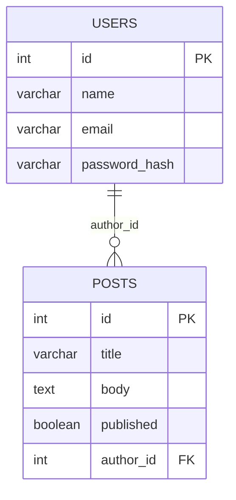

# ০২. Schema Design Basics

আগের লেসনে আমরা কাগজে-কলমে ঠিক করেছি আমাদের ব্লগ প্ল্যাটফর্মে তিনটা entity লাগবে — User, Post, Comment। এখন সময় এসেছে এগুলোকে আসল **schema**-তে রূপান্তর করার। Schema মানে হলো একটা ডেটাবেজের টেবিলগুলোর সম্পূর্ণ কাঠামোর ব্লুপ্রিন্ট — কোন টেবিলে কোন কলাম আছে, প্রতিটার টাইপ কী, কোনটা বাধ্যতামূলক।

শুরু করি **ডেটা টাইপ** দিয়ে। জাভাস্ক্রিপ্টে (Module 9) আমাদের হাতে ছিলো `string`, `number`, `boolean` — মোটামুটি সাধারণ কয়েকটা টাইপ। Module 13-এ TypeScript শেখার পর তুমি বুঝেছো টাইপ সুনির্দিষ্ট করে বলে দিলে কতটা ভুল আগেভাগে ধরা পড়ে। PostgreSQL-এও একই দর্শন, কিন্তু আরও বিস্তারিত টাইপ সিস্টেম:

| PostgreSQL Type | কী রাখে | উদাহরণ |
|---|---|---|
| `SERIAL` | স্বয়ংক্রিয় ক্রমবর্ধমান পূর্ণসংখ্যা (auto-increment ID) | 1, 2, 3, ... |
| `VARCHAR(n)` | সর্বোচ্চ n অক্ষরের টেক্সট | নাম, ইমেইল, টাইটেল |
| `TEXT` | যেকোনো দৈর্ঘ্যের টেক্সট | পোস্টের বডি, কমেন্ট |
| `INTEGER` | পূর্ণসংখ্যা | বয়স, কাউন্ট |
| `BOOLEAN` | true/false | `published`, `is_active` |
| `TIMESTAMP` | তারিখ + সময় | `created_at`, `updated_at` |
| `NUMERIC(p,s)` | নির্ভুল দশমিক সংখ্যা (টাকা-পয়সার জন্য) | `price` |

লক্ষ্য করো, TypeScript-এ (Module 13) যেমন `string` বনাম `number` ভুল হলে কম্পাইলার আটকে দেয়, PostgreSQL-এও একটা `INTEGER` কলামে টেক্সট ঢোকাতে গেলে ডেটাবেজ এরর দেবে। এই "টাইপ মেনে চলা"-র দর্শন দুই জায়গাতেই একই — ভুল ডেটা যতটা সম্ভব আগেভাগে আটকানো।

এবার প্রতিটা টেবিল ডিজাইন করি। প্রথমে `users`:

```sql
CREATE TABLE users (
  id SERIAL PRIMARY KEY,
  name VARCHAR(100) NOT NULL,
  email VARCHAR(150) UNIQUE NOT NULL,
  password_hash VARCHAR(255) NOT NULL,
  created_at TIMESTAMP DEFAULT NOW()
);
```

এখানে কয়েকটা নতুন শব্দ এলো, একে একে বুঝি:

- **`PRIMARY KEY`** — প্রতিটা সারিকে অনন্যভাবে চেনার উপায়। ঠিক যেমন প্রতিটা মানুষের একটা ইউনিক জাতীয় পরিচয়পত্র নম্বর থাকে, প্রতিটা `users` সারির একটা ইউনিক `id` থাকবে, আর ডেটাবেজ নিশ্চিত করে দুইটা সারির `id` কখনো এক হবে না।
- **`NOT NULL`** — এই কলাম খালি রাখা যাবে না। আগের লেসনে আমরা বলেছিলাম "title সবসময় লাগবেই" — সেই সিদ্ধান্তটাই এখানে `NOT NULL` হয়ে প্রকাশ পাচ্ছে।
- **`UNIQUE`** — কোনো দুইটা সারিতে একই ভ্যালু থাকতে পারবে না। দুইজন ইউজার একই ইমেইল দিয়ে রেজিস্টার করতে পারবে না — এটা বাস্তব জগতের নিয়ম, আর `UNIQUE` সেটা ডেটাবেজ লেভেলেই জোর করে।
- **`DEFAULT NOW()`** — যদি ইনসার্টের সময় এই কলামের মান না দেয়া হয়, ডেটাবেজ নিজে থেকে বর্তমান সময় বসিয়ে দেবে। এভাবে প্রতিবার কোড থেকে timestamp পাঠাতে হয় না।
- **`password_hash`** — লক্ষ্য করো, আমরা কখনো আসল পাসওয়ার্ড রাখি না, Module 12-এ শেখা হ্যাশিং (bcrypt বা crypto মডিউল দিয়ে) করা ভার্সন রাখি।

এবার `posts` টেবিল, যেখানে আমরা `users`-এর সাথে সম্পর্ক তৈরি করবো:

```sql
CREATE TABLE posts (
  id SERIAL PRIMARY KEY,
  title VARCHAR(200) NOT NULL,
  body TEXT NOT NULL,
  published BOOLEAN DEFAULT false,
  author_id INTEGER REFERENCES users(id),
  created_at TIMESTAMP DEFAULT NOW()
);
```

এখানে `author_id INTEGER REFERENCES users(id)` — এটাকে বলে **Foreign Key**। এটা `posts` টেবিলের প্রতিটা সারিকে `users` টেবিলের একটা নির্দিষ্ট সারির সাথে বেঁধে দেয়। এটাই SQL-এ আগের লেসনের "one-to-many" সম্পর্ক বাস্তবায়ন করার উপায় — একটা `author_id` অনেকগুলো পোস্টে রিপিট হতে পারে (একজন ইউজারের অনেক পোস্ট), কিন্তু প্রতিটা মান অবশ্যই `users` টেবিলে বাস্তবে থাকা কোনো `id`-কে নির্দেশ করবে। ভুল করে অস্তিত্বহীন `author_id = 999` বসাতে চাইলে PostgreSQL সেটা প্রত্যাখ্যান করবে — এটাই **referential integrity**।



নামকরণের ব্যাপারেও কিছু প্রচলিত নিয়ম মেনে চলা ভালো, যাতে টিমের সবাই একই ভাষায় কোড পড়তে পারে:

- টেবিলের নাম **plural** (বহুবচন) রাখা প্রচলিত — `users`, `posts`, `comments`, একটা টেবিল অনেক সারি রাখে বলে।
- কলামের নাম **snake_case** — `created_at`, `author_id`, ক্যামেলকেসের (`createdAt`) বদলে, কারণ SQL কেস-ইনসেনসিটিভ এবং স্ন্যাক-কেস সব ডেটাবেজ ইঞ্জিনে সমানভাবে নিরাপদ।
- Foreign key কলাম সাধারণত `<singular_table_name>_id` প্যাটার্নে — `author_id` (users-এর দিকে নির্দেশ করে), `post_id` (posts-এর দিকে)।

এই টেবিলগুলো একবার বানানোর পর, বাস্তব জগতে চাহিদা বদলায় — হয়তো কালকেই তোমাকে বলা হবে "পোস্টে একটা 'slug' কলাম দরকার SEO-friendly URL-এর জন্য।" তখন পুরো টেবিল ড্রপ করে আবার বানাতে হবে না — বরং লাইভ টেবিলে পরিবর্তন আনার একটা নিরাপদ উপায় আছে, যেটা আমরা পরের লেসনে শিখবো।
