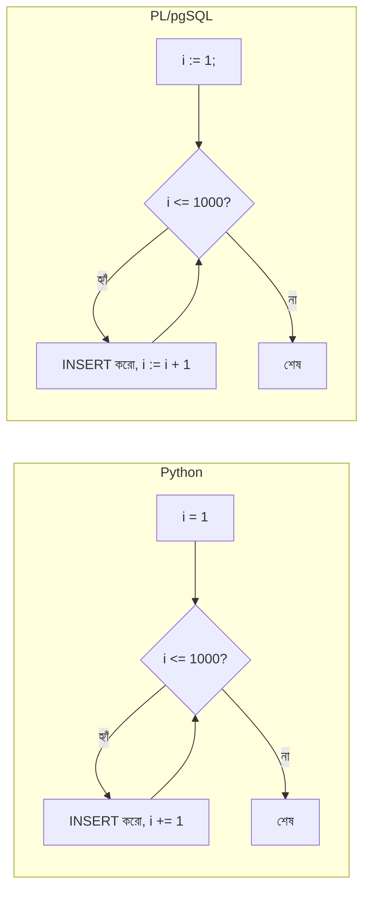

# ০৪. How to Loop in SQL and Generate Fake Data Using Loop?

তোমার `posts` টেবিল এখন সুন্দর করে ডিজাইন করা, `slug` কলামও যোগ হয়েছে, `ALTER TABLE`-ও শেখা হয়ে গেছে। কিন্তু একটা বাস্তব সমস্যা থেকে যায় — টেবিলটা এখনো প্রায় খালি, মাত্র কয়েকটা টেস্ট সারি আছে। অ্যাপ্লিকেশনের পারফরম্যান্স টেস্ট করতে, বা pagination (Module 28-এ শেখা) ঠিকভাবে কাজ করছে কিনা দেখতে, তোমার দরকার হাজারো সারি ডেটা। প্রতিটা `INSERT` স্টেটমেন্ট হাতে লিখে ১০০০ বার চালানো — এটা স্পষ্টতই বাস্তবসম্মত নয়।

জাভাস্ক্রিপ্টে (Module 5, 9) এই সমস্যার সমাধান আমরা জানি — একটা `for` লুপ চালিয়ে দাও। SQL-এও ঠিক এই ধরনের সমস্যার জন্য লুপ চালানোর উপায় আছে, যদিও SQL মূলত declarative (আগের লেসনে শেখা), তবু PostgreSQL-এর একটা এক্সটেনশন ভাষা আছে — **PL/pgSQL** — যেটা দিয়ে ইম্পারেটিভ স্টাইলে (imperative, ধাপে ধাপে) কোড লেখা যায়, অনেকটা জাভাস্ক্রিপ্টের মতোই।

প্রথমে সবচেয়ে সহজ আর দ্রুততম উপায় দেখি — PostgreSQL-এর বিল্ট-ইন ফাংশন `generate_series`:

```sql
SELECT generate_series(1, 5);
```

এটা চালালে ১ থেকে ৫ পর্যন্ত ৫টা সারি ফেরত দেবে — অনেকটা জাভাস্ক্রিপ্টের `Array.from({length: 5}, (_, i) => i + 1)`-এর মতোই কাজ করে, শুধু SQL-এর ভাষায়। এবার এটাকে `INSERT`-এর সাথে জুড়ে দিলে দ্রুত অনেক ফেক ডেটা বানানো যায়:

```sql
INSERT INTO posts (title, body, author_id)
SELECT
  'Test Post ' || i,
  'This is dummy content number ' || i,
  1
FROM generate_series(1, 1000) AS i;
```

এই একটা স্টেটমেন্ট ১০০০টা পোস্ট তৈরি করে ফেলবে, প্রতিটার টাইটেল "Test Post 1", "Test Post 2", ... "Test Post 1000"। লক্ষ্য করো `||` অপারেটর — এটা PostgreSQL-এ স্ট্রিং জোড়া লাগানোর (concatenation) চিহ্ন, ঠিক জাভাস্ক্রিপ্টের `+` এর মতোই কাজ করে টেক্সটের ক্ষেত্রে।

এখন যদি সত্যিকারের ধাপে ধাপে (procedural) লুপ চালাতে চাও — যেমন প্রতিটা ইটারেশনে শর্তসাপেক্ষ আলাদা লজিক লাগবে — তখন PL/pgSQL ব্লক ব্যবহার করি:

```sql
DO $$
DECLARE
  i INTEGER := 1;
BEGIN
  WHILE i <= 1000 LOOP
    INSERT INTO posts (title, body, author_id, published)
    VALUES (
      'Post number ' || i,
      'Generated content for testing purposes.',
      1,
      (i % 2 = 0)  -- জোড় নম্বর হলে published = true
    );
    i := i + 1;
  END LOOP;
END $$;
```

এই কোডটা প্রায় হুবহু পাইথনের একটা `while` লুপের মতো পড়া যায়। তুলনা করে দেখি:



`DECLARE` ব্লকে ভ্যারিয়েবল ঘোষণা করা হয় (`i INTEGER := 1` — অনেকটা Python-এর, Module 13-এ শেখা, টাইপ-হিন্ট সহ ভ্যারিয়েবল ঘোষণার মতো)। `BEGIN...END` এর মধ্যে আসল লজিক থাকে। `:=` চিহ্নটা এসাইনমেন্টের জন্য (পাইথনের `=`-এর সমতুল্য), কারণ SQL-এ `=` চিহ্নটা তুলনার (comparison) জন্য সংরক্ষিত।

বাস্তব প্রজেক্টে এলোমেলো/এলোমেলো-দেখতে ডেটা দরকার হলে (শুধু ক্রমিক নম্বর নয়) `random()` ফাংশন কাজে লাগে:

```sql
INSERT INTO posts (title, body, author_id, published)
SELECT
  'Random Post ' || i,
  'Lorem ipsum content block ' || i,
  (1 + FLOOR(RANDOM() * 5))::INTEGER,  -- author_id এলোমেলোভাবে ১ থেকে ৫
  (RANDOM() > 0.5)                      -- published এলোমেলোভাবে true/false
FROM generate_series(1, 500) AS i;
```

এখানে `RANDOM()` একটা ০ থেকে ১-এর মধ্যে দশমিক সংখ্যা দেয় (পাইথনের `random.random()`-এর মতোই), আর `::INTEGER` হলো PostgreSQL-এর **টাইপ কাস্টিং** সিনট্যাক্স — মানে জোর করে একটা মানকে নির্দিষ্ট টাইপে রূপান্তর করা, ঠিক যেমন পাইথনে `int(x)` লেখো।

Python/FastAPI দিক থেকেও (Module 15-এ শেখা ডাটাবেস কানেকশন পুল ব্যবহার করে) এই সিডিং স্ক্রিপ্টটা চালানো যায় একটা আলাদা ফাইল থেকে, যাতে প্রতিবার প্রজেক্ট নতুন করে সেটআপ করার সময় সহজে টেস্ট ডেটা লোড করা যায়:

```python
# seed.py
from db import pool

def seed():
    with pool.connection() as conn:
        conn.execute("""
            INSERT INTO posts (title, body, author_id)
            SELECT 'Seeded Post ' || i, 'Content ' || i, 1
            FROM generate_series(1, 100) AS i
        """)
    print("Seeding complete!")

if __name__ == "__main__":
    seed()
```

এটা টার্মিনাল থেকে `python seed.py` দিয়ে চালালেই ১০০টা পোস্ট মুহূর্তেই টেবিলে ঢুকে যাবে — ঠিক যেমন একটা নতুন টিমমেট প্রজেক্ট ক্লোন করার পর দ্রুত বাস্তবসম্মত ডেটা নিয়ে কাজ শুরু করতে পারে, খালি টেবিল দেখে বিভ্রান্ত না হয়ে।

আমরা এখন জানি কীভাবে PostgreSQL-এর ভেতরেই `generate_series` আর PL/pgSQL লুপ দিয়ে বিপুল পরিমাণ টেস্ট ডেটা মুহূর্তেই তৈরি করা যায়, আর কীভাবে এটাকে একটা Python সিডিং স্ক্রিপ্টের সাথে জুড়ে দেয়া যায়। এই মডিউলে আমরা শিখেছি কীভাবে টেবিল ডিজাইন করতে হয়, বদলাতে হয়, আর টেস্ট ডেটায় ভরে তুলতে হয় — কিন্তু এখনো আমরা এই ডেটা থেকে অর্থপূর্ণ প্রশ্নের উত্তর বের করার গভীর কৌশল শিখিনি। পরের মডিউলে আমরা `SELECT` কোয়েরিকে সত্যিকার অর্থে আয়ত্ত করবো — WHERE, GROUP BY, ORDER BY দিয়ে জটিল প্রশ্নের উত্তর বের করা।
