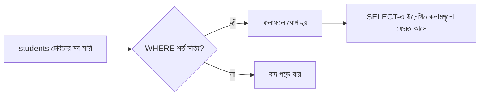

# ০১. Introduction to SELECT Query

Module 16-এ আমরা টেবিল বানাতে শিখেছি — `CREATE TABLE` দিয়ে schema design করা, কলাম ঠিক করা, ডেটা টাইপ বসানো। কিন্তু একটা টেবিল বানিয়ে তাতে ডেটা ঢুকিয়ে রাখলেই তো কাজ শেষ না — আসল মজা শুরু হয় যখন তুমি সেই ডেটার ভেতর থেকে দরকারি অংশটুকু খুঁজে বের করতে চাও। এই লেসন থেকে আমরা ঠিক সেই কাজটাই শিখবো — ডেটা "পড়া", মানে **read query**।

ধরো আমাদের একটা `students` টেবিল আছে, যেটা আমরা Module 16-এর ধারাবাহিকতায় বানিয়েছিলাম:

```sql
CREATE TABLE students (
    id INT PRIMARY KEY,
    name VARCHAR(100),
    age INT,
    department VARCHAR(50),
    gpa DECIMAL(3, 2)
);
```

এই টেবিলে যদি শখানেক ছাত্রের তথ্য থাকে, আর তোমাকে শুধু নাম আর বিভাগ দেখতে হয়, তাহলে পুরো টেবিল স্ক্রল করে দেখা তো বাস্তবসম্মত না। এখানেই আসে SQL-এর সবচেয়ে বেশি ব্যবহৃত কমান্ড — `SELECT`।

সবচেয়ে সহজ রূপে, পুরো টেবিলের সব কলাম, সব সারি দেখতে চাইলে লিখবে:

```sql
SELECT * FROM students;
```

এখানে `*` মানে "সব কলাম দাও"। কিন্তু বাস্তব প্রজেক্টে `*` ব্যবহার করা প্রায়ই একটা বাজে অভ্যাস, কারণ তুমি হয়তো দরকার নেই এমন কলামও নিয়ে আসছো, যেটা অকারণে নেটওয়ার্ক আর মেমরি খরচ করে। তার চেয়ে ভালো, নির্দিষ্ট কলাম বেছে নেয়া:

```sql
SELECT name, department FROM students;
```

এতে শুধু `name` আর `department` কলাম দুটো ফেরত আসবে, বাকি সব বাদ। এটাকে বলা যায় **column selection** — টেবিলের কোন "স্তম্ভ" তোমার দরকার সেটা বেছে নেয়া।

এখন প্রশ্ন হলো — সব সারি না চেয়ে যদি নির্দিষ্ট শর্ত মেনে চলা সারিগুলো চাই? যেমন ধরো, শুধু Computer Science বিভাগের ছাত্রদের দেখতে চাই। এখানে দরকার হয় `WHERE` ক্লজ:

```sql
SELECT name, department
FROM students
WHERE department = 'Computer Science';
```

`WHERE` অনেকটা একটা "ফিল্টার গেট"-এর মতো কাজ করে — টেবিলের প্রতিটা সারিকে সে পরীক্ষা করে দেখে শর্তটা সত্যি কিনা, সত্যি হলে সেই সারি ফলাফলে যায়, মিথ্যা হলে বাদ পড়ে যায়। শর্ত আরও জটিল হতে পারে — একাধিক শর্ত `AND`/`OR` দিয়ে জোড়া লাগানো যায়:

```sql
SELECT name, age, gpa
FROM students
WHERE department = 'Computer Science' AND gpa >= 3.50;
```

এই কোয়েরিটা পড়লে বাংলায় বললে দাঁড়ায় — "students টেবিল থেকে name, age, gpa কলাম আনো, যেসব সারিতে department Computer Science এবং gpa কমপক্ষে ৩.৫০"। লক্ষ করো, SQL অনেকটা ইংরেজি বাক্যের মতোই পড়া যায় — এটাই SQL-কে অন্যান্য প্রোগ্রামিং ভাষা থেকে আলাদা করে, একে বলে **declarative language**: তুমি বলছো "কী চাই", কিন্তু "কীভাবে খুঁজবে" সেটা ডেটাবেস ইঞ্জিন নিজে বুঝে নেয়।

একটা ছোট flowchart দিয়ে ব্যাপারটা দেখা যাক:



`WHERE`-এ তুমি `=`, `>`, `<`, `>=`, `<=`, `!=` (বা `<>`) — এই তুলনা অপারেটরগুলো ব্যবহার করতে পারো, ঠিক যেমন তুমি যেকোনো প্রোগ্রামিং ভাষার `if` কন্ডিশনে করো। যেমন ২০ বছরের বেশি বয়সী ছাত্র খুঁজতে:

```sql
SELECT name, age FROM students WHERE age > 20;
```

আরেকটা দরকারি জিনিস — টেক্সট সার্চের জন্য `LIKE` অপারেটর, যেটা দিয়ে আংশিক মিল খোঁজা যায়:

```sql
SELECT name FROM students WHERE name LIKE 'A%';
```

এখানে `%` মানে "যেকোনো কিছু" — তাই এই কোয়েরি সেইসব ছাত্রের নাম খুঁজে বের করবে যাদের নাম "A" দিয়ে শুরু।

এই লেসনে আমরা SQL-এর সবচেয়ে বেসিক অথচ সবচেয়ে বেশি ব্যবহৃত অংশটা শিখলাম — কলাম বেছে নেয়া আর শর্ত দিয়ে সারি ফিল্টার করা। পরের লেসনে আমরা এটাকে আরেক ধাপ এগিয়ে নেবো — একসাথে অনেকগুলো সারিকে দলবদ্ধ (group) করে, যোগফল-গড়-সংখ্যা বের করে, আর ফলাফলকে সাজিয়ে (sort) দেখবো।
