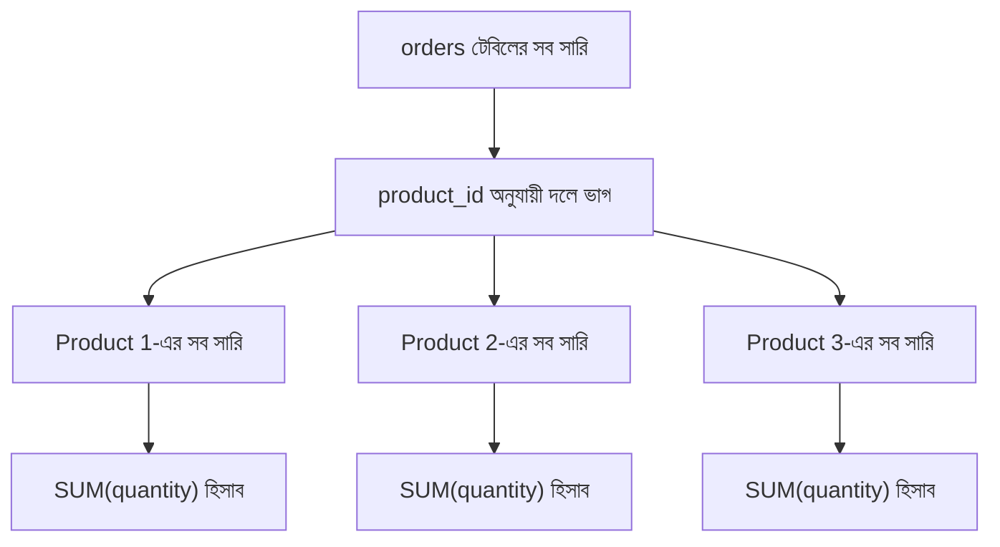
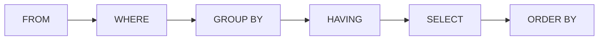

# ০২. জটিল কোয়েরি: SELECT, WHERE, GROUP BY, HAVING আর ORDER BY একসাথে

আগের লেসনে আমরা শিখেছি একটা টেবিল থেকে নির্দিষ্ট কলাম বেছে নেয়া, আর `WHERE` দিয়ে সারি ফিল্টার করা। কিন্তু বাস্তব জীবনের বেশিরভাগ প্রশ্ন এর চেয়ে একটু জটিল হয় — যেমন "প্রতিটা বিভাগে গড় GPA কত?" বা "কোন প্রোডাক্টের মোট বিক্রি সবচেয়ে বেশি?" এই ধরনের প্রশ্নের উত্তর দিতে হলে তোমাকে অনেকগুলো সারিকে একসাথে "দলবদ্ধ" করে হিসাব করতে হয় — এটাই এই লেসনের মূল বিষয়।

চলো একটা বাস্তবসম্মত উদাহরণ নেই — একটা ছোট অনলাইন দোকানের ডেটাবেস, যেখানে দুটো টেবিল আছে:

```sql
CREATE TABLE products (
    id INT PRIMARY KEY,
    name VARCHAR(100),
    category VARCHAR(50),
    price DECIMAL(10, 2)
);

CREATE TABLE orders (
    id INT PRIMARY KEY,
    product_id INT,
    quantity INT,
    order_date DATE
);
```

প্রথমে দেখি **aggregate function** কী জিনিস — এগুলো এমন ফাংশন যেগুলো অনেকগুলো সারি নিয়ে একটাই মান বের করে দেয়। সবচেয়ে বেশি ব্যবহৃত চারটা হলো `COUNT`, `SUM`, `AVG`, `MAX`/`MIN`। যেমন, মোট কতগুলো অর্ডার হয়েছে জানতে:

```sql
SELECT COUNT(*) AS total_orders FROM orders;
```

অথবা মোট কতগুলো পণ্য বিক্রি হয়েছে (quantity যোগ করে):

```sql
SELECT SUM(quantity) AS total_quantity_sold FROM orders;
```

এগুলো পুরো টেবিলের ওপর একটা একক মান দেয়। কিন্তু আসল ক্ষমতা দেখা যায় যখন আমরা এগুলোকে ভাগে ভাগে হিসাব করতে চাই — যেমন **প্রতিটা প্রোডাক্টের জন্য আলাদা করে** মোট বিক্রি জানতে চাই। এখানেই দরকার হয় `GROUP BY`:

```sql
SELECT product_id, SUM(quantity) AS total_quantity
FROM orders
GROUP BY product_id;
```

`GROUP BY` করলে ডেটাবেস ইঞ্জিন `product_id` অনুযায়ী সব সারিকে ছোট ছোট দলে ভাগ করে ফেলে, তারপর প্রতিটা দলের ওপর আলাদাভাবে `SUM` চালায়। ব্যাপারটা কল্পনা করা যাক এভাবে:



একটা নিয়ম মনে রাখা জরুরি — `SELECT`-এ যে কলামগুলো লিখবে, সেগুলো হয় `GROUP BY`-তে থাকতে হবে, নয়তো কোনো aggregate function-এর ভেতরে থাকতে হবে। কারণ যখন সারি দলবদ্ধ হয়ে যায়, তখন প্রতিটা আলাদা সারির অন্যান্য কলামের মান আলাদা করে দেখানো সম্ভব না।

এখন, `WHERE` আর `GROUP BY`-এর পার্থক্য বোঝা জরুরি। `WHERE` কাজ করে **গ্রুপিং হওয়ার আগে**, প্রতিটা সারির ওপর। কিন্তু যদি গ্রুপ তৈরি হওয়ার **পরে** কোনো শর্ত বসাতে চাও (যেমন, শুধু সেসব প্রোডাক্ট দেখাও যাদের মোট বিক্রি ১০-এর বেশি), তখন `WHERE` কাজ করবে না, কারণ `SUM` তখনো হিসাব হয়নি। এখানে দরকার হয় `HAVING`:

```sql
SELECT product_id, SUM(quantity) AS total_quantity
FROM orders
GROUP BY product_id
HAVING SUM(quantity) > 10;
```

শেষে, ফলাফলকে সাজিয়ে দেখানোর জন্য আছে `ORDER BY` — ডিফল্টে `ASC` (ছোট থেকে বড়), আর `DESC` দিলে (বড় থেকে ছোট):

```sql
SELECT product_id, SUM(quantity) AS total_quantity
FROM orders
GROUP BY product_id
HAVING SUM(quantity) > 10
ORDER BY total_quantity DESC;
```

এই একটা কোয়েরি এখন অনেকগুলো ধাপ একসাথে করছে — বলা যায়, বাংলায় অনুবাদ করলে: "orders টেবিল থেকে প্রতিটা product_id-এর জন্য মোট quantity বের করো, শুধু সেগুলো রাখো যাদের মোট ১০-এর বেশি, আর সবচেয়ে বেশি বিক্রি হওয়া প্রোডাক্ট আগে দেখাও।" SQL-এ এই ধাপগুলোর একটা নির্দিষ্ট কার্যকরী ক্রম আছে, যেটা মনে রাখা ভালো:



লক্ষ করার বিষয়, আমরা কোয়েরি *লিখি* `SELECT ... FROM ... WHERE ... GROUP BY ... HAVING ... ORDER BY` এই ক্রমে, কিন্তু ডেটাবেস ইঞ্জিন সেটা *কার্যকর করে* ভিন্ন ক্রমে — আগে টেবিল থেকে ডেটা আনে, ফিল্টার করে, দলবদ্ধ করে, তারপর কলাম বাছাই করে, সবশেষে সাজায়। এই পার্থক্যটা মাথায় থাকলে `HAVING` কেন `WHERE`-এর মতো কাজ করে না, সেটা স্পষ্ট হয়ে যাবে।

এখন আমরা জানি কীভাবে ডেটা ফিল্টার, দলবদ্ধ, আর সাজানো যায় — SQL-এর সবচেয়ে শক্তিশালী read query টুলগুলো হাতে এসে গেছে। পরের লেসনে আমরা দেখবো, এই SQL-এর "চিন্তাভাবনা" আসলে জাভাস্ক্রিপ্ট/টাইপস্ক্রিপ্টে তুমি যা আগে থেকেই লিখে আসছো, তার সাথে কতটা মিল রাখে।
