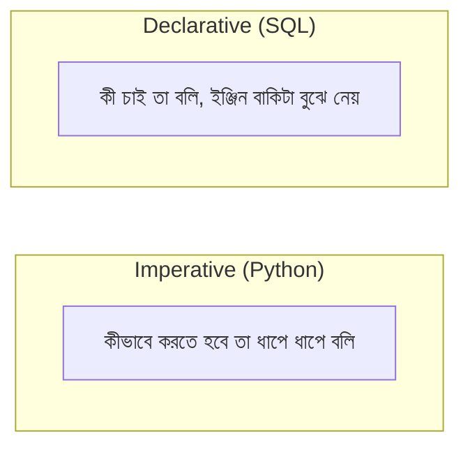

# ০৩. SQL আর প্রোগ্রামিং ভাষার মিল

এতক্ষণ আমরা SQL শিখেছি অনেকটা "নতুন একটা ভাষা" হিসেবে। কিন্তু আসলে যদি ভালো করে খেয়াল করো, SQL-এর প্রতিটা অংশ — `WHERE`, `GROUP BY`, `ORDER BY` — এগুলোর সাথে পাইথনে তুমি যা আগে লিখেছো তার সরাসরি মিল আছে, যা আমরা লিস্ট কম্প্রিহেনশন আর `filter`/`map` নিয়ে কাজ করার সময় দেখেছিলাম। এই লেসনে আমরা সেই দুই জগতের মধ্যে একটা সেতু বানাবো, যাতে SQL আর "ভিনগ্রহের ভাষা" মনে না হয়।

ধরো আমাদের কাছে পাইথনে একটা list of dictionary আছে, যেটা আমাদের `students` টেবিলের মতোই তথ্য রাখে:

```python
students = [
    {"name": "Rafi", "department": "CSE", "gpa": 3.8},
    {"name": "Nadia", "department": "EEE", "gpa": 3.4},
    {"name": "Tanvir", "department": "CSE", "gpa": 3.9},
]
```

আমরা শিখেছিলাম লিস্ট কম্প্রিহেনশন (বা `filter()`) দিয়ে কীভাবে একটা list থেকে শর্ত মেনে চলা উপাদানগুলো বেছে নেয়া যায়:

```python
cse_students = [s for s in students if s["department"] == "CSE"]
```

আর SQL-এ ঠিক এই একই কাজটাই করে `WHERE`:

```sql
SELECT * FROM students WHERE department = 'CSE';
```

দুটো কোড পাশাপাশি রাখলে বোঝা যায়, দুটোই আসলে একই প্রশ্ন করছে — "কোন উপাদানগুলো এই শর্ত মেনে চলে?" পার্থক্যটা শুধু সিনট্যাক্সে, চিন্তাভাবনায় না।

এখন `map()`-এর কথা ভাবো, যেটা দিয়ে আমরা প্রতিটা উপাদান থেকে নির্দিষ্ট কিছু তথ্য বের করে আনি:

```python
names_only = [s["name"] for s in students]
```

SQL-এ এই কাজটা করে `SELECT`-এর কলাম বাছাই:

```sql
SELECT name FROM students;
```

`map()` বলছে "প্রতিটা dictionary থেকে শুধু এই অংশটুকু আমাকে দাও" — আর `SELECT name` ঠিক একই কথা বলছে, শুধু SQL-এর ভাষায়।

সবচেয়ে সুন্দর মিলটা পাওয়া যায় `GROUP BY` আর manual accumulation-এর মধ্যে। ধরো আমরা পাইথনে বিভাগ অনুযায়ী ছাত্র সংখ্যা গুনতে চাই:

```python
count_by_dept = {}
for s in students:
    count_by_dept[s["department"]] = count_by_dept.get(s["department"], 0) + 1
# { "CSE": 2, "EEE": 1 }
```

এখানে লুপটা প্রতিটা উপাদান একে একে দেখছে, আর একটা "accumulator" dictionary-তে দলবদ্ধ করে গুনছে। SQL-এ এই একই কাজ:

```sql
SELECT department, COUNT(*) AS total
FROM students
GROUP BY department;
```

দুটোই আসলে একই ধারণা প্রকাশ করছে — ডেটাকে ভাগে ভাগ করে প্রতিটা ভাগের ওপর একটা হিসাব চালানো। পার্থক্য শুধু এইটুকু, পাইথনের লুপে তোমাকে ধাপে ধাপে বলে দিতে হয় *কীভাবে* গোনা হবে, কিন্তু `GROUP BY`-তে তুমি শুধু বলছো *কী* চাও, বাকিটা ডেটাবেস ইঞ্জিন নিজে বুঝে নেয়।

এই পার্থক্যটাই আসলে দুই ধরনের প্রোগ্রামিং স্টাইলের মূল পার্থক্য:



পাইথন (আর বেশিরভাগ প্রোগ্রামিং ভাষা) মূলত **imperative** — তুমি computer-কে ধাপে ধাপে নির্দেশ দাও: "প্রথমে এটা করো, তারপর এটা, তারপর ওটা।" কিন্তু SQL **declarative** — তুমি শুধু বলো ফলাফল কেমন হওয়া উচিত, আর কীভাবে সেটা বের করতে হবে তা database engine নিজে হিসাব করে ঠিক করে (কোন index ব্যবহার করবে, কোন ক্রমে টেবিল স্ক্যান করবে, ইত্যাদি — এই optimization নিয়ে আমরা পরে Module 21-এ Indexing শেখার সময় আরও গভীরে যাবো)।

`ORDER BY`-এর সাথেও মিল আছে `sorted()`-এর:

```python
sorted_students = sorted(students, key=lambda s: s["gpa"], reverse=True)
```

```sql
SELECT name, gpa FROM students ORDER BY gpa DESC;
```

তাহলে এখন যদি কেউ জিজ্ঞেস করে "SQL কি সম্পূর্ণ নতুন একটা চিন্তাভাবনা?", উত্তরটা হবে — না, ঠিক না। এটা তুমি যে লিস্ট অপারেশনগুলো ইতিমধ্যে জানো (list comprehension, `map`, `sorted`), তারই একটা declarative রূপ, যেটা বিশাল ডেটাসেটের জন্য অপ্টিমাইজ করা। তুমি যখনই একটা filtering + mapping চেইন লিখেছো, তুমি আসলে মনে মনে একটা `SELECT ... WHERE` কোয়েরিই লিখেছো, শুধু পাইথনের ভাষায়।

এই তুলনাটা মাথায় রাখলে SQL শেখা অনেক সহজ মনে হবে, কারণ এটা নতুন কিছু নয় — শুধু চেনা চিন্তাভাবনার একটা নতুন প্রকাশভঙ্গি। এখন পর্যন্ত আমরা একটা মাত্র টেবিলের ওপর কাজ করেছি, কিন্তু বাস্তব প্রজেক্টে ডেটা প্রায় সবসময় একাধিক টেবিলে ছড়ানো থাকে, আর সেগুলোর মধ্যে সম্পর্ক তৈরি করাই পরের মডিউলের মূল বিষয়।
