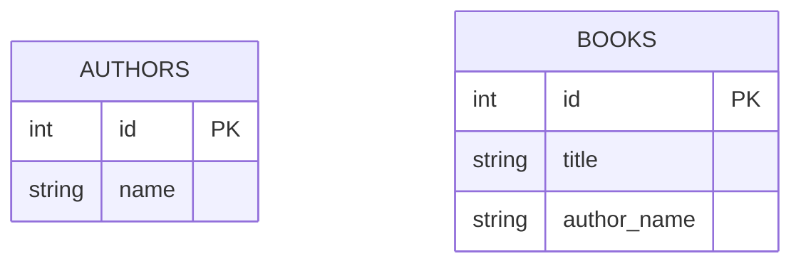
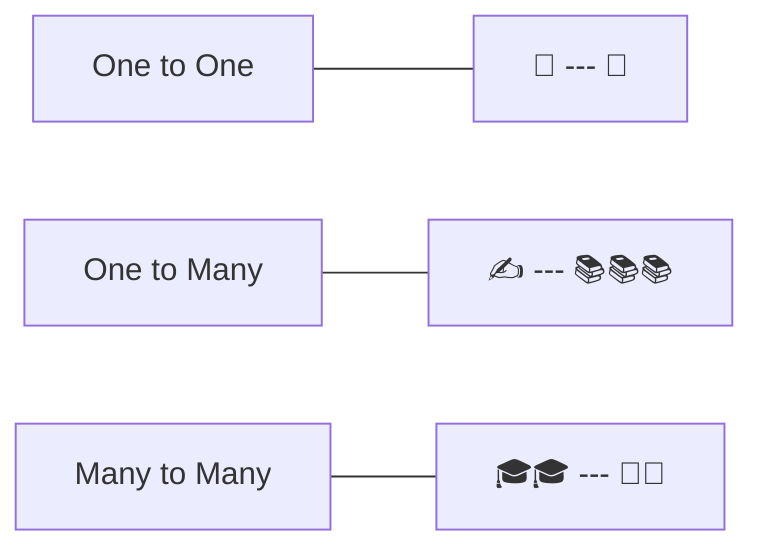

# ০১. মডিউল পরিচিতি: Relationship আসলে কী?

Module 17-এ আমরা শিখেছি একটা টেবিল থেকে কীভাবে ডেটা খুঁজে বের করতে হয় — ফিল্টার করা, দলবদ্ধ করা, সাজানো। কিন্তু সেই পুরো সময়টায় আমরা কাজ করেছি মাত্র একটা টেবিল নিয়ে, যেন পৃথিবীতে শুধু `students` নামের একটা তালিকাই আছে। বাস্তব জগতে ডেটা কখনো এত একা থাকে না — একটা ছাত্রের সাথে জড়িয়ে আছে তার ভর্তি হওয়া কোর্স, একটা বইয়ের সাথে জড়িয়ে আছে তার লেখক, একটা অর্ডারের সাথে জড়িয়ে আছে কাস্টমার আর প্রোডাক্ট। এই "জড়িয়ে থাকা"টাই এই মডিউলের মূল বিষয় — **relationship** বা সম্পর্ক।

Relationship বলতে বোঝায়, একটা টেবিলের একটা সারি অন্য একটা টেবিলের এক বা একাধিক সারির সাথে যুক্ত। যেমন ধরো একটা বইয়ের দোকানের কথা ভাবি — এই গোটা মডিউল জুড়ে আমরা এই বইয়ের দোকানের উদাহরণটাই বারবার ব্যবহার করবো, ধীরে ধীরে সেটাকে আরও বাস্তবসম্মত করে তুলবো। শুরুতে ধরে নেই আমাদের দুটো টেবিল আছে:

এখানে `BOOKS` টেবিলে `author_name` নামের একটা কলাম আছে, যেটা লেখকের নাম সরাসরি টেক্সট হিসেবে রেখে দিচ্ছে। এতে সমস্যা কী, সেটা আমরা লেসন ৩ আর ৪-এ বিস্তারিত দেখবো। এই মুহূর্তে শুধু বোঝার চেষ্টা করি — এই দুটো টেবিলের মধ্যে একটা **সম্পর্ক** আছে: প্রতিটা বই একজন লেখকের লেখা, আর একজন লেখক একাধিক বই লিখতে পারেন।

এই ধরনের সম্পর্ককে আমরা মূলত তিন ধরনে ভাগ করি, যেগুলো নিয়ে আমরা এই মডিউলে বিস্তারিত কাজ করবো:

- **One to One** — একটা রেকর্ড ঠিক একটা রেকর্ডের সাথে যুক্ত (যেমন একজন ইউজার আর তার একটাই পাসপোর্ট তথ্য)
- **One to Many** — একটা রেকর্ড একাধিক রেকর্ডের সাথে যুক্ত (যেমন একজন লেখক, অনেকগুলো বই)
- **Many to Many** — দুই দিক থেকেই একাধিক সম্পর্ক (যেমন একজন ছাত্র অনেক কোর্সে ভর্তি, আর একটা কোর্সে অনেক ছাত্র)

কেন এই জিনিসটা এত গুরুত্বপূর্ণ? কারণ একটা ডেটাবেস schema design করার সময় সবচেয়ে বড় সিদ্ধান্তটাই হলো — কোন কোন টেবিল থাকবে, আর তাদের মধ্যে সম্পর্কগুলো কীভাবে সাজানো হবে। ভুল সম্পর্ক ডিজাইন করলে ডেটা পুনরাবৃত্তি হয়, আপডেট করা কঠিন হয়ে যায়, আর ভুল তথ্য ঢুকে যাওয়ার সুযোগ তৈরি হয় — এই সমস্যাগুলো আমরা লেসন ৩ আর ৪-এ হাতেকলমে দেখবো।

এই মডিউলের যাত্রাটা এরকম — প্রথমে আমরা relationship-এর ধারণাটা OOP-এর সাথে তুলনা করে বুঝবো (Module 13-14-এ শেখা class আর object মনে করিয়ে দেবো), তারপর দেখবো কেন একটামাত্র টেবিলে সব রাখা সমস্যাজনক, তারপর ফরেন কি (foreign key) দিয়ে সম্পর্ক বাস্তবায়ন করবো, real-life উদাহরণ দিয়ে One-to-Many আর Many-to-Many দেখবো, আর সবশেষে **normalization**-এর জগতে ঢুকবো — যেখানে আমরা শিখবো কীভাবে একটা schema-কে ধাপে ধাপে পরিষ্কার আর নির্ভরযোগ্য করে তোলা যায়।

চলো পরের লেসনে দেখি, এই "টেবিল আর সম্পর্ক"-এর জগৎটা তোমার আগে থেকে চেনা Object-Oriented Programming-এর "ক্লাস আর অবজেক্ট"-এর জগতের সাথে কতটা মিলে যায়।
