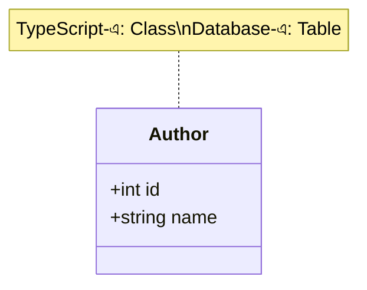
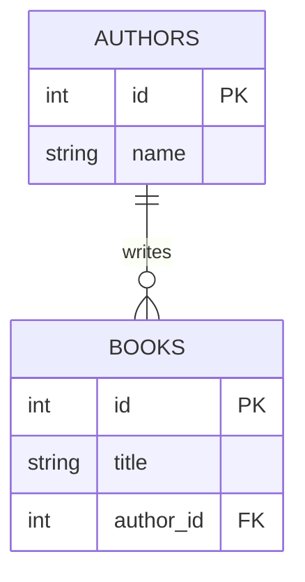

# ০২. ডেটাবেসের জগৎকে OOP-এর চোখে দেখা

Module 13 আর 14-এ আমরা TypeScript দিয়ে OOP শিখেছি — Class, Object, Encapsulation, Inheritance। মজার ব্যাপার হলো, ডেটাবেসের জগতেও প্রায় একই ধরনের চিন্তাভাবনা কাজ করে, শুধু নাম আলাদা। এই লেসনে আমরা সেই মিলটা স্পষ্ট করে দেখবো, যাতে relationship-এর ধারণাটা তোমার কাছে সম্পূর্ণ নতুন কিছু মনে না হয়।

Module 13-এ শেখা class syntax ব্যবহার করে, ধরে নেই আমরা এভাবে একটা `Author` class লিখেছি:

```typescript
class Author {
  constructor(
    public id: number,
    public name: string
  ) {}
}

const author1 = new Author(1, "Humayun Ahmed");
const author2 = new Author(2, "Muhammed Zafar Iqbal");
```

এখানে `Author` হলো একটা **blueprint** — এটা বলে দেয় একটা author-এর কী কী বৈশিষ্ট্য (property) থাকবে, কিন্তু নিজে কোনো নির্দিষ্ট লেখক না। আর `author1`, `author2` হলো সেই blueprint থেকে তৈরি নির্দিষ্ট **instance** বা object, যাদের প্রকৃত ডেটা আছে।

ডেটাবেসে ঠিক এই একই সম্পর্কটা আছে **টেবিল** আর **সারি (row)**-এর মধ্যে:



| OOP-এর ধারণা | ডেটাবেসের সমতুল্য ধারণা |
|---|---|
| Class | Table |
| Object / Instance | Row (একটা সারি) |
| Property | Column |
| Property-এর টাইপ (`string`, `number`) | Column-এর ডেটা টাইপ (`VARCHAR`, `INT`) |
| প্রতিটা object-এর ইউনিক পরিচয় (reference) | Primary Key |

তাহলে `CREATE TABLE authors (id INT PRIMARY KEY, name VARCHAR(100));` লেখাটা অনেকটা `class Author { id: number; name: string; }` লেখার মতোই — শুধু ভাষা আলাদা, উদ্দেশ্য একই: বলে দেয়া "একটা author এর গঠন কেমন হবে।" আর টেবিলে একটা নতুন সারি `INSERT` করা মানে অনেকটা `new Author(1, "Humayun Ahmed")` লেখার মতো — একটা নতুন নির্দিষ্ট instance তৈরি করা।

এখন প্রশ্ন আসে সম্পর্কের ব্যাপারে। OOP-তে যখন একটা class অন্য একটা class-কে reference করে, তখন আমরা কী করি? Module 14-এ শেখা ধারণা অনুযায়ী, ধরে নেই আমরা এরকম কিছু লিখলাম:

```typescript
class Book {
  constructor(
    public id: number,
    public title: string,
    public author: Author   // <-- এখানে Author object-টাকে reference করা হচ্ছে
  ) {}
}

const book1 = new Book(1, "Himu", author1);
```

লক্ষ করো, `Book`-এর ভেতরে পুরো `Author` object কপি না করে, শুধু তার **reference** রাখা হয়েছে (`author1`)। এটাই OOP-এর একটা গুরুত্বপূর্ণ প্র্যাকটিস — একই ডেটা বারবার কপি না করে, একটা জায়গায় রেখে সেটাকে পয়েন্ট করা।

ডেটাবেসেও ঠিক এই একই চিন্তাভাবনা কাজ করে, শুধু নাম ভিন্ন — object reference-এর বদলে আমরা ব্যবহার করি **Foreign Key**। `Book`-এর টেবিলে পুরো author-এর তথ্য কপি না করে, শুধু `author_id` নামের একটা কলাম রাখা হয়, যেটা `authors` টেবিলের `id`-কে নির্দেশ করে:



এই `erDiagram`-টা মূলত সেই একই সম্পর্ক দেখাচ্ছে যা আমরা TypeScript-এ `author: Author` লিখে প্রকাশ করেছিলাম — শুধু ডেটাবেসের ভাষায়, `FK` (Foreign Key) দিয়ে।

একটা গুরুত্বপূর্ণ পার্থক্যও বলে রাখা ভালো — OOP-তে reference মেমরির একটা ঠিকানা (memory address), যেটা প্রোগ্রাম বন্ধ হয়ে গেলে হারিয়ে যায়। কিন্তু ডেটাবেসের Foreign Key হলো একটা **স্থায়ী, ডিস্কে সংরক্ষিত মান** (সাধারণত primary key-এর কপি), যেটা ডেটাবেস বন্ধ করে আবার খুললেও ঠিক একইভাবে কাজ করে। এই স্থায়িত্বই ডেটাবেসকে দীর্ঘমেয়াদী ডেটা সংরক্ষণের জন্য উপযুক্ত করে তোলে, যেখানে সাধারণ প্রোগ্রামের object সাময়িক (in-memory, RAM-নির্ভর)।

তাহলে সারমর্ম করলে — Table হলো Class-এর মতো blueprint, Row হলো Object-এর মতো instance, আর Foreign Key হলো এক টেবিলের সারি থেকে অন্য টেবিলের সারিকে "পয়েন্ট" করার উপায়, ঠিক যেমন OOP-তে এক object অন্য object-কে reference করে। এই মানসিক মডেলটা মাথায় রাখলে সামনে relationship ডিজাইন করা অনেক সহজ মনে হবে।

এখন প্রশ্ন হলো — কেন আমরা প্রথমেই সবকিছু একটামাত্র টেবিলে না রেখে, আলাদা আলাদা টেবিলে ভাগ করি? পরের লেসনে আমরা ঠিক এই প্রশ্নের উত্তর খুঁজবো।
