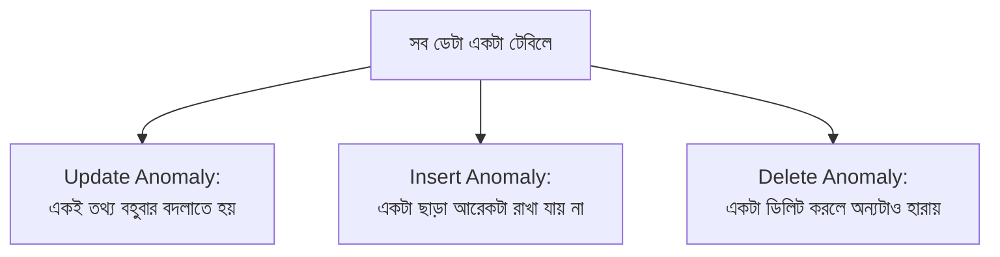

# ০৩. কেন একাধিক টেবিল দরকার?

আগের লেসনে আমরা দেখেছি, `Book` class-এর ভেতরে পুরো `Author` object কপি না করে শুধু একটা reference রাখাই বুদ্ধিমানের কাজ। কিন্তু কেন? চলো এই লেসনে সেটা হাতেকলমে দেখি — আমাদের বইয়ের দোকানের উদাহরণ দিয়ে।

ধরো, আমরা অলস হয়ে সবকিছু একটামাত্র টেবিলে রেখে দিলাম:

```sql
CREATE TABLE books (
    id INT PRIMARY KEY,
    title VARCHAR(200),
    author_name VARCHAR(100),
    author_email VARCHAR(100),
    author_country VARCHAR(50)
);
```

শুরুতে এটা ঠিকঠাক কাজ করে মনে হবে। কিন্তু বাস্তবে ডেটা ঢোকাতে শুরু করলে সমস্যা দেখা দেয়:

```sql
INSERT INTO books VALUES (1, 'Himu', 'Humayun Ahmed', 'humayun@email.com', 'Bangladesh');
INSERT INTO books VALUES (2, 'Deyal', 'Humayun Ahmed', 'humayun@email.com', 'Bangladesh');
INSERT INTO books VALUES (3, 'Misir Ali', 'Humayun Ahmed', 'humayun@email.com', 'Bangladesh');
```

লক্ষ করো — "Humayun Ahmed", তার ইমেইল, তার দেশ — এই তিনটা তথ্য প্রতিটা বইয়ের সারিতে **হুবহু কপি** হয়ে গেছে। এই একই তথ্যের বারবার পুনরাবৃত্তিকে বলে **data redundancy**। এখন কল্পনা করো, এই লেখকের যদি ১০০টা বই থাকে, তার মানে তার নাম-ইমেইল-দেশ ১০০ বার কপি হয়ে আছে ডেটাবেসে। এখানেই আসল সমস্যাগুলো শুরু হয়:

**সমস্যা ১ — Update Anomaly।** ধরো এই লেখক তার ইমেইল পরিবর্তন করলেন। এখন তোমাকে ১০০টা সারিতেই গিয়ে ইমেইল বদলাতে হবে। যদি ভুলে একটা সারি বাদ পড়ে যায়, তাহলে ডেটাবেসে একই লেখকের দুই রকম ইমেইল থাকবে — কোনটা সঠিক বলা যাবে না।

```sql
UPDATE books SET author_email = 'new_email@email.com' WHERE author_name = 'Humayun Ahmed';
-- এই এক কমান্ডে ১০০টা সারি বদলাতে হচ্ছে, একই তথ্যের জন্য!
```

**সমস্যা ২ — Insert Anomaly।** ধরো একজন নতুন লেখক এখনো কোনো বই প্রকাশ করেননি, কিন্তু তার তথ্য সিস্টেমে রাখতে চাও। এই টেবিল-ডিজাইনে সেটা সম্ভব না, কারণ `books` টেবিলে একটা সারি মানেই একটা বই থাকতে হবে — লেখক ছাড়া বই থাকলেও রাখা যাচ্ছে না, বই ছাড়া লেখকও রাখা যাচ্ছে না। লেখক আর বই একে অপরের সাথে জোর করে বাঁধা পড়ে গেছে।

**সমস্যা ৩ — Delete Anomaly।** ধরো একজন লেখকের একটামাত্র বই ছিলো, আর সেই বইয়ের রেকর্ডটা ডিলিট করা হলো (হয়তো বইটা আর বিক্রি হয় না)। তাহলে সেই লেখকের সব তথ্যও হারিয়ে যাবে, যদিও লেখক মানুষটা হয়তো এখনো আছেন, শুধু ঐ একটা বই সরানো হয়েছে।



এই তিনটা সমস্যার মূল কারণ একটাই — আমরা দুইটা ভিন্ন ধরনের বিষয়বস্তু (entity), "লেখক" আর "বই", জোর করে একটা টেবিলে গুঁজে দিয়েছি। অথচ বাস্তবে এরা স্বতন্ত্র জিনিস, শুধু একে অপরের সাথে সম্পর্কিত।

সমাধান হলো — প্রতিটা স্বতন্ত্র বিষয়বস্তুর জন্য আলাদা টেবিল বানানো, আর তাদের মধ্যে সম্পর্ক রাখা একটা reference দিয়ে (যা আমরা আগের লেসনে Foreign Key নামে চিনেছি):

```sql
CREATE TABLE authors (
    id INT PRIMARY KEY,
    name VARCHAR(100),
    email VARCHAR(100),
    country VARCHAR(50)
);

CREATE TABLE books (
    id INT PRIMARY KEY,
    title VARCHAR(200),
    author_id INT REFERENCES authors(id)
);
```

এখন লেখকের তথ্য মাত্র **একবার** থাকে `authors` টেবিলে, আর প্রতিটা বই শুধু তার `author_id` দিয়ে সেই লেখককে নির্দেশ করে। ইমেইল বদলাতে হলে এখন মাত্র একটা সারি বদলালেই চলবে, নতুন লেখক তার প্রথম বই ছাড়াও যোগ করা যাবে, আর একটা বই ডিলিট করলেও লেখকের তথ্য অক্ষত থাকবে।

এই নীতিটাকে সংক্ষেপে বলা যায় — **"প্রতিটা তথ্য যেন ঠিক একটা জায়গায় থাকে, একবার মাত্র"** (Single Source of Truth)। এটাই মূলত পরবর্তী লেসনগুলোতে আমরা যে normalization শিখবো, তার মূল দর্শন। পরের লেসনে আমরা দেখবো, শুধু "দুটো টেবিল বানানো" যথেষ্ট না — সম্পর্কটা কীভাবে বাস্তবায়ন করা হয় তাতেও ভুল হতে পারে, আর সেই সাধারণ ভুলগুলো কী কী।
