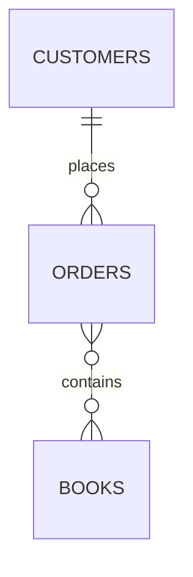
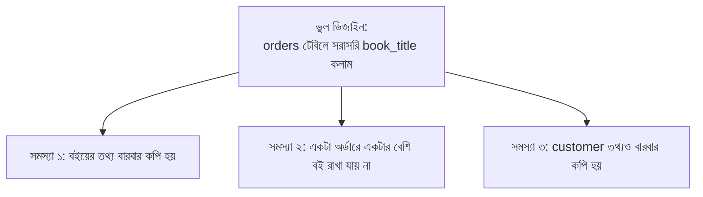

# ০৪. বর্তমান দুই-টেবিল ডিজাইনের সমস্যা

আগের লেসনে আমরা `authors` আর `books` — দুইটা টেবিলে ভাগ করে redundancy সমস্যার সমাধান করেছি বলে মনে হয়েছিলো। কিন্তু বাস্তবে একটা বইয়ের দোকান শুধু লেখক আর বই নিয়ে চলে না — এখানে **কাস্টমার** আছে, তারা বই **কেনে**। চলো এই নতুন বাস্তবতাটা যোগ করি, আর দেখি আমাদের এখনকার ডিজাইন কতটা টেকে।

ধরো আমরা তাড়াহুড়ো করে একটা `orders` টেবিল বানিয়ে ফেললাম, যেখানে সবকিছু আবার একসাথে গুঁজে দিলাম:

```sql
CREATE TABLE orders (
    id INT PRIMARY KEY,
    customer_name VARCHAR(100),
    customer_email VARCHAR(100),
    book_title VARCHAR(200),
    book_price DECIMAL(10, 2),
    quantity INT
);
```

এখন ডেটা ঢুকিয়ে দেখি বাস্তবে কী হয়:

```sql
INSERT INTO orders VALUES (1, 'Arif', 'arif@email.com', 'Himu', 250.00, 2);
INSERT INTO orders VALUES (2, 'Arif', 'arif@email.com', 'Deyal', 300.00, 1);
INSERT INTO orders VALUES (3, 'Nadia', 'nadia@email.com', 'Himu', 250.00, 1);
```

এখানে আমরা লেসন ৩-এ যে ভুলটা করেছিলাম, ঠিক সেই একই ভুল আবার করেছি — শুধু জায়গা বদলেছে। খেয়াল করো:

- "Arif" আর তার ইমেইল দুইবার লেখা হয়েছে (দুইটা আলাদা অর্ডারে)
- "Himu" বইয়ের নাম আর দাম দুইবার লেখা হয়েছে (দুইজন আলাদা কাস্টমারের অর্ডারে)

এটা ঠিক আগের মতোই redundancy তৈরি করছে — যদি "Himu" বইয়ের দাম বদলায়, তাহলে যতগুলো অর্ডারে এই বই আছে, সবগুলোতে গিয়ে বদলাতে হবে। আর যদি ভুল করে একটাতে বদলাই আর আরেকটাতে ভুলে যাই, তাহলে একই বইয়ের দুই রকম দাম দেখাবে — কোনটা সত্যি, বোঝার উপায় নেই।

আরেকটা লুকোনো সমস্যা আছে, যেটা প্রথম নজরে চোখে পড়ে না — এই ডিজাইনে একটা অর্ডারে **শুধু একটাই বই** থাকতে পারে (কারণ `book_title` একটাই কলাম)। বাস্তবে তো একজন কাস্টমার একই অর্ডারে একাধিক বই কিনতে পারে। এই সীমাবদ্ধতাটা আসলে schema design-এর একটা গুরুত্বপূর্ণ প্রশ্নের দিকে ইঙ্গিত করে — সম্পর্কটা আসলে কী ধরনের?

চলো সম্পর্কগুলো একটু বিশ্লেষণ করি:

- একজন **কাস্টমার** একাধিক **অর্ডার** দিতে পারে, কিন্তু একটা অর্ডার একজন কাস্টমারেরই — এটা **One to Many** (Customer → Orders)।
- একটা **অর্ডারে** একাধিক **বই** থাকতে পারে, আবার একটা **বই** একাধিক **অর্ডারে** থাকতে পারে (অনেকে একই বই কিনতে পারে) — এটা **Many to Many** (Orders ↔ Books)।



এই দ্বিতীয় সম্পর্কটাই আমাদের বর্তমান ডিজাইনে ভেঙে পড়ছে — কারণ আমরা `orders` টেবিলে সরাসরি একটামাত্র `book_title` কলাম রেখে দিয়েছি, যা Many-to-Many সম্পর্ককে জায়গা দিতে পারে না। এটা এমন, যেন তুমি TypeScript-এ একটা `Order` class-এ শুধু `book: Book` (একবচন) রেখেছো, অথচ বাস্তবে দরকার ছিলো `books: Book[]` (একটা array, কারণ একাধিক বই থাকতে পারে)।



সংক্ষেপে বলা যায়, এই ডিজাইনের মূল সমস্যা দুটো স্তরে — প্রথমত, আমরা আবারও একাধিক entity (customer, order, book) কে একটা টেবিলে মিশিয়ে ফেলেছি, যা redundancy তৈরি করছে। দ্বিতীয়ত, এমনকি যদি আমরা এগুলোকে আলাদা টেবিলে ভাগও করি, শুধু একটা সাধারণ Foreign Key (One-to-Many-এর মতো) দিয়ে Many-to-Many সম্পর্ক প্রকাশ করা সম্ভব না — এর জন্য একটা আলাদা কৌশল দরকার।

পরের লেসনে আমরা ঠিক এই কৌশলটাই শিখবো — কীভাবে Foreign Key দিয়ে One-to-Many সম্পর্ক বাস্তবায়ন করতে হয়, আর Many-to-Many সম্পর্কের জন্য কীভাবে একটা মাঝখানের "junction table" ব্যবহার করতে হয়।
