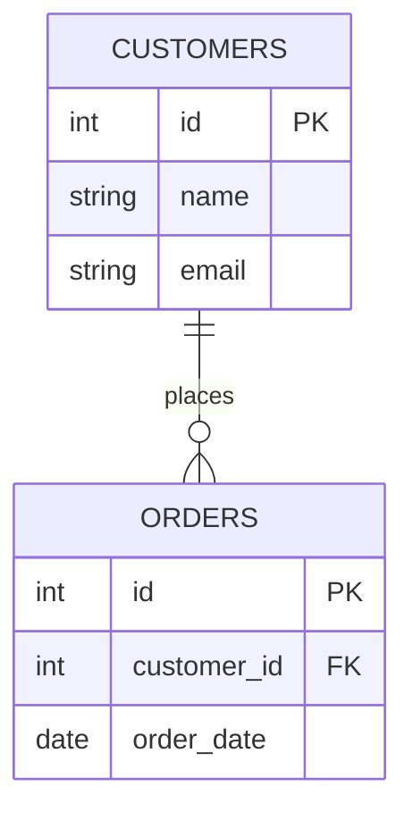
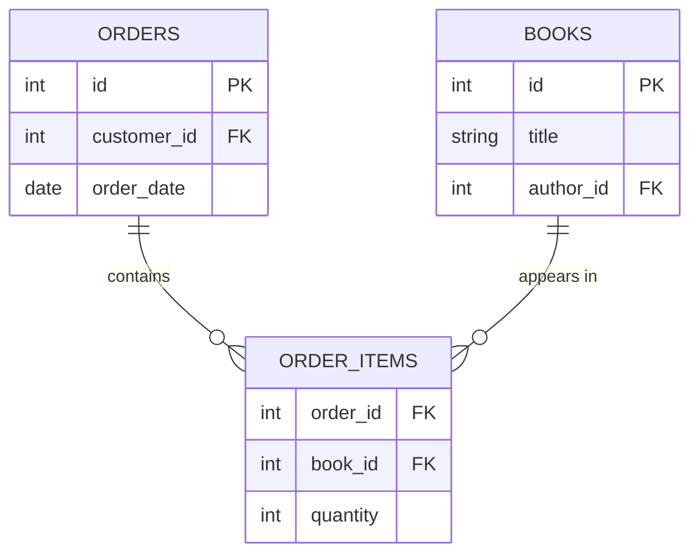

# ০৫. One-to-Many আর Many-to-Many সম্পর্ক বাস্তবায়ন করা

আগের লেসনে আমরা বুঝেছি, আমাদের বইয়ের দোকানের ডেটাতে আসলে দুই রকম সম্পর্ক আছে — Customer আর Order-এর মধ্যে One-to-Many, আর Order আর Book-এর মধ্যে Many-to-Many। এই লেসনে আমরা সেগুলো সঠিকভাবে schema-তে বাস্তবায়ন করবো।

প্রথমে সহজটা দিয়ে শুরু করি — **One to Many**। এখানে নিয়মটা সহজ: "যার সংখ্যা বেশি হতে পারে (Many পক্ষ), তার টেবিলেই Foreign Key রাখো, যেটা "One" পক্ষকে নির্দেশ করবে।" একজন কাস্টমার অনেক অর্ডার দিতে পারে, তাই Foreign Key থাকবে `orders` টেবিলে:

```sql
CREATE TABLE customers (
    id INT PRIMARY KEY,
    name VARCHAR(100),
    email VARCHAR(100)
);

CREATE TABLE orders (
    id INT PRIMARY KEY,
    customer_id INT,
    order_date DATE,
    FOREIGN KEY (customer_id) REFERENCES customers(id)
);
```

এখানে `orders.customer_id` কলামটা `customers.id`-কে নির্দেশ করছে। প্রতিটা অর্ডার সারিতে ঠিক একটা `customer_id` থাকবে, কিন্তু একটা `customer_id` অনেকগুলো অর্ডার সারিতে দেখা যেতে পারে — এভাবেই "One to Many" প্রকাশ পায়।



এখন আসি কঠিন অংশে — **Many to Many**। একটা অর্ডারে একাধিক বই থাকতে পারে, আবার একটা বই অনেক অর্ডারে থাকতে পারে। সমস্যা হলো, আমরা যদি `orders` টেবিলে একটা `book_id` কলাম যোগ করি, তাহলে একটা অর্ডারে মাত্র একটাই বই রাখা যাবে — যেটা ভুল। আর যদি `books` টেবিলে একটা `order_id` যোগ করি, তাহলে একটা বই মাত্র একটা অর্ডারেই থাকতে পারবে — সেটাও ভুল।

এই সমস্যার সমাধান হলো একটা তৃতীয়, মাঝখানের টেবিল বানানো, যাকে বলে **junction table** (কখনো bridge table বা associative table-ও বলা হয়):

```sql
CREATE TABLE order_items (
    order_id INT,
    book_id INT,
    quantity INT,
    PRIMARY KEY (order_id, book_id),
    FOREIGN KEY (order_id) REFERENCES orders(id),
    FOREIGN KEY (book_id) REFERENCES books(id)
);
```

এই `order_items` টেবিলের প্রতিটা সারি বলছে "এই নির্দিষ্ট অর্ডারে, এই নির্দিষ্ট বইটা, এত কপি আছে।" লক্ষ করো, এখানে দুটো Foreign Key আছে — একটা `orders`-কে, আরেকটা `books`-কে নির্দেশ করছে। আর `PRIMARY KEY (order_id, book_id)` — এটা একটা **composite key** (একাধিক কলাম মিলে একটা primary key), যেটা নিশ্চিত করে একই বই একই অর্ডারে দুইবার যোগ না হয়ে যায়।



লক্ষ করো, junction table আসলে Many-to-Many সম্পর্ককে দুটো One-to-Many সম্পর্কে ভেঙে ফেলে — `ORDERS` থেকে `ORDER_ITEMS`-এ এক দিকে One-to-Many, আর `BOOKS` থেকে `ORDER_ITEMS`-এ আরেক দিকে One-to-Many। এই কৌশলটা মনে রাখা জরুরি, কারণ প্রায় সব Many-to-Many সম্পর্ক এভাবেই সমাধান করা হয়।

এখন আমরা এই junction table ব্যবহার করে দেখতে পারি একটা অর্ডারে কী কী বই আছে — এর জন্য দরকার হয় `JOIN`, যেটা আমরা পরের লেসনগুলোতে বিস্তারিত শিখবো। এখানে একটা ঝলক দেখি:

```sql
SELECT b.title, oi.quantity
FROM order_items oi
JOIN books b ON oi.book_id = b.id
WHERE oi.order_id = 1;
```

এই কোয়েরিটা `order_items` টেবিল থেকে অর্ডার ১-এর সব সারি নিয়ে, প্রতিটা `book_id`-এর জন্য `books` টেবিল থেকে আসল বইয়ের নাম টেনে আনছে।

তাহলে সারমর্ম করলে — One-to-Many সম্পর্কের জন্য "many" পক্ষের টেবিলে একটা Foreign Key যথেষ্ট, কিন্তু Many-to-Many সম্পর্কের জন্য মাঝখানে একটা junction table দরকার, যেটা দুই দিকেই Foreign Key রাখে। পরের লেসনে আমরা One-to-Many আর One-to-One সম্পর্ক নিয়ে আরও গভীরে যাবো, আর বুঝবো কখন কোনটা ব্যবহার করতে হয়।
