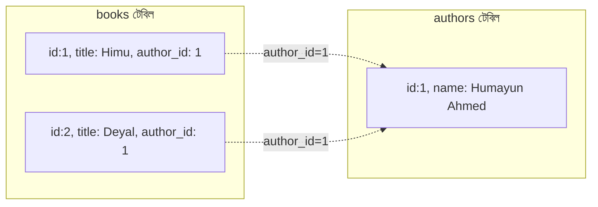
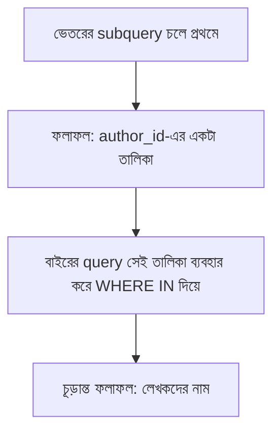

# ০৭. Subquery আর Join — কেন এগুলো দরকার?

আগের লেসনগুলোতে আমরা `authors`, `books`, `customers`, `orders`, `order_items` — এই টেবিলগুলোকে সুন্দরভাবে আলাদা করে, redundancy এড়িয়ে ডিজাইন করেছি। কিন্তু এখানে একটা স্বাভাবিক প্রশ্ন আসে — যদি ডেটা এভাবে ভাগ করা থাকে, তাহলে "কোন লেখকের কী কী বই আছে" এই তথ্যটা কীভাবে একসাথে দেখবো? এখানেই দরকার হয় `JOIN` আর subquery।

মনে করো আমরা জানতে চাই প্রতিটা বইয়ের নাম, সাথে তার লেখকের নাম। কিন্তু বইয়ের নাম আছে `books` টেবিলে, আর লেখকের নাম আছে `authors` টেবিলে। শুধু একটা `SELECT` দিয়ে দুইটা আলাদা টেবিল থেকে একসাথে ডেটা আনা যায় না, যদি না আমরা তাদের সংযুক্ত (join) করি:

```sql
SELECT books.title, authors.name AS author_name
FROM books
JOIN authors ON books.author_id = authors.id;
```

এই কোয়েরিটা যা করছে তা কল্পনা করা যাক এভাবে — `ON books.author_id = authors.id` অংশটা বলছে "যেখানে বইয়ের author_id, লেখকের id-এর সাথে মিলে যায়, সেই সারিগুলো জোড়া লাগাও":



`JOIN`-এর ফলাফল হবে একটা নতুন, সাময়িক টেবিল, যেখানে দুই টেবিলের কলাম পাশাপাশি বসানো আছে — যেখানে মিল পাওয়া গেছে সেই সারিগুলোর জন্য। এই ধরনের `JOIN`-কে বলে **INNER JOIN** (`JOIN` লিখলে ডিফল্টে এটাই হয়) — শুধু সেই সারিগুলো ফেরত আসে, যাদের দুই পাশেই মিল আছে।

কিন্তু যদি এমন কোনো লেখক থাকে যার এখনো কোনো বই নেই, তাহলে `INNER JOIN` তাকে ফলাফলে দেখাবে না — কারণ `books`-এ তার কোনো সারি নেই, মিল হওয়ার কিছু নেই। যদি আমরা সব লেখক দেখতে চাই, বই থাকুক বা না থাকুক, তখন দরকার হয় **LEFT JOIN**:

```sql
SELECT authors.name, books.title
FROM authors
LEFT JOIN books ON books.author_id = authors.id;
```

এখানে "left" টেবিল (`authors`) থেকে সব সারি থাকবেই, আর সংশ্লিষ্ট বই না থাকলে `books.title` কলামে `NULL` বসে যাবে।

এখন আসি **subquery**-তে — এটা এমন একটা কোয়েরি যেটা আরেকটা কোয়েরির ভেতরে বসানো হয়, একটা মধ্যবর্তী ফলাফল হিসেবে ব্যবহারের জন্য। ধরো আমরা জানতে চাই, "যে লেখকদের গড় বইয়ের দাম ৩০০ টাকার বেশি, তাদের নাম দেখাও।" এটা এক ধাপে করা কঠিন, তাই আমরা ভাগ করে ভাবি:

```sql
SELECT name FROM authors
WHERE id IN (
    SELECT author_id
    FROM books
    GROUP BY author_id
    HAVING AVG(price) > 300
);
```

এখানে ভেতরের কোয়েরি (`SELECT author_id FROM books GROUP BY ... HAVING ...`) আগে চলে, একটা `author_id`-এর তালিকা তৈরি করে। তারপর বাইরের কোয়েরি সেই তালিকা ব্যবহার করে `authors` টেবিল থেকে নাম বের করে।



তাহলে `JOIN` আর subquery-এর মধ্যে পার্থক্য কোথায়? `JOIN` সাধারণত ব্যবহার হয় যখন তুমি **দুই টেবিলের কলাম একসাথে, পাশাপাশি** দেখতে চাও (যেমন বইয়ের নাম আর লেখকের নাম একই সারিতে)। Subquery ব্যবহার হয় যখন একটা টেবিলের ফলাফল আরেকটা কোয়েরির শর্ত হিসেবে দরকার হয়, কিন্তু দুই টেবিলের কলাম একসাথে দেখানোর দরকার নেই।

অনেক ক্ষেত্রে একই সমস্যা `JOIN` দিয়েও সমাধান করা যায়, subquery দিয়েও — কোনটা ব্যবহার করবে তা নির্ভর করে কোনটা পড়তে সহজ, আর কোনটা ডেটাবেস ইঞ্জিনের জন্য efficient (এই efficiency নিয়ে বিস্তারিত আমরা Module 21-এ Indexing শেখার সময় দেখবো)।

এই দুই টুল হাতে থাকলে, আমাদের ছড়ানো-ছিটানো টেবিলগুলো থেকে যেকোনো জটিল প্রশ্নের উত্তর বের করা সম্ভব — বই, লেখক, কাস্টমার, অর্ডার সবকিছু একসাথে জোড়া লাগিয়ে। পরের লেসনে আমরা One-to-Many সম্পর্কের একটা সম্পূর্ণ বাস্তব উদাহরণ — লেখক আর বই — নিয়ে আরও গভীরে কাজ করবো, `JOIN` ব্যবহার করে বাস্তব প্রশ্নের উত্তর বের করে।
