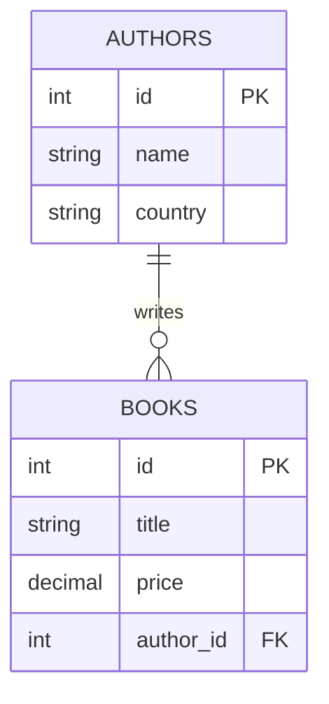

# ০৮. One to Many সম্পর্ক: বাস্তব জীবনের উদাহরণ

এতক্ষণ আমরা One-to-Many সম্পর্কের গঠন আর তত্ত্ব দেখেছি। এই লেসনে চলো পুরোপুরি হাতেকলমে, লেখক-বই (`authors`-`books`) সম্পর্কটাকে কাজে লাগিয়ে বাস্তব প্রশ্নের উত্তর বের করি। এটাই সেই ব্রিজ, যেখানে তত্ত্ব থেকে বাস্তব দক্ষতায় যাওয়া হয়।

আমাদের স্কিমা মনে করিয়ে দেই:

```sql
CREATE TABLE authors (
    id INT PRIMARY KEY,
    name VARCHAR(100),
    country VARCHAR(50)
);

CREATE TABLE books (
    id INT PRIMARY KEY,
    title VARCHAR(200),
    price DECIMAL(10, 2),
    author_id INT,
    FOREIGN KEY (author_id) REFERENCES authors(id)
);
```

কিছু নমুনা ডেটা ঢুকিয়ে নেই:

```sql
INSERT INTO authors VALUES (1, 'Humayun Ahmed', 'Bangladesh');
INSERT INTO authors VALUES (2, 'Muhammed Zafar Iqbal', 'Bangladesh');

INSERT INTO books VALUES (1, 'Himu', 250.00, 1);
INSERT INTO books VALUES (2, 'Deyal', 300.00, 1);
INSERT INTO books VALUES (3, 'Copotronic Sudhi', 200.00, 2);
```

এখন বাস্তব প্রশ্নগুলোর উত্তর খুঁজি একে একে।

**প্রশ্ন ১: হুমায়ূন আহমেদের লেখা সব বইয়ের নাম দেখাও।** এখানে Module 17-এ শেখা `WHERE`-এর সাথে `JOIN`-এর মিশেল লাগবে:

```sql
SELECT books.title
FROM books
JOIN authors ON books.author_id = authors.id
WHERE authors.name = 'Humayun Ahmed';
```

এই কোয়েরি প্রথমে `books` আর `authors`-কে জোড়া লাগাচ্ছে, তারপর সেখান থেকে ফিল্টার করছে যেখানে লেখকের নাম মিলছে।

**প্রশ্ন ২: প্রতিটা লেখকের মোট কতগুলো বই আছে?** এখানে দরকার হবে Module 17-এর `GROUP BY` আর `COUNT`, `JOIN`-এর সাথে মিশিয়ে:

```sql
SELECT authors.name, COUNT(books.id) AS total_books
FROM authors
LEFT JOIN books ON books.author_id = authors.id
GROUP BY authors.name;
```

এখানে `LEFT JOIN` ব্যবহার করা হয়েছে ইচ্ছাকৃতভাবে — যদি কোনো লেখকের এখনো কোনো বই না থাকে, তাও তাকে ফলাফলে দেখাবে (`total_books = 0` সহ), কারণ `LEFT JOIN` সব `authors` সারি রাখে, `books`-এ মিল না পেলেও।

**প্রশ্ন ৩: প্রতিটা লেখকের বইয়ের গড় দাম কত, শুধু তাদের দেখাও যাদের একাধিক বই আছে।** এখানে আমরা `HAVING` ব্যবহার করবো (Module 17-এ শেখা), কারণ শর্তটা গ্রুপ তৈরি হওয়ার পরে বসাতে হবে:

```sql
SELECT authors.name, AVG(books.price) AS avg_price, COUNT(books.id) AS total_books
FROM authors
JOIN books ON books.author_id = authors.id
GROUP BY authors.name
HAVING COUNT(books.id) > 1
ORDER BY avg_price DESC;
```

লক্ষ করো, এই একটা কোয়েরিতে আমরা এখন পর্যন্ত শেখা প্রায় সবকিছু একসাথে ব্যবহার করেছি — `JOIN` (এই মডিউল), `GROUP BY`/`HAVING`/`ORDER BY` (Module 17)।



এই উদাহরণটা দেখায় কেন One-to-Many সম্পর্ক এত সাধারণ বাস্তব জগতে — একজন লেখক অনেক বই লেখেন, একজন শিক্ষক অনেক ক্লাস নেন, একটা কোম্পানি অনেক কর্মচারী রাখে, একটা ফোল্ডার অনেক ফাইল ধরে রাখে। এই "এক পক্ষ থেকে ছড়িয়ে পড়া" প্যাটার্নটা চিনতে পারলে schema design অনেক সহজ হয়ে যায় — নিজেকে জিজ্ঞেস করো, "এই দুইটা জিনিসের মধ্যে কোনটা 'এক' পক্ষ, আর কোনটা 'অনেক' পক্ষ?"

পরের লেসনে আমরা ঠিক এই একই ধরনের হাতেকলমে অনুশীলন করবো, কিন্তু Many-to-Many সম্পর্ক নিয়ে — ছাত্র আর কোর্সের বাস্তব উদাহরণ দিয়ে।
