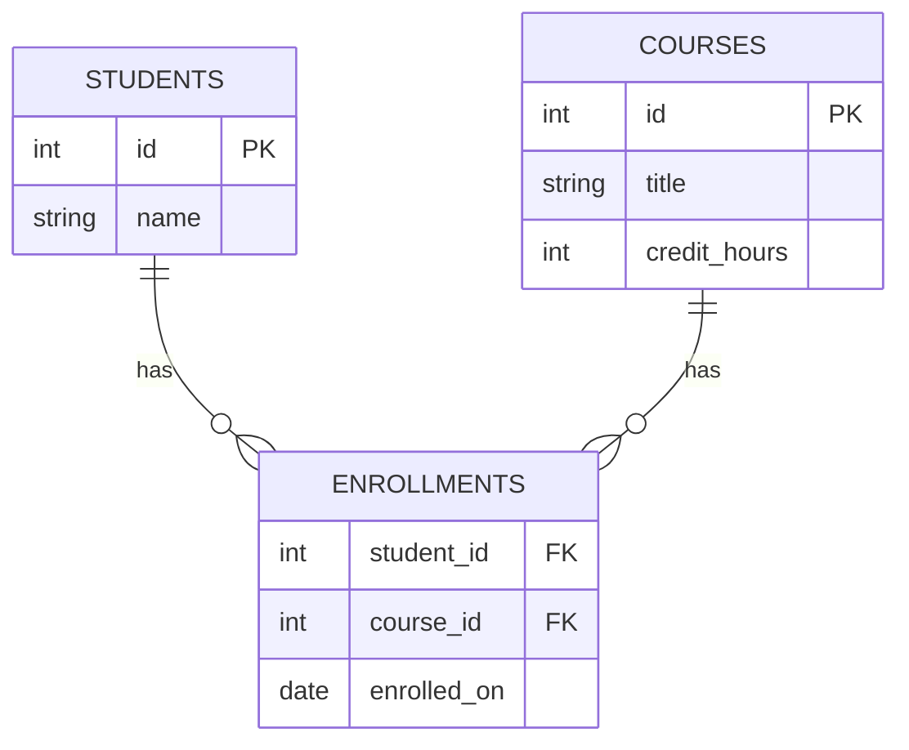
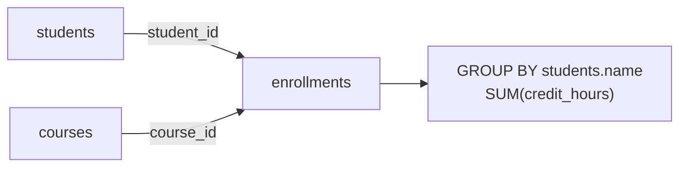

# ০৯. Many to Many সম্পর্ক: বাস্তব জীবনের উদাহরণ

আগের লেসনে আমরা One-to-Many সম্পর্ক নিয়ে হাতেকলমে কাজ করেছি লেখক-বই দিয়ে। এই লেসনে আমরা Many-to-Many সম্পর্ক নিয়ে সেরকমই একটা হাতেকলমে অনুশীলন করবো — এবার একটা নতুন, খুবই পরিচিত উদাহরণ দিয়ে: ছাত্র আর কোর্স।

একজন ছাত্র একাধিক কোর্সে ভর্তি হতে পারে, আবার একটা কোর্সে অনেক ছাত্র ভর্তি হতে পারে — এটা ক্লাসিক Many-to-Many। Module 18-এর লেসন ৫-এ শেখা junction table-এর কৌশল অনুযায়ী স্কিমা বানাই:

```sql
CREATE TABLE students (
    id INT PRIMARY KEY,
    name VARCHAR(100)
);

CREATE TABLE courses (
    id INT PRIMARY KEY,
    title VARCHAR(100),
    credit_hours INT
);

CREATE TABLE enrollments (
    student_id INT,
    course_id INT,
    enrolled_on DATE,
    PRIMARY KEY (student_id, course_id),
    FOREIGN KEY (student_id) REFERENCES students(id),
    FOREIGN KEY (course_id) REFERENCES courses(id)
);
```

`enrollments` টেবিলটাই আমাদের junction table — প্রতিটা সারি বলছে "এই ছাত্র, এই কোর্সে, এই তারিখে ভর্তি হয়েছে।"



নমুনা ডেটা:

```sql
INSERT INTO students VALUES (1, 'Rafi'), (2, 'Nadia');
INSERT INTO courses VALUES (1, 'Database Systems', 3), (2, 'Web Development', 4);

INSERT INTO enrollments VALUES (1, 1, '2026-01-10');
INSERT INTO enrollments VALUES (1, 2, '2026-01-10');
INSERT INTO enrollments VALUES (2, 1, '2026-01-12');
```

এখন বাস্তব প্রশ্নের উত্তর খুঁজি।

**প্রশ্ন ১: Rafi কোন কোন কোর্সে ভর্তি আছে?** এখানে দুইটা `JOIN` দরকার — `students` থেকে `enrollments`, তারপর `enrollments` থেকে `courses`:

```sql
SELECT courses.title
FROM enrollments
JOIN students ON enrollments.student_id = students.id
JOIN courses ON enrollments.course_id = courses.id
WHERE students.name = 'Rafi';
```

এখানে আমরা তিনটা টেবিলকে একসাথে জোড়া লাগাচ্ছি — এটাই Many-to-Many সম্পর্কের বৈশিষ্ট্য, তথ্য বের করতে গেলে সবসময় junction table হয়ে "ঘুরে" যেতে হয়।

**প্রশ্ন ২: প্রতিটা কোর্সে কতজন ছাত্র ভর্তি আছে?**

```sql
SELECT courses.title, COUNT(enrollments.student_id) AS total_students
FROM courses
LEFT JOIN enrollments ON courses.id = enrollments.course_id
GROUP BY courses.title
ORDER BY total_students DESC;
```

**প্রশ্ন ৩: যেসব ছাত্রের মোট credit hour ৫-এর বেশি (একাধিক কোর্স মিলিয়ে), তাদের নাম আর মোট credit hour দেখাও।** এটা একটু জটিল — আমাদের `students`, `enrollments`, `courses` তিনটাকেই জোড়া লাগিয়ে, `SUM` দিয়ে যোগ করতে হবে:

```sql
SELECT students.name, SUM(courses.credit_hours) AS total_credits
FROM students
JOIN enrollments ON students.id = enrollments.student_id
JOIN courses ON enrollments.course_id = courses.id
GROUP BY students.name
HAVING SUM(courses.credit_hours) > 5;
```

এই কোয়েরিটা আসলে বলছে — প্রতিটা ছাত্রের জন্য, তার সব ভর্তি হওয়া কোর্সের credit hour যোগ করো, তারপর শুধু তাদের রাখো যাদের যোগফল ৫-এর বেশি।



লক্ষ করার মতো একটা বিষয় — `enrollments` টেবিলে `enrolled_on` কলামটা এমন একটা তথ্য, যেটা শুধু student-এরও না, শুধু course-এরও না — এটা তাদের **সম্পর্কের নিজস্ব তথ্য**। এই ধরনের কলাম junction table-এ রাখাটাই স্বাভাবিক, কারণ এটা কোনো একটা entity একা ধরে রাখতে পারে না, এটা দুটোর মধ্যেকার সম্পর্কের একটা বৈশিষ্ট্য।

এখন পর্যন্ত আমরা relationship ডিজাইন করা আর সেগুলো থেকে তথ্য বের করে আনা — দুটোই শিখে ফেলেছি। কিন্তু এখনো একটা প্রশ্ন বাকি — একটা schema কতটা "ভালো" ডিজাইন করা হয়েছে তা মাপার একটা নিয়মতান্ত্রিক পদ্ধতি আছে কি? পরের লেসন থেকে আমরা সেই পদ্ধতিতে ঢুকবো — **Database Normalization**।
