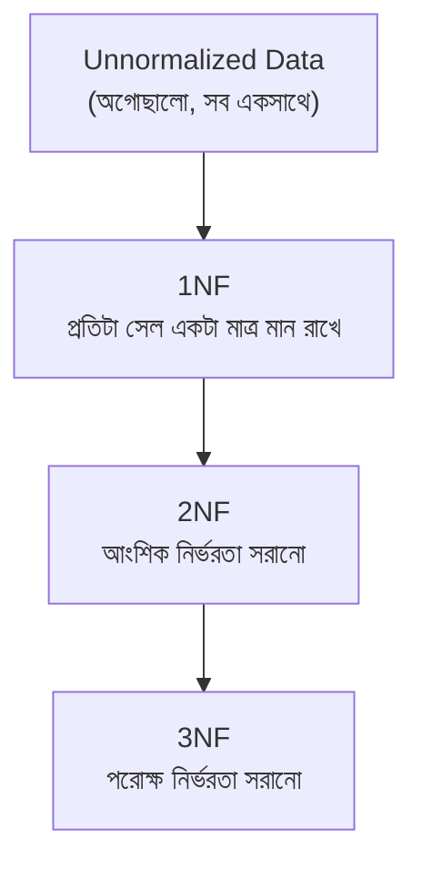
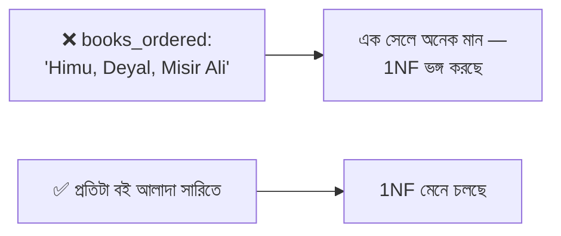

# ১০. Database Normalization পরিচিতি

আমরা এতদিন যা করেছি — লেসন ৩ আর ৪-এ redundancy সমস্যা চিহ্নিত করা, তারপর টেবিল আলাদা করা, Foreign Key দিয়ে সম্পর্ক তৈরি করা — এই পুরো প্রক্রিয়াটার আসলে একটা নাম আছে, একটা নিয়মতান্ত্রিক পদ্ধতি আছে। একে বলে **Database Normalization**। এই লেসন থেকে আমরা এই পদ্ধতিটাকে ধাপে ধাপে, নিয়ম মেনে শিখবো।

Normalization হলো একটা schema-কে ধাপে ধাপে পুনর্গঠন করার প্রক্রিয়া, যাতে redundancy কমে, আর data integrity (ডেটার সঠিকতা ও সামঞ্জস্য) বাড়ে। এই প্রক্রিয়াটা কয়েকটা ধাপে ভাগ করা, যাদের বলে **Normal Form** — সংক্ষেপে NF। প্রতিটা ধাপ আগের ধাপের ওপর ভিত্তি করে তৈরি, আর প্রতিটা ধাপে নির্দিষ্ট কিছু নিয়ম মানতে হয়:



এই কোর্সে আমরা প্রথম দুইটা ধাপ — 1NF আর 2NF — নিয়ে বিস্তারিত কাজ করবো, যেগুলো ব্যবহারিক schema design-এর ভিত্তি তৈরি করে।

চলো একটা নতুন উদাহরণ দিয়ে শুরু করি, যেটাকে আমরা এই মডিউলের বাকি অংশে ধাপে ধাপে normalize করবো — একটা অগোছালো `order_details` টেবিল, যেখানে একটা অর্ডারের সব তথ্য এক জায়গায় গুঁজে দেয়া হয়েছে:

```sql
CREATE TABLE order_details (
    order_id INT,
    customer_name VARCHAR(100),
    customer_phone VARCHAR(20),
    books_ordered VARCHAR(500),  -- 'Himu, Deyal, Misir Ali'
    order_date DATE
);
```

এই টেবিলে একটা সারি দেখতে এরকম হতে পারে:

| order_id | customer_name | customer_phone | books_ordered | order_date |
|---|---|---|---|---|
| 1 | Arif | 017xxxxxxxx | Himu, Deyal, Misir Ali | 2026-01-05 |

লক্ষ করো `books_ordered` কলামে একসাথে তিনটা বইয়ের নাম কমা দিয়ে জোড়া লাগানো আছে — একটা মাত্র সেলে একাধিক মান গুঁজে দেয়া হয়েছে। এটা normalization-এর ভাষায় একটা গুরুতর সমস্যা, কারণ এখন তুমি সহজে জিজ্ঞেস করতে পারবে না "কতগুলো বই অর্ডার করা হয়েছে?" বা "যাদের অর্ডারে Himu আছে তাদের খুঁজে বের করো" — কারণ ডেটাবেস ইঞ্জিন এই কমা-দিয়ে-জোড়া-লাগানো টেক্সটকে একটামাত্র মান হিসেবে দেখে, আলাদা আলাদা বই হিসেবে না।

```sql
-- এই কোয়েরিটা কাজ করবে না ঠিকভাবে!
SELECT * FROM order_details WHERE books_ordered LIKE '%Himu%';
-- এটা টেক্সট ম্যাচিং করছে, প্রকৃত সম্পর্ক অনুসরণ করছে না
```

এই সমস্যাটাকে ঠিক করাই **First Normal Form (1NF)**-এর কাজ। এর মূল নিয়মটা মনে রাখা সহজ: **"প্রতিটা কলামের প্রতিটা সেলে ঠিক একটা, অবিভাজ্য (atomic) মান থাকবে।"** মানে, কোনো সেলে কমা দিয়ে একাধিক জিনিস, বা একটা array, বা একটা নেস্টেড লিস্ট রাখা যাবে না।



এই লেসনে আমরা normalization-এর সামগ্রিক ধারণা আর কেন এটা দরকার সেটা বুঝেছি — মূলত redundancy কমানো আর ডেটার মধ্যে অসামঞ্জস্য (inconsistency) আটকানো। পরের লেসনে আমরা এই `order_details` টেবিলটাকে হাতেকলমে 1NF-এ রূপান্তর করবো, ধাপে ধাপে।
