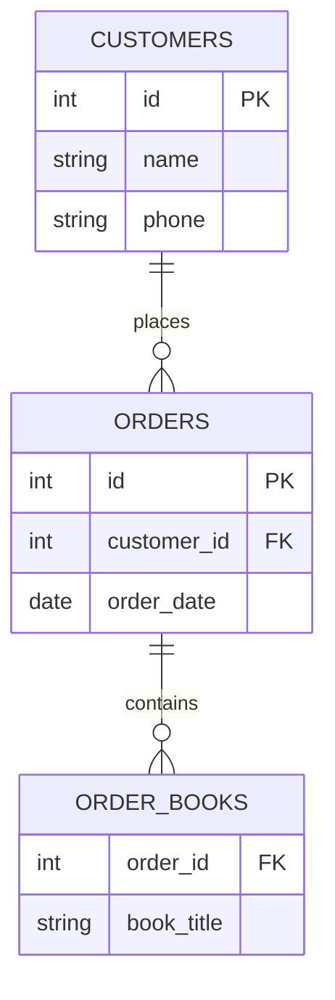

# ১১. First Normal Form (1NF) হাতেকলমে

আগের লেসনে আমরা 1NF-এর নিয়ম শিখেছি — "প্রতিটা সেলে ঠিক একটা, অবিভাজ্য মান।" এখন চলো আমাদের অগোছালো `order_details` টেবিলটাকে ধাপে ধাপে 1NF-এ রূপান্তর করি।

সমস্যাযুক্ত টেবিলটা আবার দেখি:

| order_id | customer_name | customer_phone | books_ordered | order_date |
|---|---|---|---|---|
| 1 | Arif | 017xxxxxxxx | Himu, Deyal, Misir Ali | 2026-01-05 |

**ধাপ ১: প্রতিটা multi-value কলামকে আলাদা সারিতে ভাঙা।** `books_ordered`-এ তিনটা বই আছে, তাই এই একটা সারিকে তিনটা সারিতে ভাঙতে হবে, প্রতিটাতে একটা করে বই:

| order_id | customer_name | customer_phone | book | order_date |
|---|---|---|---|---|
| 1 | Arif | 017xxxxxxxx | Himu | 2026-01-05 |
| 1 | Arif | 017xxxxxxxx | Deyal | 2026-01-05 |
| 1 | Arif | 017xxxxxxxx | Misir Ali | 2026-01-05 |

এখন প্রতিটা সেলে ঠিক একটা মান — এটা টেকনিক্যালি 1NF-এর প্রথম শর্ত পূরণ করেছে। কিন্তু লক্ষ করো, এখন একটা নতুন সমস্যা তৈরি হয়েছে — `customer_name`, `customer_phone`, `order_date` তিনবার কপি হয়ে গেছে! এটা ঠিক লেসন ৩-এ আমরা যে redundancy সমস্যা দেখেছিলাম, সেটাই আবার ফিরে এসেছে।

এই কারণেই বাস্তবে 1NF প্রয়োগ করার সময় আমরা শুধু সারি ভাঙি না, বরং একইসাথে টেবিলও ভেঙে ফেলি — ঠিক আমাদের আগের লেসনগুলোর অভ্যাস অনুযায়ী। `order_details`-কে তিনটা আলাদা, পরিষ্কার টেবিলে ভাগ করি:

```sql
CREATE TABLE customers (
    id INT PRIMARY KEY,
    name VARCHAR(100),
    phone VARCHAR(20)
);

CREATE TABLE orders (
    id INT PRIMARY KEY,
    customer_id INT,
    order_date DATE,
    FOREIGN KEY (customer_id) REFERENCES customers(id)
);

CREATE TABLE order_books (
    order_id INT,
    book_title VARCHAR(200),
    PRIMARY KEY (order_id, book_title),
    FOREIGN KEY (order_id) REFERENCES orders(id)
);
```

এখন ডেটা এভাবে সাজানো থাকবে:

```sql
INSERT INTO customers VALUES (1, 'Arif', '017xxxxxxxx');
INSERT INTO orders VALUES (1, 1, '2026-01-05');
INSERT INTO order_books VALUES (1, 'Himu'), (1, 'Deyal'), (1, 'Misir Ali');
```



এখন প্রতিটা টেবিলের প্রতিটা সেলে ঠিক একটা মান আছে, আর `customer_name`, `phone`, `order_date`-এর মতো তথ্য কোথাও পুনরাবৃত্তি হচ্ছে না। এখন আমরা সহজেই জিজ্ঞেস করতে পারি "Himu বইটা কোন কোন অর্ডারে আছে?":

```sql
SELECT order_id FROM order_books WHERE book_title = 'Himu';
```

এই কোয়েরিটা আগের ডিজাইনে (যেখানে `books_ordered` একটা কমা-দিয়ে-জোড়া টেক্সট ছিলো) সহজভাবে, নির্ভরযোগ্যভাবে করা সম্ভবই ছিলো না।

লক্ষণীয়, এই লেসনে আমরা যা করলাম তা আসলে লেসন ৩, ৪, ৫-এ শেখা কৌশলগুলোরই প্রয়োগ — টেবিল ভাগ করা, Foreign Key দিয়ে সম্পর্ক রাখা। পার্থক্যটা শুধু, এখন আমরা এটাকে একটা নির্দিষ্ট, নামকরণ করা নিয়মের (1NF) আওতায় নিয়ে এসেছি, যাতে "schema ভালো কিনা" যাচাই করার একটা প্রামাণ্য মাপকাঠি থাকে।

1NF পূরণ হয়ে গেলেও, আমাদের schema সম্পূর্ণ "পরিষ্কার" কিনা তা নিশ্চিত হতে আরেকটা ধাপ বাকি আছে, যেটার জন্য আমাদের আগে বুঝতে হবে **key** বলতে ঠিক কী বোঝায় — candidate key, primary key, আর composite key। পরের লেসনে আমরা ঠিক এই বিষয়গুলো নিয়ে কাজ করবো।
