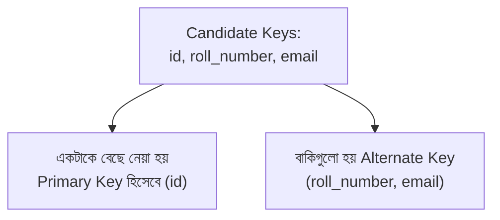
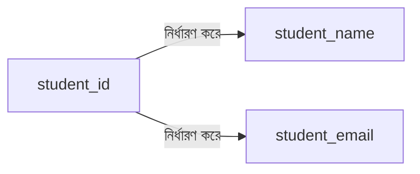

# ১২. Candidate Key, Primary Key আর Composite Key

আগের লেসনে আমরা `order_books` টেবিল বানিয়েছিলাম, যেখানে `PRIMARY KEY (order_id, book_title)` লিখেছিলাম — দুইটা কলাম মিলে একটা primary key। এই লেসনে আমরা key-এর ধারণাগুলো নিয়ে স্পষ্টভাবে বুঝবো, কারণ 2NF বুঝতে হলে key-এর ধারণাটা মজবুত হওয়া জরুরি।

শুরু করি **candidate key** দিয়ে। একটা টেবিলে candidate key হলো এমন একটা কলাম (বা কলামের সমষ্টি), যেটা প্রতিটা সারিকে আলাদাভাবে চিহ্নিত করতে পারে — মানে সেই কলামের মান দিয়ে তুমি একটা সারিকে অন্য সব সারি থেকে আলাদা করতে পারো, দ্ব্যর্থহীনভাবে। একটা টেবিলে একাধিক candidate key থাকতে পারে। যেমন ধরো `students` টেবিলে:

```sql
CREATE TABLE students (
    id INT,
    roll_number VARCHAR(20),
    email VARCHAR(100),
    name VARCHAR(100)
);
```

এখানে `id`, `roll_number`, আর `email` — এই তিনটাই candidate key হতে পারে, কারণ প্রতিটাই ইউনিক (কোনো দুইজন ছাত্রের একই `id`, একই `roll_number`, বা একই `email` থাকবে না ধরে নিচ্ছি)। কিন্তু `name` candidate key না, কারণ দুইজন ছাত্রের নাম একই হতে পারে।

এই কয়েকটা candidate key-এর মধ্য থেকে আমরা যেটাকে টেবিলের মূল, প্রধান পরিচয় হিসেবে বেছে নেই, সেটাই হয়ে যায় **Primary Key**। বাকিগুলোকে বলে **Alternate Key** (বা Unique Key)। সাধারণত আমরা `id`-কে Primary Key বানাই, কারণ এটা ছোট, সংখ্যা, আর কখনো বদলায় না — যেখানে `email` পরিবর্তন হতে পারে (কেউ ইমেইল বদলাতে পারে)।



এখন আসি **Composite Key**-এ, যেটা আমরা আগের লেসনে `order_books` টেবিলে ব্যবহার করেছিলাম:

```sql
CREATE TABLE order_books (
    order_id INT,
    book_title VARCHAR(200),
    PRIMARY KEY (order_id, book_title)
);
```

এখানে একা `order_id` দিয়ে একটা সারি ইউনিকভাবে চেনা যাবে না (একই অর্ডারে অনেক বই থাকতে পারে), আর একা `book_title` দিয়েও না (একই বই অনেক অর্ডারে থাকতে পারে)। কিন্তু `order_id` আর `book_title` **একসাথে** নিলে প্রতিটা সারি আলাদা করে চেনা যায় — একই অর্ডারে একই বই দুইবার থাকবে না। এই দুই কলামের সমষ্টিকেই বলে **Composite Key** (যৌগিক কী) — একাধিক কলাম মিলে একটা primary key তৈরি করছে।

Composite key খুবই সাধারণ junction table-এ, যা আমরা লেসন ৫ আর ৯-এ দেখেছি (`enrollments`, `order_items`)। এটা মনে রাখা সহজ উপায় — "junction table-এ প্রায়ই composite key থাকে, কারণ সেই টেবিলের কাজই হলো দুটো Foreign Key-কে একসাথে ধরে রাখা, আর সেই দুটো মিলেই একটা সম্পর্ক-instance ইউনিকভাবে চেনা যায়।"

এখন এই key-গুলোর ধারণা কেন গুরুত্বপূর্ণ, সেটা বুঝতে একটা নতুন শব্দ শিখি — **functional dependency**। আমরা বলি "B, A-এর ওপর functionally dependent," যদি A-এর একটা নির্দিষ্ট মান জানলে B-এর মান নিশ্চিতভাবে বলে দেয়া যায়। যেমন, `student_id` জানলে `student_name` নিশ্চিতভাবে বলে দেয়া যায় — তাই `student_name`, `student_id`-এর ওপর functionally dependent। এই ধারণাটাই পরের লেসনগুলোতে 2NF বোঝার মূল হাতিয়ার হবে।



সংক্ষেপে — Candidate Key হলো ইউনিক পরিচয় দেয়ার যোগ্য যেকোনো কলাম (বা কলাম-সমষ্টি), তাদের মধ্য থেকে একটা বেছে নিলে সেটা হয় Primary Key, আর যখন একাধিক কলাম মিলে একটা key তৈরি হয়, সেটা Composite Key। এই ধারণাগুলো মাথায় স্পষ্ট থাকলে পরের লেসনের 2NF সংক্রান্ত প্রশ্নগুলো অনেক সহজ মনে হবে, যেখানে আমরা নিজেদের schema যাচাই করবো।
