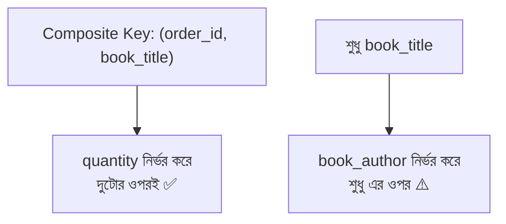

# ১৩. 2NF নিয়ে নিজেকে যাচাই করার প্রশ্ন

Second Normal Form-এ ঢোকার আগে, চলো একটু থামি। আগের লেসনে আমরা Candidate Key, Primary Key, Composite Key আর Functional Dependency শিখেছি। 2NF আসলে এই সবগুলো ধারণার একটা প্রয়োগ — তাই সরাসরি নিয়মে ঝাঁপ দেয়ার আগে, নিজেদেরকে কিছু প্রশ্ন করে দেখি, যা আমাদের মানসিকভাবে প্রস্তুত করবে।

আমাদের `order_books` টেবিলটা আরেকটু বাস্তবসম্মত করে তুলি — ধরো আমরা প্রতিটা order-book জোড়ার সাথে বইয়ের দামও রাখতে চাই (কারণ দাম সময়ের সাথে বদলাতে পারে, অর্ডারের সময়কার দামটাই রেকর্ড রাখা দরকার):

```sql
CREATE TABLE order_books (
    order_id INT,
    book_title VARCHAR(200),
    book_author VARCHAR(100),
    quantity INT,
    price_at_order DECIMAL(10, 2),
    PRIMARY KEY (order_id, book_title)
);
```

এখন নিজেকে কয়েকটা প্রশ্ন করি:

**প্রশ্ন ১: এই টেবিলের Primary Key কী, আর সেটা কি composite?** উত্তর — হ্যাঁ, `(order_id, book_title)` মিলে composite primary key, কারণ প্রতিটা আলাদাভাবে সারি ইউনিকভাবে চেনাতে পারে না, দুইটা মিলেই পারে।

**প্রশ্ন ২: `quantity` কলামটা কি পুরো composite key (`order_id` + `book_title` দুটোই)-এর ওপর নির্ভরশীল, নাকি শুধু একটা অংশের ওপর?** ভাবো — "একটা নির্দিষ্ট অর্ডারে, একটা নির্দিষ্ট বই কত কপি আছে" — এটা জানতে তোমার `order_id` **এবং** `book_title` দুটোই লাগবে। শুধু `order_id` জানলে quantity বলা যাবে না (একটা অর্ডারে অনেক বই থাকতে পারে, ভিন্ন quantity নিয়ে), শুধু `book_title` জানলেও না (একই বই ভিন্ন অর্ডারে ভিন্ন quantity-তে থাকতে পারে)। তাই `quantity`, পুরো composite key-এর ওপর নির্ভরশীল — এটা স্বাস্থ্যকর।

**প্রশ্ন ৩: `book_author` কলামটার কী অবস্থা?** এখানেই সমস্যা। `book_author` জানতে তোমার আসলে শুধু `book_title` দরকার — `order_id`-এর সাথে এর কোনো সম্পর্ক নেই। একজন লেখক একটা বইয়ের সাথে জড়িত, সেই বইটা কোন অর্ডারে আছে তার সাথে না। তাহলে `book_author`, পুরো composite key-এর ওপর নয়, বরং composite key-এর **একটা অংশের** (`book_title`) ওপর নির্ভরশীল।



এই যে `book_author`, পুরো key-এর বদলে key-এর একটা অংশের ওপর নির্ভরশীল — এটাকেই বলে **partial dependency** (আংশিক নির্ভরতা)। আর এটাই ঠিক সেই সমস্যা, যেটা 2NF সমাধান করে।

**প্রশ্ন ৪: এই partial dependency থাকার ফলে বাস্তবে কী সমস্যা হতে পারে, ভাবো তো?** একটু থেমে নিজে উত্তর দেয়ার চেষ্টা করো, তারপর দেখো তোমার উত্তর মেলে কিনা। উত্তর — যদি "Himu" বইটা পাঁচটা আলাদা অর্ডারে থাকে, তাহলে "Humayun Ahmed" নামটা পাঁচবার কপি হয়ে থাকবে `order_books` টেবিলে। এটা ঠিক লেসন ৩-এ আমরা যে redundancy সমস্যা দেখেছিলাম, সেই একই সমস্যা — শুধু এবার এটা লুকিয়ে আছে একটা junction table-এর ভেতরে।

**প্রশ্ন ৫: সমাধান কী হতে পারে, অনুমান করো তো?** ইঙ্গিত — লেসন ৩-এ আমরা কী করেছিলাম যখন `author_name` বইয়ের টেবিলে বারবার কপি হচ্ছিল? সঠিক অনুমান হলো — `book_author`-কে `order_books` থেকে সরিয়ে একটা আলাদা `books` টেবিলে রাখা, যেখানে শুধু `book_title` (বা `book_id`) দিয়ে এটা এক জায়গায় সংরক্ষিত থাকবে।

এই প্রশ্নগুলোর মধ্য দিয়ে আমরা আসলে নিজে থেকেই 2NF-এর মূল নিয়মটা আবিষ্কার করে ফেলেছি, নিজেদের বুদ্ধি দিয়ে। পরের দুই লেসনে আমরা এই আবিষ্কারটাকে একটা আনুষ্ঠানিক সংজ্ঞা দেবো, আর ধাপে ধাপে schema-টা ঠিক করবো।
