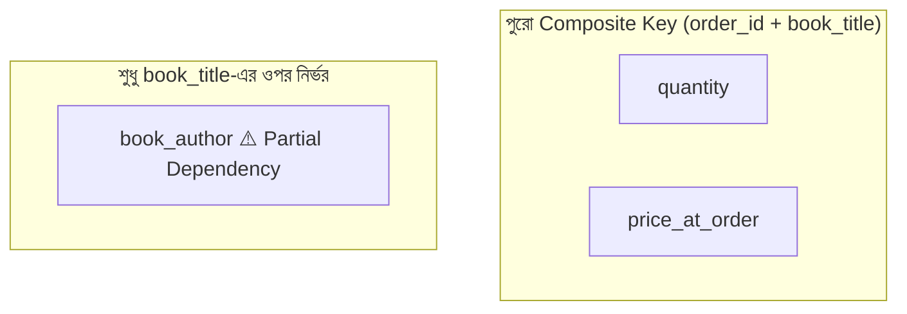
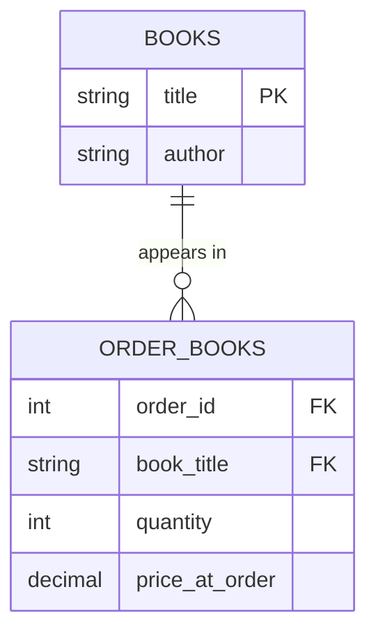

# ১৪. Second Normal Form (2NF) বিস্তারিত — পার্ট ১

আগের লেসনের প্রশ্নগুলোর মধ্য দিয়ে আমরা ইতিমধ্যে 2NF-এর মূল সমস্যাটা নিজে থেকেই খুঁজে পেয়েছি — **partial dependency**। এই লেসনে আমরা 2NF-এর আনুষ্ঠানিক সংজ্ঞা দেখবো, আর কেন এই নিয়মটা এভাবে তৈরি হয়েছে সেটা বুঝবো।

2NF-এর আনুষ্ঠানিক সংজ্ঞা এরকম:

> একটা টেবিল 2NF-এ থাকে, যদি (১) সেটা আগে থেকেই 1NF মেনে চলে, এবং (২) টেবিলের প্রতিটা non-key কলাম (যে কলামগুলো primary key-এর অংশ না) পুরো primary key-এর ওপর নির্ভরশীল হয়, primary key-এর কোনো অংশের ওপর না।

লক্ষ করো, এই নিয়মটা শুধু তখনই প্রাসঙ্গিক যখন primary key **composite** (একাধিক কলাম মিলে তৈরি)। যদি primary key মাত্র একটা কলাম হয় (যেমন `id`), তাহলে "partial" বলে কিছু থাকতেই পারে না — সেই টেবিল স্বয়ংক্রিয়ভাবে 2NF মেনে চলে (যদি সেটা 1NF-এ থাকে)।

আমাদের আগের লেসনের সমস্যাযুক্ত টেবিলে ফিরে আসি:

```sql
CREATE TABLE order_books (
    order_id INT,
    book_title VARCHAR(200),
    book_author VARCHAR(100),
    quantity INT,
    price_at_order DECIMAL(10, 2),
    PRIMARY KEY (order_id, book_title)
);
```

আমরা আগের লেসনে বিশ্লেষণ করেছিলাম:



`quantity` আর `price_at_order` — দুটোই যুক্তিসঙ্গতভাবে পুরো `(order_id, book_title)`-এর ওপর নির্ভরশীল ("এই অর্ডারে, এই বইয়ের কত কপি, আর কী দামে বিক্রি হয়েছিলো" — দুইটা তথ্যই লাগবে বলতে)। কিন্তু `book_author` শুধু `book_title`-এর ওপর নির্ভরশীল — এটাই 2NF ভঙ্গ করছে।

এই সমস্যা সমাধানের পদ্ধতিটা একটা নির্দিষ্ট রেসিপি অনুসরণ করে — **যে কলামগুলো composite key-এর একটা অংশের ওপর নির্ভরশীল, তাদের আলাদা একটা টেবিলে সরিয়ে ফেলো, যার primary key হবে সেই অংশটুকু।**

```sql
-- ধাপ ১: book_author-কে একটা নতুন টেবিলে সরানো
CREATE TABLE books (
    title VARCHAR(200) PRIMARY KEY,
    author VARCHAR(100)
);

-- ধাপ ২: order_books থেকে book_author কলাম বাদ দেয়া
CREATE TABLE order_books (
    order_id INT,
    book_title VARCHAR(200),
    quantity INT,
    price_at_order DECIMAL(10, 2),
    PRIMARY KEY (order_id, book_title),
    FOREIGN KEY (book_title) REFERENCES books(title)
);
```

এখন `book_author` মাত্র একবার সংরক্ষিত আছে `books` টেবিলে, `book_title`-এর সাথে সরাসরি যুক্ত। `order_books` টেবিলে এখন শুধু সেই তথ্যগুলো আছে, যেগুলো সত্যিকার অর্থেই order আর book-এর **সম্পর্কের** নিজস্ব বৈশিষ্ট্য (`quantity`, `price_at_order`) — ঠিক যেমনটা আমরা লেসন ৯-এ `enrolled_on` কলাম নিয়ে আলোচনা করেছিলাম।



লক্ষ করো, এই সমাধান পদ্ধতিটা মূলত সেই একই মৌলিক নীতি — "প্রতিটা তথ্য যেন ঠিক একটা জায়গায় থাকে" (Single Source of Truth), যা আমরা লেসন ৩-এ শিখেছিলাম Update/Insert/Delete Anomaly এড়াতে। 2NF আসলে সেই একই নীতির একটা আরও কঠোর, নিয়মতান্ত্রিক সংস্করণ, যা বিশেষভাবে composite key-যুক্ত টেবিলে প্রয়োগ করা হয়।

এই লেসনে আমরা 2NF-এর সংজ্ঞা আর মূল সমাধান পদ্ধতি দেখলাম। পরের লেসনে আমরা আরেকটা বাস্তব, একটু বড় উদাহরণ দিয়ে পুরো প্রক্রিয়াটা আবার অনুশীলন করবো, আর দেখবো 2NF প্রয়োগের ফলে schema-র সামগ্রিক গুণমান কীভাবে বদলে যায়।
